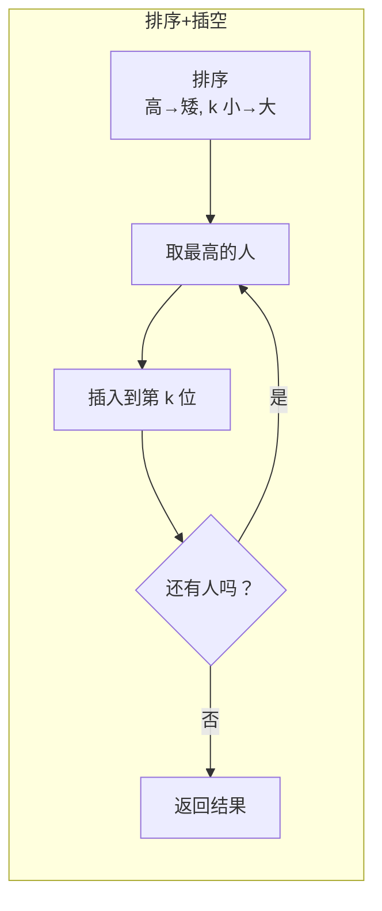

# 406. 根据身高重建队列

> 难度：中等 | 主题：贪心——排序 + 插空

## 题目

每个人表示为 `[h, k]`，h 是身高，k 是前面身高 ≥ h 的人数。重建队列。

**示例：**
```text
[[7,0],[4,4],[7,1],[5,0],[6,1],[5,2]]
→ [[5,0],[7,0],[5,2],[6,1],[4,4],[7,1]]
```

---

## 思路

### 先讲个故事：电影院的排队

电影院入场，大家按身高排成一列。每个人只记得"前面有多少人比我高（或一样高）"。

如果你是检票员，你怎么帮他们恢复正确的顺序？

关键洞察：**最高的人不受矮的人影响**。因为矮的人站在高的人前面或后面，都不会改变高的人前面≥他的人数——矮的人本来就小于高的人。

---

### 引导式推导：从高到矮逐个插入

**排序规则**：按身高降序、k 值升序。高的先排。

**插入规则**：每个人插入到结果队列的第 k 个位置。

```python
people.sort(key=lambda x: (-x[0], x[1]))
res = []
for p in people:
    res.insert(p[1], p)
```

**为什么这样是对的？**

排到某个人时，结果队列里已经全是身高 ≥ 他的人（因为高的先排）。所以此时他的 k 值就是正确的插入位置。



---

## 代码

```python
def reconstructQueue(self, people):
    people.sort(key=lambda x: (-x[0], x[1]))
    result = []
    for p in people:
        result.insert(p[1], p)
    return result
```

---

## 复杂度

| 指标 | 值 | 解释 |
|------|----|------|
| 时间 | O(n²) | 排序 O(n log n)，插入 O(n²) |
| 空间 | O(n) | 结果列表 |

---

## 实战考量

### 频率分析

> **贪心排序经典题**，约 20% 考察对"谁先排"的洞察。

### 延伸思考

**Q：为什么先排高的而不是矮的？**
A：矮的人插入不会影响高的人的 k 值——矮的人不计入高的人前面≥他的人数。从高到矮保证了每次插入时，结果队列中所有人的身高都 ≥ 当前人。

**Q：时间能优化吗？**
A：用平衡树（如 `bisect` + 链表）代替数组插入，可降到 O(n log n)。

**Q：如果 k 是后面 ≥ 他的人数呢？**
A：反过来，从矮到高排，或者从后往前插入。

### 易错点

- 排序 key 是 `(-x[0], x[1])`，不是 `(x[0], x[1])`
- insert 位置是 `p[1]`，不是 `p[0]`
- Python list insert 是 O(n)

---

## 生活类比

> **电影院排队 → 排序插空**
>
> 最高的人先站好，他前面即使站了很多人，只要不比他高就不影响他的记忆。
> 这就好比在篮球场上，姚明先站到位置，然后其他人逐个插入。
> 矮的人插在姚明前面，姚明不会觉得"前面有人比我高"——因为确实没有。
>
> **先排不受影响的人，再排受影响的人。**

---

## 相关题目

| 题目 | 关系 |
|------|------|
| [[452用最少数量的箭引爆气球]] | 区间排序 |
| [[56合并区间]] | 区间排序 |
| 135分发糖果 | 双向贪心 |

---

→ 返回题单：[[LeetCode学习清单#十一、贪心]]
