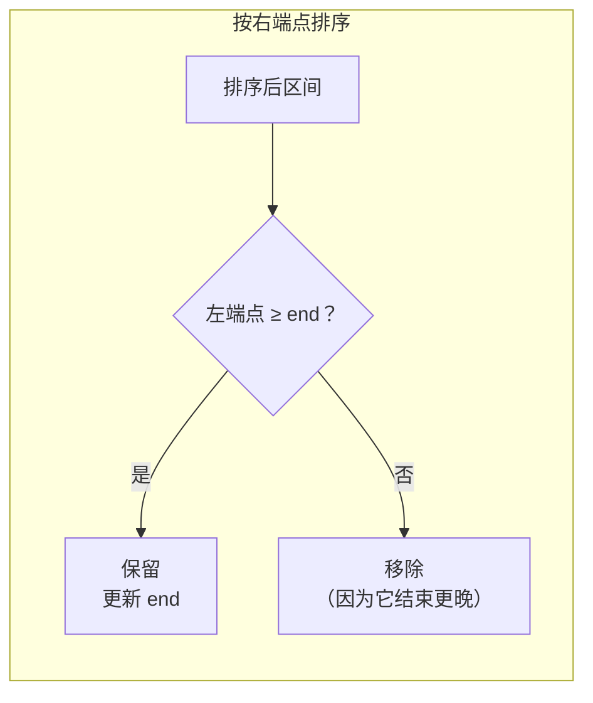

---

title: "无重叠区间"

difficulty: 中等

category: 贪心

tags:

  - leetcode

  - 贪心

created: "2026-07-21"

---

# 435. 无重叠区间

> 难度：中等 | 主题：贪心——按右端点排序

## 题目

给定区间集合 intervals，求最少移除多少个区间可以使剩余区间互不重叠。

**示例：**

```text

[[1,2],[2,3],[3,4],[1,3]] → 1

移除 [1,3] 即可

```

---

## 思路
### 先讲个故事：会议室的预定

你要安排尽可能多的会议，每个会议有起止时间。怎么做？

参考答案是：**选结束最早的会议**。因为结束早，留给后面的时间就多。

本题换个问法：最少移除几个 = 总数 - 最多能保留几个。找最多不重叠区间就是经典的"活动选择"贪心。

---

### 引导式推导：从区间调度到最少移除

**等价转换**：最少移除 = 总数 - 最多不重叠区间数。

**贪心策略**：

1. 按区间右端点升序排序

2. 维护上一个保留区间的 end

3. 如果新区间左端点 ≥ end，保留（更新 end）；否则移除



**为什么按右端点排序最优？** 右端点越小，留给后面的空间越大。选结束最早的，留给后面的最多。

---

## 代码

```python

def eraseOverlapIntervals(self, intervals):

    if not intervals:

        return 0

    intervals.sort(key=lambda x: x[1])

    count = 1

    end = intervals[0][1]

    for i in range(1, len(intervals)):

        if intervals[i][0] >= end:

            count += 1

            end = intervals[i][1]

    return len(intervals) - count

```

---

## 复杂度

| 指标 | 值 | 解释 |
|------|----|------|
| 时间 | O(n log n) | 排序 |
| 空间 | O(1) | 原地排序 |

---

## 实战考量
### 频率分析

> **区间贪心经典题**，常见。约 30% 常会从区间问题切入贪心。

### 延伸思考

**Q：为什么按右端点排序而不是左端点？**

A：按右端点保证每次选结束最早的，留给后面最大空间。按左端点会优先选长的区间（左端点早结束晚），不一定最优。

**Q：如果要求移除的区间总长度最小呢？**

A：变成不同问题，可能需要 DP（类似加权区间调度）。

**Q：如果区间是环形的呢？**

A：环形区间调度，考虑首尾相连的特殊情况，枚举断开点。

**Q：和 [[452用最少数量的箭引爆气球]] 什么关系？**

A：452 是找最少覆盖点（相交区间用一箭射穿），本题是找最多不重叠区间。思路相反但方法相同。

### 易错点

- 排序 key 是 `x[1]`（右端点），不是 `x[0]`

- 不重叠条件是 `>=`（闭区间端点相等不算重叠）

- 返回的是移除数，不是保留数

---

## 生活类比

> **会议室预订 → 选结束最早的**

>

> 你想在一天里排最多的会议。直觉会选"开始最早"的，

> 但正确做法是选"结束最早"的——早结束早散场，给后面的会议腾时间。

>

> 就像约会安排：先约那个走得早的人，晚上还能再约一场。

>

> **结束得越早，选择空间越大。**

---

## 相关题目

| 题目 | 关系 |
|------|------|
| [[452用最少数量的箭引爆气球]] | 区间覆盖问题，思路类似 |
| [[56合并区间]] | 区间合并 |
| 763划分字母区间 | 分段贪心 |

---

→ 返回题单：[[LeetCode学习路线图#十一、贪心]]

## 速记卡（面试闪卡）

**Q1：一句话讲清「435. 无重叠区间」到底是什么？**

A：最少移除几个区间让剩余互不重叠 = 总数 − 最多不重叠区间数，按右端点贪心选最早结束的。

**Q2：题目本质 —— 怎么理解？**

A：像安排会议：每个会议有起止时间，想排最多场。直觉选「开始最早」会错——正确是选「结束最早」的，早散场给后面腾时间。结束得越早，选择空间越大。英语叫 Interval Scheduling（区间调度）。

**Q3：思路：按右端点排序 —— 怎么理解？**

A：等价转换：最少移除 = 总数 − 最多不重叠数。贪心策略：区间按右端点升序排，维护上一个保留区间的 end，新区间左端点 ≥ end 就保留（更新 end），否则移除。右端点越小留给后面空间越大。

**Q4：代码要点 —— 怎么理解？**

A：sort(key=lambda x: x[1]) 按右端点排；count 从 1 起，遍历时满足 intervals[i][0] >= end 就 count++、更新 end；返回 len − count。不重叠条件是 >=（闭区间端点相等不算重叠）。

**Q5：复杂度与变体 —— 怎么理解？**

A：时间 O(n log n)（排序），空间 O(1)（原地）。变体：求移除总长度最小变成加权区间调度需 DP；环形区间要枚举断开点；452 引爆气球是「最少覆盖点」，思路相反方法相同。

**Q6：核心速记主线有哪些？**

- 最少移除数 = 总数 − 最多不重叠区间数

- 按右端点升序排序，贪心选最早结束

- 不重叠判断用 >=，返回移除数非保留数

- 时间 O(n log n)、空间 O(1)；452 气球题思路相反

**口诀**

A：无重叠区间

右端排序最早收

结束越早空间大

贪心移除不用愁

## 相关链接

- [[笔记/Leetcode笔记/11_贪心/763划分字母区间|划分字母区间]]

- [[笔记/Leetcode笔记/11_贪心/452用最少数量的箭引爆气球|用最少数量的箭引爆气球]]

- [[笔记/Leetcode笔记/11_贪心/122买卖股票的最佳时机II|买卖股票的最佳时机II]]

- [[笔记/Leetcode笔记/11_贪心/134加油站|加油站]]

- [[笔记/Leetcode笔记/11_贪心/121买卖股票的最佳时机|买卖股票的最佳时机]]

