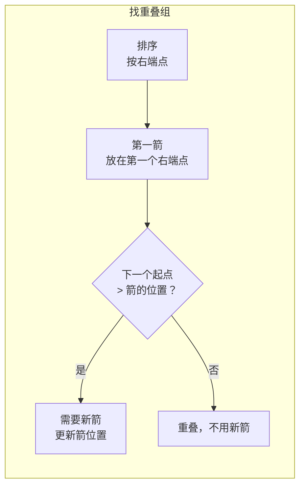

---

title: "用最少数量的箭引爆气球"

difficulty: 中等

category: 贪心

tags:

  - leetcode

  - 贪心

created: "2026-07-21"

---

# 452. 用最少数量的箭引爆气球

> 难度：中等 | 主题：贪心——区间覆盖

## 题目

气球在 XY 平面上表示为区间 [start, end]。一支箭可以射穿所有经过的气球。求最少箭数。

**示例：**

```text

[[10,16],[2,8],[1,6],[7,12]] → 2

x=6 射爆 [1,6] 和 [2,8]，x=11 射爆 [7,12] 和 [10,16]

```

---

## 思路
### 先讲个故事：贪吃蛇的射击游戏

屏幕上有多个气球，每个气球覆盖一段横坐标。你一箭射出去，只要箭经过的横坐标就能射爆重叠的气球。

问最少开几枪？

策略：**每次瞄准当前最靠右结束的气球的右端点**，这一箭可以顺带射爆所有和它重叠的气球。然后剩下的气球再开下一箭。

---

### 引导式推导：从区间覆盖到最少箭

**等价问题**：找不重叠区间的组数。每组内所有区间可以一箭射穿。

与 [[435无重叠区间]] 类似，按右端点排序。遍历时如果新区间左端点 > 当前箭的射程，就需要新的一箭。



---

## 代码

```python

def findMinArrowShots(self, points):

    if not points:

        return 0

    points.sort(key=lambda x: x[1])

    arrow_pos = points[0][1]

    count = 1

    for i in range(1, len(points)):

        if points[i][0] > arrow_pos:

            count += 1

            arrow_pos = points[i][1]

    return count

```

---

## 复杂度

| 指标 | 值 | 解释 |
|------|----|------|
| 时间 | O(n log n) | 排序 |
| 空间 | O(1) | 原地排序 |

---

## 实战考量
### 频率分析

> **区间贪心经典题**，和 435 被称为"区间贪心双壁"，常同时考察。

### 延伸思考

**Q：为什么箭放在右端点而不是左端点？**

A：放在右端点能覆盖更多右边重叠的气球（贪心——尽量往右放）。如果放左端点，可能有右边重叠的气球覆盖不到。

**Q：判断条件是 `>` 还是 `>=`？**

A：`>`。因为如果起点 == 箭的位置，箭可以射到（闭区间包含端点）。

**Q：和 435 题什么关系？**

A：435 求最多保留几个不重叠区间，本题求最少几个点覆盖所有区间。互为对偶问题。

### 易错点

- 排序 key 是 `x[1]`，不是 `x[0]`

- 判断条件是 `>` 不是 `>=`

- points 为空时返回 0

---

## 生活类比

> **射气球 → 找重叠组**

>

> 一群气球飘在空中，你每次瞄准最右边的那个气球的右边缘射箭。

> 这一箭会射穿所有和它重叠的气球。

> 剩下的气球再选最右边的一个，重复。

>

> **一箭射穿所有交集，贪心就是每次瞄准最靠边的。**

---

## 相关题目

| 题目 | 关系 |
|------|------|
| [[435无重叠区间]] | 区间选择，互为对偶 |
| [[56合并区间]] | 区间合并 |
| 763划分字母区间 | 分段贪心 |

---

→ 返回题单：[[LeetCode学习路线图#十一、贪心]]

## 速记卡（面试闪卡）

**Q1：一句话讲清「452. 用最少数量的箭引爆气球」到底是什么？**

A：把气球当区间，按右端点排序，每次箭射最右端，一箭穿所有重叠组。

**Q2：一、题目与区间覆盖 —— 怎么理解？**

A：像屏幕上飘着覆盖一段横坐标的气球，一箭穿过所有交叠的。求最少箭数等价于找不重叠区间的组数（Interval Cover）。

**Q3：二、按右端点贪心 —— 怎么理解？**

A：像每次瞄准最靠右气球的右边缘射，顺带穿所有重叠的。按右端点排序，新起点 > 箭位就需新箭（Greedy by End）。

**Q4：三、代码实现 —— 怎么理解？**

A：像排好队后第一箭放首个右端，之后谁起点超箭位就加箭并更新。判断用 > 而非 >=，闭区间端点也算射到（Arrow Position）。

**Q5：四、复杂度与易错点 —— 怎么理解？**

A：像先排个序，时间 O(n log n) 空间 O(1)。易错在排序 key 是 x[1]、判断用 >、空返回 0（Time/Space Complexity）。

**Q6：核心速记主线有哪些？**

- 气球即区间，最少箭数=不重叠区间组数

- 按右端点排序，箭放最右端覆盖最多

- 新区间起点 > 箭位才需新箭（用 >）

- 与 435 互为对偶，时间 O(n log n)

**口诀**

A：气球当区间，

箭射最右端；

重叠一箭穿，

贪心最划算。

## 相关链接

- [[笔记/Leetcode笔记/11_贪心/435无重叠区间|无重叠区间]]

- [[笔记/Leetcode笔记/11_贪心/55跳跃游戏|跳跃游戏]]

- [[笔记/Leetcode笔记/11_贪心/122买卖股票的最佳时机II|买卖股票的最佳时机II]]

- [[笔记/Leetcode笔记/11_贪心/134加油站|加油站]]

- [[笔记/Leetcode笔记/11_贪心/121买卖股票的最佳时机|买卖股票的最佳时机]]

