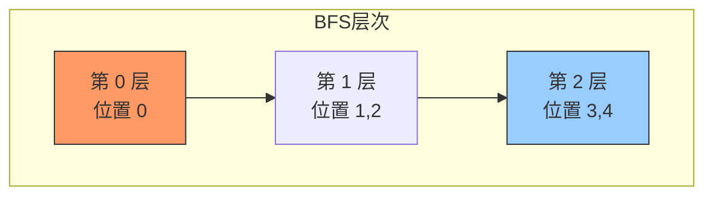
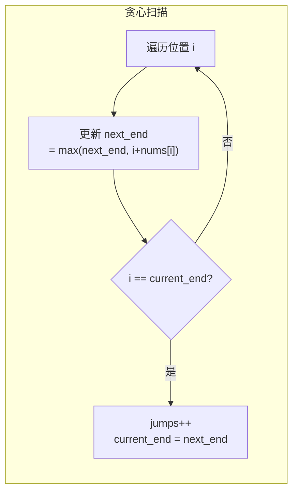

---

title: "跳跃游戏II"

difficulty: 中等

category: 贪心

tags:

  - leetcode

  - 贪心

created: "2026-07-21"

---

# 45. 跳跃游戏 II（Jump Game II）

> 难度：中等 | 主题：贪心——范围覆盖

## 题目

给定一个长度为 n 的整数数组 nums。初始位置为 nums[0]。每个元素 nums[i] 表示从索引 i 向前跳转的最大长度。返回到达 nums[n-1] 的最小跳跃次数。生成的测试用例可以到达 nums[n-1]。

**示例**

```text

nums = [2,3,1,1,4] → 2

解释：跳到最后一个位置最少需要 2 步

```

---

## 思路
### 先讲个故事：公路旅行的加油站

你开车走一条单行公路，油箱容量有限。每个加油站标着"从此处出发最多能开多远"。你想用最少的加油次数到达终点。

你不会傻傻地每到一个加油站就加油——你会在油箱耗尽之前，看看**当前这箱油能覆盖的范围内，哪个加油站能让你开得最远**，然后在那个边界加一次油。

这就是跳跃游戏 II 的贪心本质：**不是选每一步跳多远，而是选这一跳的边界在哪**。

---

### 引导式推导：从 BFS 到贪心

**第 1 层：BFS 视角**

从起点出发，每次跳跃相当于 BFS 的一层。目标是到达最后一层的最小层数。



**第 2 层：贪心（BFS 的贪心实现）**

维护当前层的边界 `current_end`，和当前能到的最远位置 `next_end`。遍历当前层所有位置，更新 `next_end`。到达 `current_end` 时步数 +1。



**为什么贪心成立？** 在当前跳能覆盖的范围内，不管从哪个位置跳，步数都一样（都算 1 跳）。所以选能跳最远的位置作为下一跳的边界，不会更差。

---

## 代码

```python

def jump(self, nums):

    n = len(nums)

    if n <= 1:

        return 0

    jumps = 0

    current_end = 0

    next_end = 0

    for i in range(n - 1):

        next_end = max(next_end, i + nums[i])

        if i == current_end:

            jumps += 1

            current_end = next_end

            if current_end >= n - 1:

                break

    return jumps

```

**为什么遍历到 n-2？** 最后一个位置是终点，不需要再跳出去。`i == current_end` 时才跳一步，`next_end` 的更新在 if 之前。

---

## 复杂度

| 指标 | 值 | 解释 |

|------|----|------|

| 时间 | O(n) | 遍历数组一次 |

| 空间 | O(1) | 几个变量 |

---

## 实战考量
### 频率分析

> **贪心经典题**，约 30% 常会从范围覆盖问题切入。常作为 [[55跳跃游戏]] 的追问出现。

### 延伸思考

**Q：为什么遍历到 n-2 而不是 n-1？**

A：最后一个位置是终点，不需要再跳出去。

**Q：如果不知道能不能到终点呢？**

A：先判断能否到达（[[55跳跃游戏]]），或者在本题中如果 `i > next_end` 说明到不了。

**Q：和 BFS 的关系？**

A：本题可以看成 BFS，每层是当前步数能到达的所有位置，贪心是对 BFS 的优化——不需要真的维护队列。

**Q：如果要求输出跳跃路径呢？**

A：用 DP 或反向贪心记录每一步的选择。

### 易错点

- 遍历范围是 `n-1` 不是 `n`

- `i == current_end` 时才跳，不是 `i >= current_end`

- `next_end` 的更新在 if 之前

---

## 生活类比

> **公路旅行 → 范围覆盖贪心**

>

> 你不需要知道每一跳具体落在哪，只需要知道"这一跳最远能到哪"。

> 到了边界，就加一次油（跳一步），看看新的最远能到哪。

>

> **贪心的精髓：不管中间过程，只管边界在哪。**

---

## 相关题目

| 题目 | 关系 |

|------|------|

| [[55跳跃游戏]] | 判断是否可达，本题求最少步数 |

| 134加油站 | 环形范围覆盖 |

| 1306跳跃游戏III | 图上 BFS/DFS |

---

→ 返回题单：[[LeetCode学习路线图#十一、贪心]]

## 速记卡（面试闪卡）

**Q1：一句话讲清「45. 跳跃游戏 II（Jump Game II）」到底是什么？**

A：求到达数组末尾的最少跳跃次数：贪心维护「当前跳能到的最远」，到边界才跳一步，O(n) 一遍扫完。

**Q2：题目：公路旅行的加油站（range coverage greedy） —— 怎么理解？**

A：每个位置标着「从这最多开多远」，求到终点最少跳几步。就像开车走单行公路，不会每站都加油——而是在油箱耗尽前，看当前这箱油覆盖范围内哪个站能开最远，到边界才加一次油。精髓：管边界不管中间。

**Q3：思路：BFS 层 = 跳数（greedy over BFS） —— 怎么理解？**

A：每跳相当于 BFS 一层，目标是到末层的最小层数。贪心优化：维护 current_end（当前层边界）和 next_end（能到的最远）。遍历当前层更新 next_end，走到 current_end 时 jumps+1、current_end=next_end。在当前跳覆盖内不管从哪跳步数都算 1，选最远的不会更差。

**Q4：代码：一次扫描（O(n)） —— 怎么理解？**

A：for i in range(n-1)：先更新 next_end=max(next_end, i+nums[i])，再判 i==current_end 才 jumps+1 并把 current_end 更新为 next_end（到终点就 break）。遍历到 n-2 即可——最后一个是终点不用跳出。next_end 更新要在 if 之前。

**Q5：复杂度与实战（O(n)，贪心经典） —— 怎么理解？**

A：时间 O(n) 一遍扫，空间 O(1)。实战：贪心经典题，约 30% 从范围覆盖切入，常作 55 跳跃游戏的追问。易错：遍历范围是 n-1 不是 n；i==current_end 才跳不是 ≥；next_end 更新在判断前。若未知能否到达，先判 i>next_end 即断。

**Q6：核心速记主线有哪些？**

- 题目：最少跳跃次数到达末尾

- 思路：BFS 层=跳数，贪心选最远边界

- 代码：维护 current_end/next_end，到边界才 jumps+1

- 复杂度：时间 O(n)，空间 O(1)

- 易错：遍历到 n-1；i==边界才跳；next_end 先更新

**口诀**

A：跳跃游戏求步少，

贪心管界不管跑；

到边才跳加一脚，

最远覆盖自然好。

## 相关链接

- [[笔记/Leetcode笔记/11_贪心/55跳跃游戏|跳跃游戏]]

- [[笔记/Leetcode笔记/11_贪心/134加油站|加油站]]

- [[笔记/Leetcode笔记/11_贪心/122买卖股票的最佳时机II|买卖股票的最佳时机II]]

- [[笔记/Leetcode笔记/11_贪心/121买卖股票的最佳时机|买卖股票的最佳时机]]

- [[笔记/Leetcode笔记/11_贪心/763划分字母区间|划分字母区间]]

