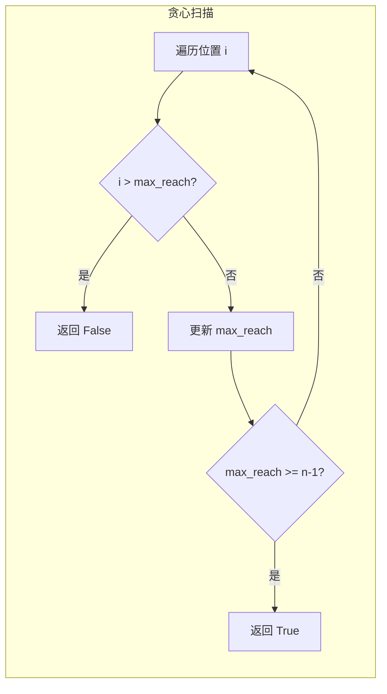

---

title: "跳跃游戏"

difficulty: 中等

category: 贪心

tags:

  - leetcode

  - 贪心

created: "2026-07-21"

---

# 55. 跳跃游戏（Jump Game）

> 难度：中等 | 主题：贪心——可达性判断

## 题目

给你一个非负整数数组 nums，你最初位于数组的第一个下标。数组中的每个元素代表你在该位置可以跳跃的最大长度。判断你是否能够到达最后一个下标。

**示例**

```text

nums = [2,3,1,1,4] → true

nums = [3,2,1,0,4] → false

```

---

## 思路
### 先讲个故事：闯关游戏的传送门

你在一个闯关游戏里，每个房间有一个传送门，标着"最多能传送到前方第几关"。你不用管每一步具体传到哪——只需要确认一件事：**你最远能到哪**。

如果最远能到的位置已经覆盖了终点，那就赢了。如果中途发现当前位置超出了之前能到的最远距离，那就卡住了。

---

### 引导式推导：从暴力到贪心

**第 1 层：暴力 DFS**

从每个位置出发，尝试所有可能的跳跃，看能否到达终点。时间 O(2ⁿ)。

**第 2 层：DP**

`dp[i]` 表示位置 i 是否可达。时间 O(n²)。

**第 3 层：贪心 O(n)**

维护 `max_reach` 表示从起点出发能到达的最远位置。遍历每个位置：

- 如果 `i > max_reach`，说明到不了这里，返回 False

- 否则更新 `max_reach = max(max_reach, i + nums[i])`

- 如果 `max_reach >= n-1`，提前返回 True



**为什么贪心成立？** 不需要在每一步做选择，只需要知道"最远能到哪里"。如果能到位置 i，从 i 能跳到的位置会累积到 max_reach 里。

---

## 代码

```python

def canJump(self, nums):

    max_reach = 0

    for i in range(len(nums)):

        if i > max_reach:

            return False

        max_reach = max(max_reach, i + nums[i])

        if max_reach >= len(nums) - 1:

            return True

    return True

```

---

## 复杂度

| 指标 | 值 | 解释 |

|------|----|------|

| 时间 | O(n) | 遍历数组一次 |

| 空间 | O(1) | 一个变量 |

---

## 实战考量
### 频率分析

> **贪心入门题**，约 25% 考察"全局最优可达"的贪心思维。常作为 [[45跳跃游戏II]] 的前置问题。

### 延伸思考

**Q：如果要求输出跳跃路径呢？**

A：用 DP 或反向贪心记录每一步的选择。

**Q：如果数组里有 0 且前面都跨不过去？**

A：`max_reach` 不会增加，如果 `i` 到了 0 的位置且 `max_reach == i`，就卡住了。

**Q：i > max_reach 为什么不是 >=？**

A：`i == max_reach` 说明当前位置刚好能到，还可以尝试跳出去。只有 `i > max_reach` 才是真正到不了。

### 易错点

- `i > max_reach` 不是 `>=`

- `max_reach` 的更新用 `i + nums[i]`，不是 `nums[i]`

- 提前终止条件：`max_reach >= len(nums) - 1`

---

## 生活类比

> **闯关传送门 → 可达性贪心**

>

> 你不需要规划每一步跳到哪，只需要盯着"最远能到哪"。

> 就像看地图上的信号覆盖范围——只要你的手机信号能覆盖到目的地，你就不用管中间经过了几个基站。

>

> **贪心的本质：忽略细节，只看边界。**

---

## 相关题目

| 题目 | 关系 |

|------|------|

| [[45跳跃游戏II]] | 求最少跳跃次数 |

| 134加油站 | 环形可达性 |

| 1306跳跃游戏III | 图上 BFS/DFS |

---

→ 返回题单：[[LeetCode学习路线图#十一、贪心]]

## 速记卡（面试闪卡）

**Q1：一句话讲清「55. 跳跃游戏（Jump Game）」到底是什么？**

A：判断能否从数组起点跳到终点：每格最多跳 nums[i] 步，核心只看"最远能到哪"。

**Q2：题目本质 —— 怎么理解？**

A：给你一排房间，每间标着"最多能往前传几关"。问题不是"怎么跳"，而是"终点在不在我的信号覆盖范围内"。这叫 reachability（可达性）判断：只关心边界，不关心路径。

**Q3：贪心思路推导 —— 怎么理解？**

A：维护一个 max_reach，每走到一间房就刷新"从我能到的范围里再往外扩多少"。一旦当前位置 i 超过了 max_reach，说明前面断了，直接判死。像滚雪球——能到的范围只增不减，这就是 greedy（贪心）O(n) 的精髓。

**Q4：代码与边界 —— 怎么理解？**

A：遍历里先判断 `i > max_reach` 返回 False，再 `max_reach = max(max_reach, i + nums[i])`，够到末位提前 True。易错点：是 `>` 不是 `>=`（刚好够到还能跳），更新用 `i + nums[i]` 不是光 `nums[i]`。

**Q5：复杂度与实战 —— 怎么理解？**

A：时间 O(n) 一遍扫描，空间 O(1) 一个变量。它是贪心入门题（约 25% 出现），常作 45 跳跃游戏 II 的前置——II 求"最少跳几次"，本质同一框架换个目标函数。

**Q6：核心速记主线有哪些？**

- 题型：可达性判断，回答 True/False 而非路径

- 核心变量：max_reach，只增不减

- 终止：i>max_reach 死；max_reach>=n-1 活

- 易错：用 `>` 不用 `>=`；更新带下标 i

**口诀**

A：跳格贪心看最远，

覆盖终点才安全；

一旦越界路走断，

可否到达立刻判。

## 相关链接

- [[笔记/Leetcode笔记/11_贪心/45跳跃游戏II|跳跃游戏II]]

- [[笔记/Leetcode笔记/11_贪心/134加油站|加油站]]

- [[笔记/Leetcode笔记/11_贪心/121买卖股票的最佳时机|买卖股票的最佳时机]]

- [[笔记/Leetcode笔记/11_贪心/763划分字母区间|划分字母区间]]

- [[笔记/Leetcode笔记/11_贪心/122买卖股票的最佳时机II|买卖股票的最佳时机II]]

