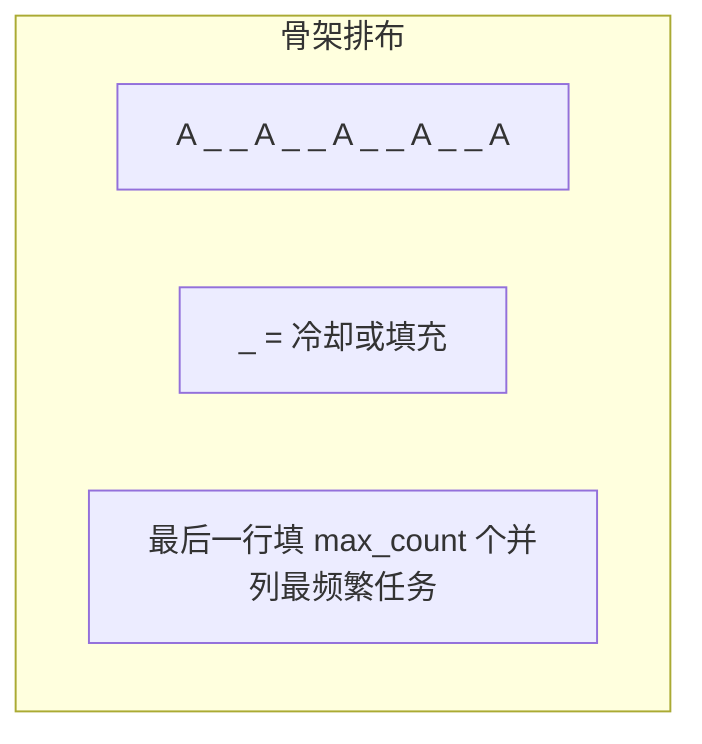

# 621. 任务调度器（Task Scheduler）

> 难度：中等 | 主题：贪心——数学公式

## 题目

给你一个用字符数组 tasks 表示的 CPU 需要执行的任务列表，每个字母代表一种不同种类的任务。在任何一个单位时间，CPU 可以完成一个任务或处于待命状态。然而，两个相同种类的任务之间必须有长度为整数 n 的冷却时间。计算完成所有任务所需要的最短时间。

**示例**
```text
tasks = ["A","A","A","B","B","B"], n = 2
输出：8
解释：A→B→(待)→A→B→(待)→A→B，共 8 个时间单位
```

---

## 思路

### 先讲个故事：工厂流水线的排班

你是个工厂排班经理，有 A、B、C 三种产品要生产。每种产品的生产机器需要冷却 n 分钟才能再生产同一种产品。

你发现一个规律：**最热门的产品是瓶颈**。假如 A 要生产 5 件，那至少需要 `4 × (n+1) + 1` 个时间单位（4 个冷却间隔 + 最后一件）。其他产品可以插在冷却间隔里。

如果其他产品够多，冷却间隔被填满，就不需要额外等待——总时间就是任务总数。

---

### 引导式推导：从骨架到公式

**核心洞察**：最频繁的任务是瓶颈。设最大频次为 `max_freq`，有 `max_count` 个任务有最大频次。



**推导公式**：
- `(max_freq - 1)` 个完整的"块"，每个块长度 `(n + 1)`（任务本身 + n 个冷却）
- 最后一行填充 `max_count` 个同样频繁的任务
- 如果任务总数超过骨架坑位，答案就是任务总数

```text
最少时间 = max(len(tasks), (max_freq - 1) × (n + 1) + max_count)
```

---

## 代码

```python
def leastInterval(self, tasks, n):
    from collections import Counter

    freq = Counter(tasks)
    max_freq = max(freq.values())
    max_count = sum(1 for v in freq.values() if v == max_freq)

    part_count = max_freq - 1
    part_length = n + 1
    last_row = max_count

    formula_result = part_count * part_length + last_row

    return max(formula_result, len(tasks))
```

---

## 复杂度

| 指标 | 值 | 解释 |
|------|----|------|
| 时间 | O(n) | 统计频次 O(n)，找最大值 O(26) |
| 空间 | O(1) | 最多 26 个大写字母 |

---

## 实战考量

### 频率分析

> **贪心数学分析题**，约 20% 考察对问题结构的分析能力，不只是写代码。

### 延伸思考

**Q：公式怎么来的？**
A：把最频繁的任务 A 排成骨架：`A _ _ A _ _ A`，中间填冷却或其他任务。骨架大小就是 `(max_freq-1) × (n+1) + max_count`。

**Q：如果有并列最频繁的任务呢？**
A：`max_count` 个并列，最后一行要排 `max_count` 个。

**Q：如果 n = 0 呢？**
A：公式退化为 `max_freq * max_count`，但 `len(tasks)` 更大，返回任务数。

**Q：如果要求输出具体调度方案呢？**
A：用最大堆，每次取剩余最多的任务，填充冷却。这就是 [[358K距间隔重排字符串]] 的思路。

### 易错点

- 最后和 `len(tasks)` 取 max
- `max_count` 是并列最频繁的任务数，不是出现次数
- 公式中是 `(max_freq - 1)` 不是 `max_freq`

---

## 生活类比

> **工厂排班 → 骨架填充**
>
> 最热门的产品决定了流水线的最短周期。
> 其他产品见缝插针填满冷却时间。
> 如果产品种类够多，冷却时间自然被填满，不需要额外等待。
>
> **瓶颈决定下限，填充决定上限。**

---

## 相关题目

| 题目 | 关系 |
|------|------|
| [[358K距间隔重排字符串]] | 类似冷却问题，但要求输出具体排列 |
| 767重构字符串 | 相邻字符不相同的简化版 |

---

→ 返回题单：[[LeetCode学习清单#十一、贪心]]
