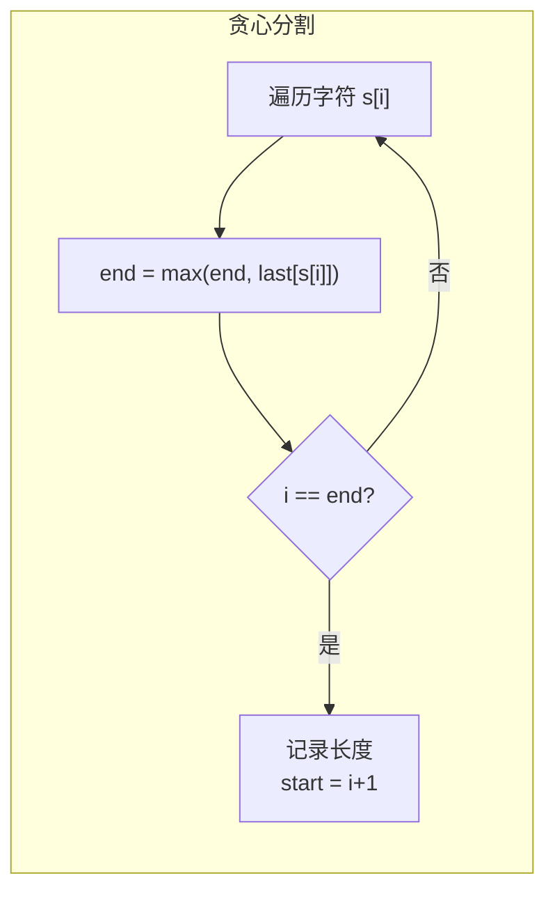

# 763. 划分字母区间（Partition Labels）

> 难度：中等 | 主题：贪心——预处理 + 贪心分割

## 题目

给你一个字符串 s，由若干小写字母组成。要把这个字符串划分为尽可能多的片段，同一字母最多出现在一个片段中。返回一个表示每个字符串片段的长度的列表。

**示例**
```text
s = "ababcbacadefegdehijhklij"
输出：[9,7,8]
解释："ababcbaca" / "defegde" / "hijhklij"
```

---

## 思路

### 先讲个故事：切割生日蛋糕

你有一块长蛋糕，上面撒了各种糖果（a、b、c...）。你要切成尽可能多的块，但**同一颗糖果不能分到两块里**。

怎么做？先看看每种糖果最远出现在哪个位置。然后从左往右扫，维护"当前这块的最远边界"。当扫到边界时，说明当前块里所有糖果都不会出现在后面了——切一刀！

---

### 引导式推导：从预处理到贪心

**第 1 层：记录每个字符最后出现的位置**

第一次遍历：`last[ch] = i`，记录每种字符最后出现的索引。

**第 2 层：贪心分割**

第二次遍历：维护当前分区的右边界 `end`。如果当前字符的最后位置 > end，更新 end。当 `i == end` 时，当前分区结束。



**为什么贪心成立？** 每次尽可能扩展分区直到覆盖所有当前字符的最后出现位置，保证各分区互不相交。如果不在 `i == end` 处切，当前块里某个字符会出现在后面，违反条件。

---

## 代码

```python
def partitionLabels(self, s):
    last_occurrence = {}
    for i, ch in enumerate(s):
        last_occurrence[ch] = i

    result = []
    start = 0
    end = 0

    for i, ch in enumerate(s):
        end = max(end, last_occurrence[ch])

        if i == end:
            result.append(end - start + 1)
            start = i + 1

    return result
```

---

## 复杂度

| 指标 | 值 | 解释 |
|------|----|------|
| 时间 | O(n) | 遍历两次字符串 |
| 空间 | O(1) | 哈希表最多 26 个字母 |

---

## 实战考量

### 频率分析

> **贪心应用题**，约 20% 考察先预处理、再贪心的两步思路。

### 延伸思考

**Q：怎么证明这样划分是最多的？**
A：当 `i == end` 时，如果不在这里切，当前块内某个字符会出现在后面，违反条件。所以这是唯一合法的切割点。

**Q：如果要求每段长度尽量均匀呢？**
A：变成不同的优化目标，可能需要动态规划。

**Q：和区间合并有什么关系？**
A：可以把每种字符的出现范围看成区间 `[first, last]`，本题相当于合并所有相交的区间。

### 易错点

- 先预处理最后位置，这是贪心的基础
- `end` 是当前块内所有字符 `last_occurrence` 的最大值
- `i == end` 时切，不是 `i >= end`

---

## 生活类比

> **切蛋糕 → 预处理 + 贪心**
>
> 先摸清每种糖果最远在哪（预处理），再从左往右扫。
> 扫到"当前块的最远边界"时切一刀——因为再不切，糖果就要跑到下一块去了。
>
> **贪心的前提是信息充分：先收集情报，再做决策。**

---

## 相关题目

| 题目 | 关系 |
|------|------|
| [[56合并区间]] | 区间合并，类似思路 |
| [[435无重叠区间]] | 区间选择 |
| [[452用最少数量的箭引爆气球]] | 区间覆盖 |

---

→ 返回题单：[[LeetCode学习清单#十一、贪心]]

## 速记卡（面试闪卡）

**Q1：一句话讲清「763. 划分字母区间（Partition Labels）」到底是什么？**
A：给你一个字符串 s，由若干小写字母组成。要把这个字符串划分为尽可能多的片段，同一字母最多出现在一个片段中。返回一个表示每个字符串片段的长度的列表。
**示例**
---

**Q2：题目 —— 怎么理解？**
A：给你一个字符串 s，由若干小写字母组成。要把这个字符串划分为尽可能多的片段，同一字母最多出现在一个片段中。返回一个表示每个字符串片段的长度的列表。
**示例**
---

**Q3：思路 —— 怎么理解？**
A：你有一块长蛋糕，上面撒了各种糖果（a、b、c...）。你要切成尽可能多的块，但**同一颗糖果不能分到两块里**。
怎么做？先看看每种糖果最远出现在哪个位置。然后从左往右扫，维护"当前这块的最远边界"。当扫到边界时，说明当前块里所有糖果都不会出现在后面了——切一刀！
---
**第 1 层：记录每个字符最后出现的位置**
第一次遍历：，记录每种字符最后出现的索引。
**第 2 层：贪心分割**
第二次遍历：维护当前分区的右边界 。

**Q4：代码 —— 怎么理解？**
A：---

**Q5：复杂度 —— 怎么理解？**
A：| 指标 | 值 | 解释 |
|------|----|------|
| 时间 | O(n) | 遍历两次字符串 |
| 空间 | O(1) | 哈希表最多 26 个字母 |
---

**Q6：核心速记主线有哪些？**
A：抓住这几根：题目、思路、代码、复杂度、实战考量、生活类比。

