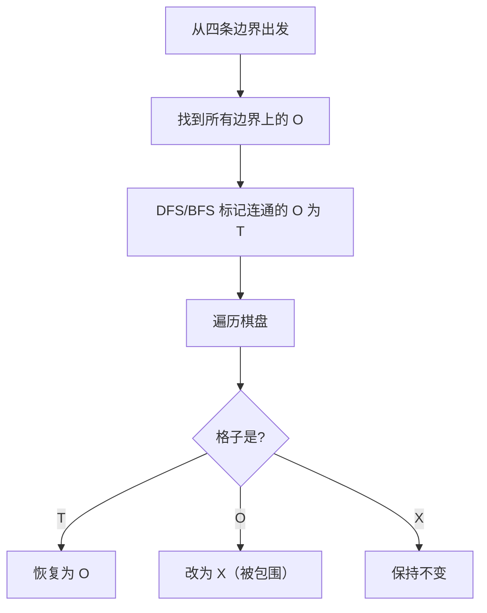

# 130. 被围绕的区域（Surrounded Regions）

> 难度：中等 | 主题：图论、DFS、BFS、并查集

## 题目

给你一个 m x n 的矩阵 board，由若干字符 'X' 和 'O' 组成，找到所有被 'X' 围绕的区域，并将这些区域里所有的 'O' 用 'X' 填充。被围绕的区间不会存在于边界上。

**示例**
```python
输入：board = [["X","X","X","X"],["X","O","O","X"],["X","X","O","X"],["X","O","X","X"]]
输出：[["X","X","X","X"],["X","X","X","X"],["X","X","X","X"],["X","O","X","X"]]
```

---

## 思路

### 先讲个故事：隔离墙，边界上的逃犯

你是一个监狱长，要抓所有被包围的犯人（'O'）。
但有个规则：**边界上的犯人不算被包围**——他们能逃到监狱外面。

怎么办？**反向思维**：不找被包围的，而是找**能逃出去的**（与边界连通的 'O'），给他们打上标记（'T'）。最后，没被标记的 'O' 就是被包围的，改成 'X'；标记的恢复成 'O'。

---

### 引导式推导：反向思维

**核心洞察：** 被 'X' 包围的 'O' 一定不连通到边界。

所以先从四条边上的 'O' 出发 DFS/BFS，标记所有与边界连通的 'O' 为临时字符。



---

## 代码

```python
class Solution:
    def solve(self, board: list[list[str]]) -> None:
        if not board or not board[0]:
            return
        m, n = len(board), len(board[0])

        def dfs(i: int, j: int):
            if i < 0 or i >= m or j < 0 or j >= n or board[i][j] != 'O':
                return
            board[i][j] = 'T'
            dfs(i + 1, j)
            dfs(i - 1, j)
            dfs(i, j + 1)
            dfs(i, j - 1)

        for i in range(m):
            dfs(i, 0)
            dfs(i, n - 1)
        for j in range(n):
            dfs(0, j)
            dfs(m - 1, j)

        for i in range(m):
            for j in range(n):
                if board[i][j] == 'T':
                    board[i][j] = 'O'
                elif board[i][j] == 'O':
                    board[i][j] = 'X'
```

---

## 复杂度

| 指标 | 值 | 解释 |
|------|----|------|
| 时间 | O(m*n) | 每个格子访问一次 |
| 空间 | O(m*n) | DFS 递归栈最坏情况 |

---

## 实战考量

### 频率分析

> **出现在**：字节/美团 图论题，约 20% 常会考到。**考察反向思维和边界处理**。

### 延伸思考

**Q：为什么从边界出发而不是从中间出发？**
A：边界上的 'O' 一定不被包围，从它们扩散找连通块更高效。如果从中间出发，需要额外判断是否连通到边界。

**Q：并查集能做吗？**
A：可以，把所有 'O' 和边界上的虚拟节点合并，最后不连通的改 'X'。

**Q：空间复杂度能优化吗？**
A：可以用 BFS + 队列，或用并查集；但最坏都是 O(m*n)。

**Q：如果要求输出被包围区域的边界呢？**
A：DFS 时记录访问过的 'O' 的邻居中的 'X'，这些就是包围边界。

### 易错点

- 四条边都要处理
- 标记用临时字符 'T'，最后统一替换
- 替换顺序：先 T→O，再 O→X

---

## 生活类比

> **隔离墙，找能逃出去的犯人**
>
> 监狱长不找被包围的犯人，而是找**能逃到边界外的**。
> 从边界开始，把所有能连通到外面的 'O' 打上标记（'T'）。
> 最后，没标记的 'O' 就是被包围的，改成 'X'；标记的放回 'O'。
>
> **反向思维：找"不被包围的"，剩下的就是目标。**

---

## 相关题目

| 题目 | 关系 |
|------|------|
| 200岛屿数量 | 连通块计数 |
| [[417太平洋大西洋水流问题]] | 多边界扩散 |
| [[695岛屿的最大面积]] | 连通块面积 |
| 130被围绕的区域 | 本题 |

---

→ 返回题单：[[LeetCode学习清单#十二、图论]]
