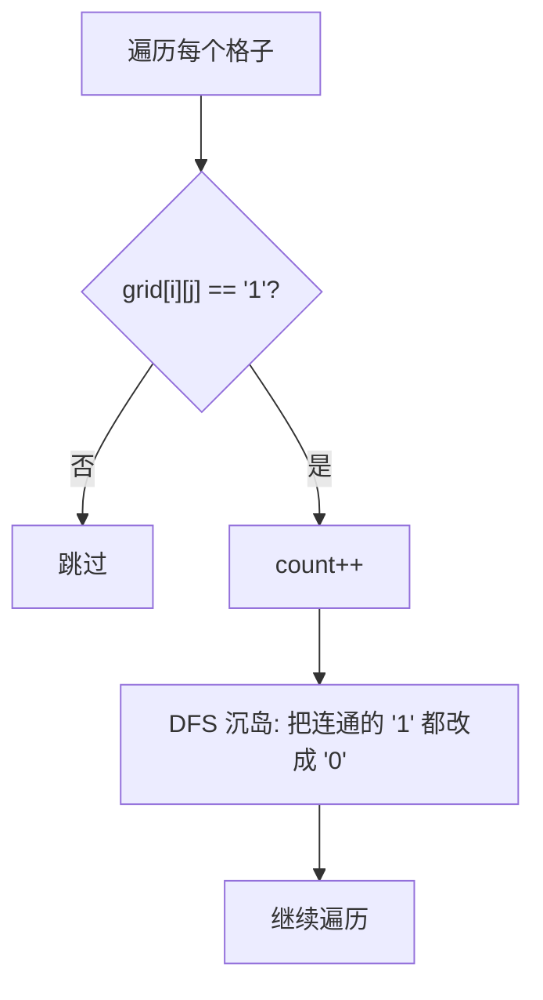

---

title: "岛屿数量"

difficulty: 中等

category: 图论

tags:

  - leetcode

  - 图论

created: "2026-07-21"

---

# 200. 岛屿数量（Number of Islands）

> 难度：中等 | 主题：图论、DFS、BFS、并查集

## 题目

给你一个由 '1'（陆地）和 '0'（水）组成的的二维网格，请你计算网格中岛屿的数量。岛屿总是被水包围，并且每座岛屿只能由水平方向和/或竖直方向上相邻的陆地连接形成。

**示例**

```python

输入：grid = [

  ["1","1","1","1","0"],

  ["1","1","0","1","0"],

  ["1","1","0","0","0"],

  ["0","0","0","0","0"]

]

输出：1

```

---

## 思路
### 先讲个故事：卫星地图数岛屿

你是卫星地图分析师，要数一张地图上有多少个独立的岛屿。

规则：**相邻的陆地算同一个岛屿**（上下左右连通）。

怎么数？**看到一个 '1' 就启动探测器，把整个岛屿的所有 '1' 都标记为 '0'（沉岛）。**

下一个没被标记的 '1' 就是新岛屿。

---

### 引导式推导：DFS 沉岛 + 计数

**核心流程：**



**三种写法：**

| 解法 | 时间 | 空间 | 适用场景 |
|------|------|------|----------|
| **DFS（推荐）** | O(m*n) | O(m*n) | 代码短，首选 |
| BFS | O(m*n) | O(min(m,n)) | 防递归栈溢出 |
| 并查集 | O(m*n×α) | O(m*n) | 动态加边场景 |

---

## 代码

```python

# DFS（推荐）

class Solution:

    def numIslands(self, grid: list[list[str]]) -> int:

        if not grid or not grid[0]:

            return 0

        m, n = len(grid), len(grid[0])

        count = 0

        def dfs(i: int, j: int):

            if i < 0 or i >= m or j < 0 or j >= n or grid[i][j] == '0':

                return

            grid[i][j] = '0'

            dfs(i + 1, j)

            dfs(i - 1, j)

            dfs(i, j + 1)

            dfs(i, j - 1)

        for i in range(m):

            for j in range(n):

                if grid[i][j] == '1':

                    count += 1

                    dfs(i, j)

        return count

```

```python

# BFS

from collections import deque

class Solution:

    def numIslands(self, grid: list[list[str]]) -> int:

        if not grid or not grid[0]:

            return 0

        m, n = len(grid), len(grid[0])

        count = 0

        for i in range(m):

            for j in range(n):

                if grid[i][j] == '1':

                    count += 1

                    queue = deque([(i, j)])

                    grid[i][j] = '0'

                    while queue:

                        x, y = queue.popleft()

                        for dx, dy in [(1,0),(-1,0),(0,1),(0,-1)]:

                            nx, ny = x + dx, y + dy

                            if 0 <= nx < m and 0 <= ny < n and grid[nx][ny] == '1':

                                grid[nx][ny] = '0'

                                queue.append((nx, ny))

        return count

```

---

## 复杂度

| 指标 | 值 | 解释 |
|------|----|------|
| 时间 | O(m*n) | 每个格子访问一次 |
| 空间 | DFS: O(m*n), BFS: O(min(m,n)) | DFS 递归栈 vs BFS 队列 |

---

## 实战考量
### 频率分析

> **出现在**：字节/阿里/美团 高频题，约 40% 常会考到。**考察 DFS/BFS 在网格上的应用**。

### 延伸思考

**Q：DFS 和 BFS 选哪个？**

A：一般选 DFS 代码短；数据量大选 BFS 防栈溢出。

**Q：如果网格很大（10^5 x 10^5）呢？**

A：用 BFS，或并查集；DFS 递归栈可能溢出。

**Q：如果对角线也算连通呢？**

A：方向数组加四个对角 `(1,1), (1,-1), (-1,1), (-1,-1)`。

**Q：并查集怎么做？**

A：遍历每个 '1'，和右边、下边的 '1' 合并，最后统计集合数。

**Q：「沉岛」技巧是什么？**

A：访问过的 '1' 直接改成 '0'，省去 visited 数组。

### 易错点

- 网格是字符串 '1'/'0' 不是数字

- 边界检查 `0 <= nx < m and 0 <= ny < n`

- 标记访问时机（DFS 前标记，BFS 入队时标记）

---

## 生活类比

> **卫星地图数岛屿**

>

> 你是卫星地图分析师，要数地图上有多少独立岛屿。

> 看到一个 '1'，就派探测器沉掉整个岛屿（全改成 '0'）。

> 下一个没被沉掉的 '1' 就是新岛屿，继续沉。

> 最后沉了几次，就有几个岛屿。

>

> **沉岛法：看到就沉，沉完计数——这是网格 DFS 的标准套路。**

---

## 相关题目

| 题目 | 关系 |
|------|------|
| [[695岛屿的最大面积]] | 最大连通块面积 |
| [[547省份数量]] | 无向图连通块 |
| 994腐烂的橘子 | BFS 多源扩散 |
| 200岛屿数量 | 本题 |

---

→ 返回题单：[[LeetCode学习路线图#十二、图论]]

## 速记卡（面试闪卡）

**Q1：一句话讲清「200. 岛屿数量（Number of Islands）」到底是什么？**

A：数网格里有多少块由相邻陆地连成的独立岛屿。

**Q2：思路：DFS 沉岛 + 计数 —— 怎么理解？**

A：卫星看图数岛：看到一块陆地就派探测器把整座岛沉成水（'1' 改 '0'），沉完计数加一。深度优先搜索（DFS, Depth-First Search）就是那台沉岛探测器。

**Q3：代码：DFS 与 BFS 两种写法 —— 怎么理解？**

A：DFS 代码短首选；怕递归栈爆就用广度优先搜索（BFS, Breadth-First Search）拿队列（Queue）装待访问节点；沉岛法省掉 visited 数组。

**Q4：复杂度：时间与空间 —— 怎么理解？**

A：每个格子只访问一次，时间复杂度（Time Complexity）O(m*n) 扫一遍；DFS 空间靠递归栈 O(m*n)，BFS 靠队列 O(min(m,n))——看数据量挑。

**Q5：生活类比：沉岛探测器 —— 怎么理解？**

A：岛屿数量（Number of Islands）像数地图上独立岛屿：看到一个 '1' 就沉掉整座岛，下一个没沉的 '1' 就是新岛。沉了几次就有几座岛——网格 DFS 的标准套路。

**Q6：核心速记主线有哪些？**

- 相邻陆地算同一岛屿

- 看到 1 就 DFS 沉岛

- DFS 短 BFS 防栈爆

- 时间 O(mn) 空间看栈

**口诀**

A：岛屿相连算一块，

见 1 沉岛莫发呆。

DFS 短小 BFS 快，

数完几座记胸怀。

## 相关链接

- [[笔记/Leetcode笔记/12_图论/547省份数量|省份数量]]

- [[笔记/Leetcode笔记/12_图论/695岛屿的最大面积|岛屿的最大面积]]

- [[笔记/Leetcode笔记/12_图论/417太平洋大西洋水流问题|太平洋大西洋水流问题]]

- [[笔记/Leetcode笔记/12_图论/994腐烂的橘子|腐烂的橘子]]

- [[笔记/Leetcode笔记/12_图论/130被围绕的区域|被围绕的区域]]

