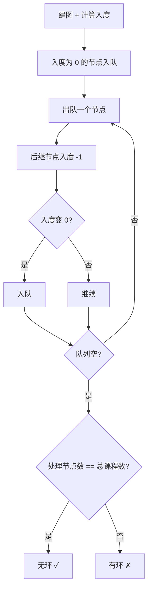
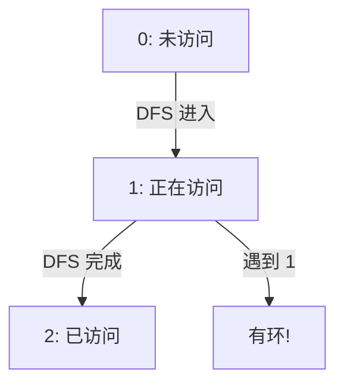

# 207. 课程表（Course Schedule）

> 难度：中等 | 主题：图论、拓扑排序、DFS、BFS

## 题目

你这个学期必须选修 numCourses 门课程，记为 0 到 numCourses-1。在选修某些课程之前需要一些先修课程。先修课程按数组 prerequisites 给出，其中 prerequisites[i] = [ai, bi] 表示如果要学习课程 ai 则必须先学习课程 bi。请你判断是否可能完成所有课程的学习。

**示例**
```python
输入：numCourses = 2, prerequisites = 1,0
输出：true
解释：先修关系 0→1，可以完成
```

---

## 思路

### 先讲个故事：选课系统的死循环

教务系统让你选课，但有些课有先修要求：A 课要先修 B 课，B 课要先修 C 课……
如果 A→B→C→A 形成死循环——**永远选不完**。

怎么检测死循环？**拓扑排序**。

---

### 引导式推导：两种判环方法

**第 1 层：BFS 拓扑排序（Kahn 算法，推荐）**



**第 2 层：DFS 判环（三色标记法）**



---

### 两种方法对比

| 维度 | BFS（Kahn） | DFS（三色标记） |
|------|-------------|----------------|
| 直观性 | 更直观，入度为 0 先处理 | 需要理解三种状态 |
| 代码量 | 稍多 | 稍少 |
| 输出拓扑序 | 天然输出 | 需要额外记录 |
| 适用场景 | 需要拓扑序时 | 只判环时 |

---

## 代码

```python
from collections import deque, defaultdict

# BFS 拓扑排序（Kahn 算法，推荐）
class Solution:
    def canFinish(self, numCourses: int, prerequisites: list[list[int]]) -> bool:
        graph = defaultdict(list)
        indegree = [0] * numCourses

        for a, b in prerequisites:
            graph[b].append(a)
            indegree[a] += 1

        queue = deque()
        for i in range(numCourses):
            if indegree[i] == 0:
                queue.append(i)

        count = 0
        while queue:
            course = queue.popleft()
            count += 1
            for next_course in graph[course]:
                indegree[next_course] -= 1
                if indegree[next_course] == 0:
                    queue.append(next_course)

        return count == numCourses
```

```python
# DFS 判环
class Solution:
    def canFinish(self, numCourses: int, prerequisites: list[list[int]]) -> bool:
        graph = defaultdict(list)
        for a, b in prerequisites:
            graph[b].append(a)

        state = [0] * numCourses

        def has_cycle(node: int) -> bool:
            if state[node] == 1:
                return True
            if state[node] == 2:
                return False
            state[node] = 1
            for next_node in graph[node]:
                if has_cycle(next_node):
                    return True
            state[node] = 2
            return False

        for i in range(numCourses):
            if state[i] == 0:
                if has_cycle(i):
                    return False
        return True
```

---

## 复杂度

| 指标 | 值 | 解释 |
|------|----|------|
| 时间 | O(V+E) | 建图 + 拓扑排序 |
| 空间 | O(V+E) | 图的存储 + 入度/状态数组 |

---

## 实战考量

### 频率分析

> **出现在**：字节/阿里 高频题，约 35% 常会考到。**考察 DAG 和环的判断**。

### 延伸思考

**Q：BFS 和 DFS 判环有什么区别？**
A：BFS（Kahn）更直观，适合找拓扑序；DFS 三种状态法代码简洁。

**Q：如果要求输出一个合法的上课顺序呢？**
A：210课程表II，拓扑排序的过程中记录顺序。

**Q：如果有多个合法顺序，怎么保证输出某个特定顺序？**
A：用优先队列代替普通队列，每次选编号最小的。

**Q：并查集能做吗？**
A：可以检测环，但不能给出拓扑序。

### 易错点

- 建图方向别反：`b -> a` 表示 b 是 a 的先修课
- BFS 最后比较 `count == numCourses`
- DFS 状态标记：进入时设 1，退出时设 2

---

## 生活类比

> **选课系统的死循环检测**
>
> 教务系统要检查先修关系有没有死循环。
> Kahn 算法的思路：**先选没有先修要求的课**（入度为 0），选完后把依赖它的课的先修数 -1。
> 如果所有课都能选完，说明没死循环；选不完就是有环。
>
> **入度为 0 = 没有先修 = 可以直接选——这是拓扑排序的核心。**

---

## 相关题目

| 题目 | 关系 |
|------|------|
| 210课程表II | 输出拓扑序 |
| [[684冗余连接]] | 无向图判环（并查集） |
| [[547省份数量]] | 连通块计数 |
| 207课程表 | 本题 |

---

→ 返回题单：[[LeetCode学习清单#十二、图论]]
