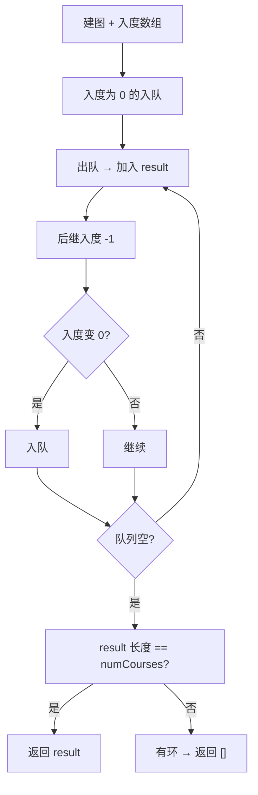

# 210. 课程表 II（Course Schedule II）

> 难度：中等 | 主题：图论、拓扑排序、BFS、DFS

## 题目

现在你总共有 numCourses 门课需要选，记为 0 到 numCourses-1。在选修某些课程之前需要一些先修课程。给定课程总量以及它们的先决条件，返回你为了学完所有课程所安排的学习顺序。

**示例**
```python
输入：numCourses = 4, prerequisites = [[1,0],[2,0],[3,1],[3,2]]
输出：[0,1,2,3] 或 [0,2,1,3]
```

---

## 思路

### 先讲个故事：选课系统的最优顺序

教务系统不仅要知道能不能选完，还要给出**最优选课顺序**。
Kahn 算法天然就能输出拓扑序——每次处理入度为 0 的节点时，就把它加入结果列表。

---

### 引导式推导：207 的一行升级

**与 207 题的关系：** 207 只判断是否有环，210 还要输出拓扑序。



**关键洞察：** BFS 拓扑排序（Kahn 算法）天然可以输出拓扑序——每次处理入度为 0 的节点时，就把它加入结果列表。

---

## 代码

```python
from collections import deque, defaultdict

class Solution:
    def findOrder(self, numCourses: int, prerequisites: list[list[int]]) -> list[int]:
        graph = defaultdict(list)
        indegree = [0] * numCourses

        for a, b in prerequisites:
            graph[b].append(a)
            indegree[a] += 1

        queue = deque()
        for i in range(numCourses):
            if indegree[i] == 0:
                queue.append(i)

        result = []
        while queue:
            course = queue.popleft()
            result.append(course)
            for next_course in graph[course]:
                indegree[next_course] -= 1
                if indegree[next_course] == 0:
                    queue.append(next_course)

        return result if len(result) == numCourses else []
```

---

## 复杂度

| 指标 | 值 | 解释 |
|------|----|------|
| 时间 | O(V+E) | 建图 + 拓扑排序 |
| 空间 | O(V+E) | 图 + 入度数组 + 结果 |

---

## 实战考量

### 频率分析

> **出现在**：字节/阿里 高频题，约 30% 常会考到。**207 的进阶版，考察拓扑序输出**。

### 延伸思考

**Q：拓扑序唯一吗？**
A：不唯一，入度为 0 的节点可能有多个，选哪个都行。

**Q：怎么保证输出字典序最小的拓扑序？**
A：用最小堆（优先队列）代替普通队列，每次选编号最小的。

**Q：如果要求并行上课（每学期尽可能多的课）呢？**
A：按层输出拓扑序，每层是可以同时上的课。

**Q：如果要求输出所有可能的拓扑序呢？**
A：DFS + 回溯，每次选一个入度为 0 的节点，递归处理。

### 易错点

- 最后检查 `len(result) == numCourses`
- 有环时返回空列表不是 None
- 拓扑序不唯一，题目只要求返回任意一个

---

## 生活类比

> **选课系统的最优顺序**
>
> 教务系统不仅想知道能不能选完，还要给出一个选课清单。
> Kahn 算法每次选一门没有先修要求的课（入度为 0），加入清单。
> 选完后，依赖它的课的先修数 -1，如果变成 0 就可以选了。
> 最后清单就是拓扑序——按这个顺序选课，保证先修课在前面。
>
> **入度为 0 = 可以选 = 加入清单——这就是拓扑排序输出顺序。**

---

## 相关题目

| 题目 | 关系 |
|------|------|
| 207课程表 | 只判环，不输出顺序 |
| 210课程表II | 本题 |
| [[684冗余连接]] | 无向图判环 |

---

→ 返回题单：[[LeetCode学习清单#十二、图论]]

## 速记卡（面试闪卡）

**Q1：一句话讲清「210. 课程表 II（Course Schedule II）」到底是什么？**
A：现在你总共有 numCourses 门课需要选，记为 0 到 numCourses-1。在选修某些课程之前需要一些先修课程。给定课程总量以及它们的先决条件，返回你为了学完所有课程所安排的学习顺序。
**示例**
---

**Q2：题目 —— 怎么理解？**
A：现在你总共有 numCourses 门课需要选，记为 0 到 numCourses-1。在选修某些课程之前需要一些先修课程。给定课程总量以及它们的先决条件，返回你为了学完所有课程所安排的学习顺序。
**示例**
---

**Q3：思路 —— 怎么理解？**
A：教务系统不仅要知道能不能选完，还要给出**最优选课顺序**。
Kahn 算法天然就能输出拓扑序——每次处理入度为 0 的节点时，就把它加入结果列表。
---
**与 207 题的关系：** 207 只判断是否有环，210 还要输出拓扑序。
**关键洞察：** BFS 拓扑排序（Kahn 算法）天然可以输出拓扑序——每次处理入度为 0 的节点时，就把它加入结果列表。
---

**Q4：代码 —— 怎么理解？**
A：---

**Q5：复杂度 —— 怎么理解？**
A：| 指标 | 值 | 解释 |
|------|----|------|
| 时间 | O(V+E) | 建图 + 拓扑排序 |
| 空间 | O(V+E) | 图 + 入度数组 + 结果 |
---

**Q6：核心速记主线有哪些？**
A：抓住这几根：题目、思路、代码、复杂度、实战考量、生活类比。

