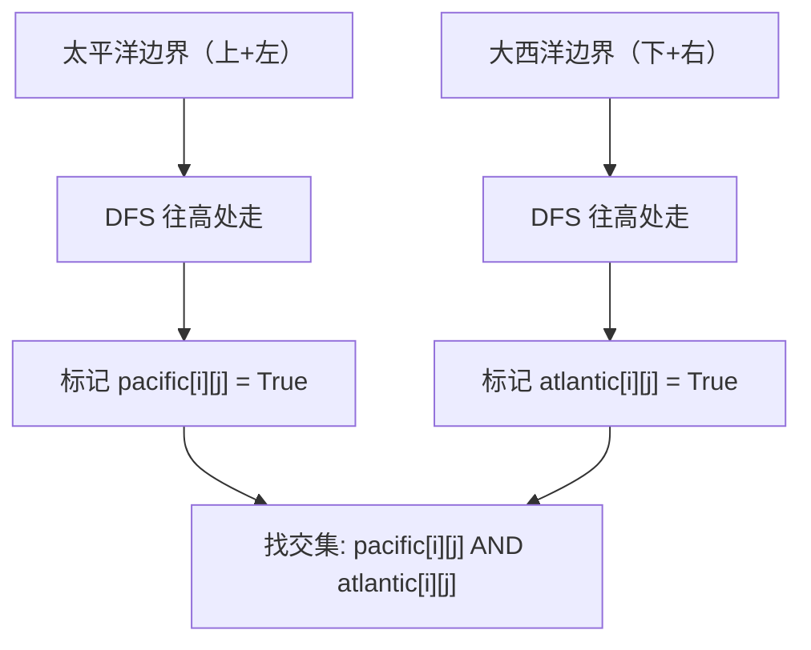

# 417. 太平洋大西洋水流问题（Pacific Atlantic Water Flow）

> 难度：中等 | 主题：图论、DFS、BFS、多源扩散

## 题目

有一个 m × n 的矩形岛屿，与太平洋和大西洋相邻。太平洋在左边界和上边界，大西洋在右边界和下边界。给定一个 m x n 的整数矩阵 heights，返回网格坐标 result 的列表，其中雨水可以从该坐标流向太平洋和大西洋。

**示例**
```python
输入：heights = [[1,2,2,3,5],[3,2,3,4,4],[2,4,5,3,1],[6,7,1,4,5],[5,1,1,2,4]]
输出：[[0,4],[1,3],[1,4],[2,2],[3,0],[3,1],[4,0]]
```

---

## 思路

### 先讲个故事：水往低处流，反着找水源

你站在山顶，想知道雨水会流向哪片海洋。
水往低处流——但你**反着想**：从海洋边界往高处走，能走到的地方就是水能流回来的地方。

太平洋：从上边和左边边界出发，往高处走。
大西洋：从下边和右边边界出发，往高处走。
**交集：两个海洋都能流到的格子。**

---

### 引导式推导：反向 DFS

**核心洞察：** 反向思维。不是从中间往两边流，而是从**两个海洋边界往高处流**。



**反向 DFS 的条件：** `heights[nx][ny] >= heights[x][y]`（往高处或等高走），因为从边界逆行向高坡找水源。

---

## 代码

```python
class Solution:
    def pacificAtlantic(self, heights: list[list[int]]) -> list[list[int]]:
        m, n = len(heights), len(heights[0])
        pacific = [[False] * n for _ in range(m)]
        atlantic = [[False] * n for _ in range(m)]

        def dfs(i: int, j: int, visited: list[list[bool]], prev_height: int):
            if i < 0 or i >= m or j < 0 or j >= n:
                return
            if visited[i][j]:
                return
            if heights[i][j] < prev_height:
                return
            visited[i][j] = True
            dfs(i + 1, j, visited, heights[i][j])
            dfs(i - 1, j, visited, heights[i][j])
            dfs(i, j + 1, visited, heights[i][j])
            dfs(i, j - 1, visited, heights[i][j])

        for i in range(m):
            dfs(i, 0, pacific, heights[i][0])
            dfs(i, n - 1, atlantic, heights[i][n - 1])
        for j in range(n):
            dfs(0, j, pacific, heights[0][j])
            dfs(m - 1, j, atlantic, heights[m - 1][j])

        return [[i, j] for i in range(m) for j in range(n) if pacific[i][j] and atlantic[i][j]]
```

---

## 复杂度

| 指标 | 值 | 解释 |
|------|----|------|
| 时间 | O(m*n) | 每个格子最多被两个 DFS 各访问一次 |
| 空间 | O(m*n) | 递归栈 + 两个 visited 数组 |

---

## 实战考量

### 频率分析

> **出现在**：字节/美团 图论题，约 20% 常会考到。**考察反向思维和多边界处理**。

### 延伸思考

**Q：正向从每个格子往两边流可以吗？**
A：可以，但每个格子都 DFS 是 O((m*n)²)，太慢。

**Q：BFS 可以吗？**
A：可以，用队列代替递归，逻辑一样。

**Q：如果矩阵很大，递归栈溢出怎么办？**
A：用 BFS 或显式栈。

**Q：反向 DFS 的比较条件为什么是 `heights[i][j] < prev_height` 时返回？**
A：反向时当前高度必须 >= 前一个高度，才能「逆流而上」。

### 易错点

- 反向 DFS 的比较条件是 `<` 时返回（即要求 `>=` 才继续）
- 两次 DFS 分别从两个海洋的边界出发
- 最后找交集

---

## 生活类比

> **水往低处流，反着找水源**
>
> 站在山顶，不知道雨水会流向哪片海洋。
> 反着想：从太平洋边界往高处走，能走到的地方 = 水能流回来的地方。
> 大西洋同理。
> 两个集合的交集 = 两个海洋都能流到的格子。
>
> **反向思维：从目标出发逆推，比正向枚举快得多。**

---

## 相关题目

| 题目 | 关系 |
|------|------|
| 130被围绕的区域 | 类似多边界扩散 |
| 200岛屿数量 | 连通块计数 |
| [[695岛屿的最大面积]] | 连通块面积 |
| [[417太平洋大西洋水流问题]] | 本题 |

---

→ 返回题单：[[LeetCode学习清单#十二、图论]]
