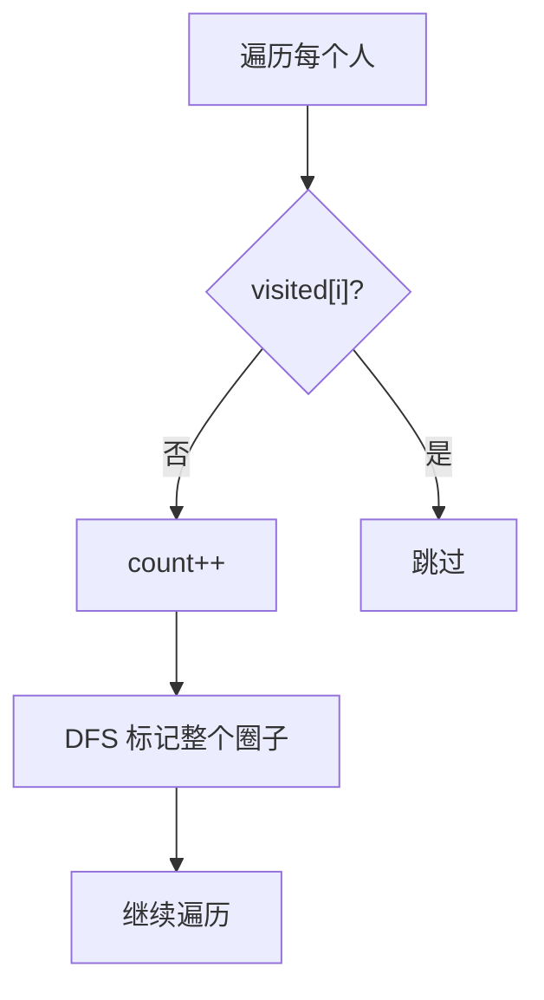
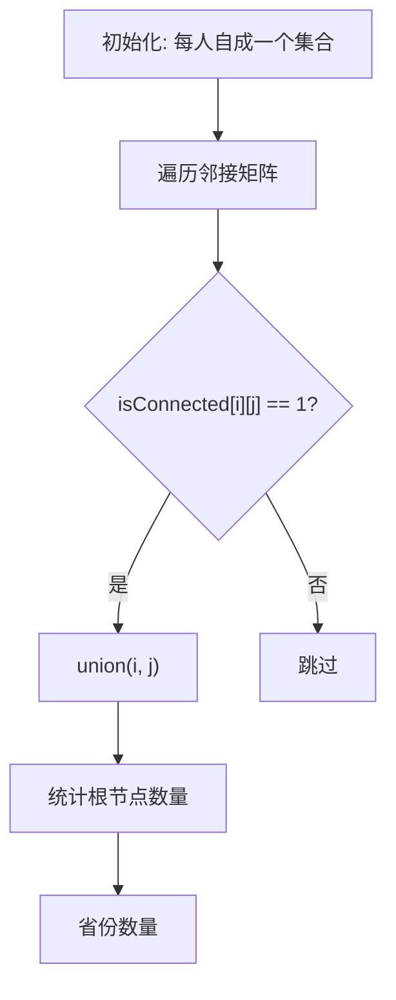

# 547. 省份数量（Number of Provinces）

> 难度：中等 | 主题：图论、并查集、DFS、BFS

## 题目

有 n 个城市，其中一些彼此相连，另一些没有相连。如果城市 a 与城市 b 直接相连，且城市 b 与城市 c 直接相连，那么城市 a 与城市 c 间接相连。省份是一组直接或间接相连的城市。给你一个 n x n 的矩阵 isConnected，返回矩阵中省份的数量。

**示例**
```python
输入：isConnected = [[1,1,0],[1,1,0],[0,0,1]]
输出：2
```

---

## 思路

### 先讲个故事：社交网络找圈子

你是社交网络分析师，要找出有多少个独立的社交圈子。
规则：**朋友的朋友也是朋友**（传递性）。

怎么数圈子？**两种方法：**
1. DFS：看到一个人就启动探测，把他的整个圈子都标记。下一个没标记的人就是新圈子。
2. 并查集：把朋友关系合并，最后看有多少个独立的集合。

---

### 引导式推导：两种方法

**第 1 层：DFS**



**第 2 层：并查集（推荐）**



---

## 代码

```python
# 并查集（推荐）
class Solution:
    def findCircleNum(self, isConnected: list[list[int]]) -> int:
        n = len(isConnected)
        parent = list(range(n))

        def find(x: int) -> int:
            if parent[x] != x:
                parent[x] = find(parent[x])
            return parent[x]

        def union(x: int, y: int):
            px, py = find(x), find(y)
            if px != py:
                parent[px] = py

        for i in range(n):
            for j in range(i + 1, n):
                if isConnected[i][j] == 1:
                    union(i, j)

        return sum(find(i) == i for i in range(n))
```

```python
# DFS
class Solution:
    def findCircleNum(self, isConnected: list[list[int]]) -> int:
        n = len(isConnected)
        visited = [False] * n
        count = 0

        def dfs(i: int):
            for j in range(n):
                if isConnected[i][j] == 1 and not visited[j]:
                    visited[j] = True
                    dfs(j)

        for i in range(n):
            if not visited[i]:
                count += 1
                visited[i] = True
                dfs(i)
        return count
```

---

## 复杂度

| 指标 | 值 | 解释 |
|------|----|------|
| 时间 | O(n² × α) | 遍历矩阵 + 并查集操作 |
| 空间 | O(n) | parent 数组 |

---

## 实战考量

### 频率分析

> **出现在**：字节/美团 图论题，约 25% 常会考到。**考察并查集的基本操作**。

### 延伸思考

**Q：并查集的时间复杂度为什么是反阿克曼函数？**
A：路径压缩 + 按秩合并，证明复杂，知道是极小的常数即可。

**Q：如果输入是边列表而不是邻接矩阵呢？**
A：直接遍历边列表 union，更省时间。

**Q：DFS 和并查集哪个更好？**
A：邻接矩阵时两者都是 O(n²)；边列表时并查集 O(E)，DFS 需要建图也是 O(E)。

**Q：如果图是动态的（不断加边），怎么维护连通块数？**
A：并查集天然支持动态加边，每次 union 成功时连通块数 -1。

### 易错点

- 路径压缩在 find 里
- 遍历矩阵只遍历一半（i < j）
- 最后统计要 find 一次（确保路径压缩完成）

---

## 生活类比

> **社交网络找圈子**
>
> 你是社交网络分析师，要找出有多少独立的圈子。
> 看到一个人没标记，就启动探测，把他的整个朋友圈都标记（DFS）。
> 或者用并查集：每对朋友合并一次，最后看有多少个独立的根。
>
> **DFS：看到就沉；并查集：朋友就合并——两种方法都能数圈子。**

---

## 相关题目

| 题目 | 关系 |
|------|------|
| 200岛屿数量 | 网格连通块 |
| [[684冗余连接]] | 并查集判环 |
| [[547省份数量]] | 本题 |

---

→ 返回题单：[[LeetCode学习清单#十二、图论]]

## 速记卡（面试闪卡）

**Q1：一句话讲清「547. 省份数量（Number of Provinces）」到底是什么？**
A：有 n 个城市，其中一些彼此相连，另一些没有相连。如果城市 a 与城市 b 直接相连，且城市 b 与城市 c 直接相连，那么城市 a 与城市 c 间接相连。省份是一组直接或间接相连的城市。给你一个 n x n 的矩阵 isConnected，返回矩阵中省份的数量。
**示例**
---

**Q2：题目 —— 怎么理解？**
A：有 n 个城市，其中一些彼此相连，另一些没有相连。如果城市 a 与城市 b 直接相连，且城市 b 与城市 c 直接相连，那么城市 a 与城市 c 间接相连。省份是一组直接或间接相连的城市。给你一个 n x n 的矩阵 isConnected，返回矩阵中省份的数量。
**示例**
---

**Q3：思路 —— 怎么理解？**
A：你是社交网络分析师，要找出有多少个独立的社交圈子。
规则：**朋友的朋友也是朋友**（传递性）。
怎么数圈子？**两种方法：**
DFS：看到一个人就启动探测，把他的整个圈子都标记。下一个没标记的人就是新圈子。
并查集：把朋友关系合并，最后看有多少个独立的集合。
---
**第 1 层：DFS**
**第 2 层：并查集（推荐）**
---

**Q4：代码 —— 怎么理解？**
A：---

**Q5：复杂度 —— 怎么理解？**
A：| 指标 | 值 | 解释 |
|------|----|------|
| 时间 | O(n² × α) | 遍历矩阵 + 并查集操作 |
| 空间 | O(n) | parent 数组 |
---

**Q6：核心速记主线有哪些？**
A：抓住这几根：题目、思路、代码、复杂度、实战考量、生活类比。

