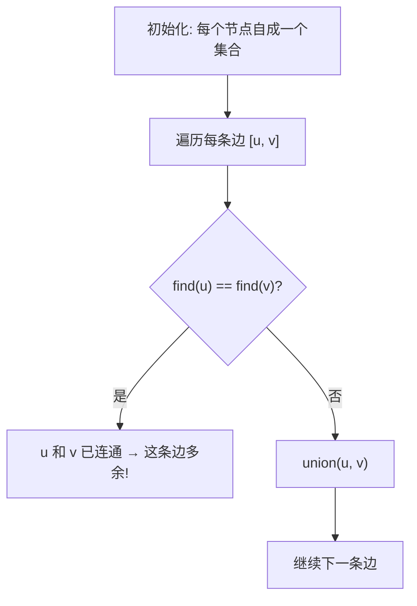

---

title: "冗余连接"

difficulty: 中等

category: 图论

tags:

  - leetcode

  - 图论

  - 并查集

created: "2026-07-21"

---

# 684. 冗余连接（Redundant Connection）

> 难度：中等 | 主题：图论、并查集、DFS

## 题目

树可以看成是一个连通且无环的无向图。在往这棵树中附加一条边后，图出现环。请找出这条多余的边。输入的 edges 是一个二维数组，其中每条边包含两个端点的编号。

**示例**

```python

输入：edges = [[1,2],[1,3],[2,3]]

输出：[2,3]

```

---

## 思路
### 先讲个故事：修路公司的冗余工程

市政要修 n 条路连接 n 个村庄，结果施工队多修了一条，形成了环。

你要找出**哪条路是多余的**——删掉它就能恢复成树。

怎么找？**并查集**：每修一条路就检查两个村庄是否已经连通。如果已经连通，这条路就是多余的（会成环）。

---

### 引导式推导：并查集判环

**核心流程：**



**关键洞察：** 并查集天然适合检测无向图环。如果两个节点已经在同一个集合，再加一条边就会成环。

---

## 代码

```python

class Solution:

    def findRedundantConnection(self, edges: list[list[int]]) -> list[int]:

        n = len(edges)

        parent = list(range(n + 1))

        def find(x: int) -> int:

            if parent[x] != x:

                parent[x] = find(parent[x])

            return parent[x]

        def union(x: int, y: int) -> bool:

            px, py = find(x), find(y)

            if px == py:

                return False

            parent[px] = py

            return True

        for u, v in edges:

            if not union(u, v):

                return [u, v]

        return []

```

---

## 复杂度

| 指标 | 值 | 解释 |
|------|----|------|
| 时间 | O(n × α) | 遍历每条边 + 并查集操作 |
| 空间 | O(n) | parent 数组 |

---

## 实战考量
### 频率分析

> **出现在**：字节/美团 图论题，约 20% 常会考到。**考察并查集在无向图判环中的应用**。

### 延伸思考

**Q：如果要求返回最后出现的多余边呢？**

A：题目已经按顺序给边，遍历到最后一条形成的环就是答案。

**Q：如果要求删除后形成树，怎么删？**

A：并查集找到成环的边，删除它。

**Q：有向图判环怎么做？**

A：拓扑排序或 DFS 三种状态，并查集不适合有向图。

**Q：为什么节点从 1 开始？**

A：题目约定节点编号从 1 到 n，所以 parent 数组大小是 n+1。

### 易错点

- 节点从 1 开始，parent 数组大小 n+1

- `union` 返回 False 表示成环

- 路径压缩在 find 里

---

## 生活类比

> **修路公司的冗余工程**

>

> 市政要修 n 条路连接 n 个村庄，施工队多修了一条形成环。

> 并查集就是你的检测工具：每修一条路，先查两个村庄是否已经连通。

> 如果已经连通——这条路多余了，删掉它！

>

> **已连通再加边 = 成环——这是并查集判环的核心。**

---

## 相关题目

| 题目 | 关系 |
|------|------|
| [[547省份数量]] | 并查集连通块 |
| 207课程表 | 有向图判环 |
| [[684冗余连接]] | 本题 |

---

→ 返回题单：[[LeetCode学习路线图#十二、图论]]

## 速记卡（面试闪卡）

**Q1：一句话讲清「684. 冗余连接（Redundant Connection）」到底是什么？**

A：684 题给一棵多了一条边的无向图，要求找出那条成环的多余边，用并查集判环最直观。

**Q2：题目 —— 怎么理解？**

A：树是连通无环的无向图，附加一条边后就成环。给你 edges，找出多余的那条。像市政修路连 n 个村庄多修了一条形成环，要揪出多余路。Union-Find（并查集）每加一条边先查两端是否已连通，连通即多余。

**Q3：思路 —— 怎么理解？**

A：核心流程：初始化每个节点自成一集合；遍历边 [u,v]，find(u)==find(v) 说明已连通 → 成环，这条就是答案；否则 union。并查集天然适合无向图判环，路径压缩写在 find 里。

**Q4：代码 —— 怎么理解？**

A：parent 数组大小 n+1（节点从 1 开始）。find 递归路径压缩；union 若 px==py 返回 False（成环），否则挂接。遍历到第一条 union 失败的边即返回，没找到返回空。

**Q5：复杂度 —— 怎么理解？**

A：时间 O(n×α)（α 为反阿克曼函数，近似常数），空间 O(n)。有向图判环要用拓扑排序或 DFS 三色，并查集不适用。

**Q6：核心速记主线有哪些？**

- 题意：找出使无向图成环的那条多余边

- 并查集：find 相同则成环，否则 union

- 节点从 1 开始，parent 开 n+1

- 时间 O(nα)、空间 O(n)

**口诀**

A：多修一条路成环，

并查集里查连通；

两端已连即多余，

union 失败就是它。

## 相关链接

- [[笔记/Leetcode笔记/12_图论/547省份数量|省份数量]]

- [[笔记/Leetcode笔记/12_图论/994腐烂的橘子|腐烂的橘子]]

- [[笔记/Leetcode笔记/12_图论/200岛屿数量|岛屿数量]]

- [[笔记/Leetcode笔记/12_图论/130被围绕的区域|被围绕的区域]]

- [[笔记/Leetcode笔记/12_图论/417太平洋大西洋水流问题|太平洋大西洋水流问题]]

