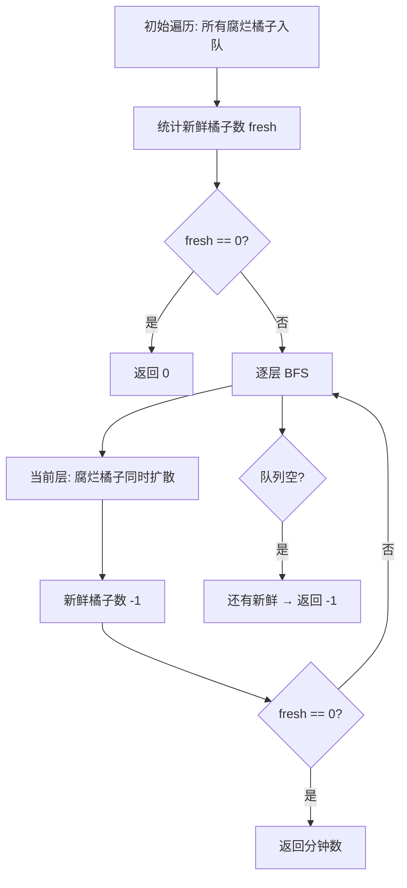

# 994. 腐烂的橘子（Rotting Oranges）

> 难度：中等 | 主题：图论、BFS、多源扩散

## 题目

在给定的 m x n 网格 grid 中，每个单元格可以有以下三个值之一：值 0 代表空单元格；值 1 代表新鲜橘子；值 2 代表腐烂橘子。每分钟，腐烂的橘子周围 4 个方向上相邻的新鲜橘子都会腐烂。返回直到单元格中没有新鲜橘子为止所必须经过的最小分钟数。如果不可能，返回 -1。

**示例**
```python
输入：grid = [[2,1,1],[1,1,0],[0,1,1]]
输出：4
```

---

## 思路

### 先讲个故事：病毒传播，同时扩散

实验室里有几个培养皿，有些培养皿里的细菌已经"腐烂"了。
每分钟，腐烂的细菌会传染给上下左右的新鲜细菌。
问：**所有细菌都腐烂需要多少分钟？**

关键：**所有腐烂细菌同时开始传播**（多源 BFS），而不是一个个来。

---

### 引导式推导：多源 BFS

**核心流程：**



**关键优化：** 用 `for _ in range(len(queue))` 控制按层遍历，每层代表一分钟。

---

## 代码

```python
from collections import deque

class Solution:
    def orangesRotting(self, grid: list[list[int]]) -> int:
        m, n = len(grid), len(grid[0])
        queue = deque()
        fresh = 0

        for i in range(m):
            for j in range(n):
                if grid[i][j] == 2:
                    queue.append((i, j))
                elif grid[i][j] == 1:
                    fresh += 1

        if fresh == 0:
            return 0

        minutes = 0
        directions = [(1,0), (-1,0), (0,1), (0,-1)]

        while queue:
            for _ in range(len(queue)):
                x, y = queue.popleft()
                for dx, dy in directions:
                    nx, ny = x + dx, y + dy
                    if 0 <= nx < m and 0 <= ny < n and grid[nx][ny] == 1:
                        grid[nx][ny] = 2
                        fresh -= 1
                        queue.append((nx, ny))
            if queue:
                minutes += 1

        return minutes if fresh == 0 else -1
```

---

## 复杂度

| 指标 | 值 | 解释 |
|------|----|------|
| 时间 | O(m*n) | 每个格子最多入队出队一次 |
| 空间 | O(m*n) | 队列最多存所有格子 |

---

## 实战考量

### 频率分析

> **出现在**：字节/美团 一面 BFS 题，约 30% 常会考到。**考察多源扩散的思想**。

### 延伸思考

**Q：为什么用 BFS 不用 DFS？**
A：求最短时间就是求最短路径，BFS 天然适合；DFS 会重复计算。

**Q：如果每分钟腐烂范围扩大（比如距离为 2 的也腐烂）呢？**
A：每轮扩散两步，或建图后求最短路。

**Q：如果有些橘子永远不会被腐烂呢？**
A：被隔离在角落，BFS 结束后 fresh > 0，返回 -1。

**Q：为什么用 `for _ in range(len(queue))` 而不是 `while queue`？**
A：`for _ in range(len(queue))` 只处理当前层，处理完才进入下一层。`while queue` 会把所有层混在一起，无法计时。

### 易错点

- 多源入队（所有腐烂橘子同时入队）
- 按层遍历用 `for _ in range(len(queue))`
- 最后判断 fresh 是否为 0
- 分钟数在每层结束后 +1（不是开始时）

---

## 生活类比

> **病毒传播，同时扩散**
>
> 实验室里几个培养皿同时开始腐烂。
> 每分钟，腐烂的细菌向四周传染。
> 用 BFS 一层一层扩散，每层 = 一分钟。
> 扩散完检查：还有新鲜的吗？有就继续；没有就结束。
>
> **多源 BFS = 多个起点同时扩散，层数就是时间。**

---

## 相关题目

| 题目 | 关系 |
|------|------|
| 200岛屿数量 | 网格 DFS/BFS 基础 |
| [[695岛屿的最大面积]] | 连通块面积 |
| [[547省份数量]] | 连通块计数 |
| 994腐烂的橘子 | 本题 |

---

→ 返回题单：[[LeetCode学习清单#十二、图论]]

## 速记卡（面试闪卡）

**Q1：一句话讲清「994. 腐烂的橘子（Rotting Oranges）」到底是什么？**
A：在给定的 m x n 网格 grid 中，每个单元格可以有以下三个值之一：值 0 代表空单元格；值 1 代表新鲜橘子；值 2 代表腐烂橘子。每分钟，腐烂的橘子周围 4 个方向上相邻的新鲜橘子都会腐烂。返回直到单元格中没有新鲜橘子为止所必须经过的最小分钟数。如果不可能，返回 -1。
**示例**
---

**Q2：题目 —— 怎么理解？**
A：在给定的 m x n 网格 grid 中，每个单元格可以有以下三个值之一：值 0 代表空单元格；值 1 代表新鲜橘子；值 2 代表腐烂橘子。每分钟，腐烂的橘子周围 4 个方向上相邻的新鲜橘子都会腐烂。返回直到单元格中没有新鲜橘子为止所必须经过的最小分钟数。如果不可能，返回 -1。
**示例**
---

**Q3：思路 —— 怎么理解？**
A：实验室里有几个培养皿，有些培养皿里的细菌已经"腐烂"了。
每分钟，腐烂的细菌会传染给上下左右的新鲜细菌。
问：**所有细菌都腐烂需要多少分钟？**
关键：**所有腐烂细菌同时开始传播**（多源 BFS），而不是一个个来。
---
**核心流程：**
**关键优化：** 用  控制按层遍历，每层代表一分钟。
---

**Q4：代码 —— 怎么理解？**
A：---

**Q5：复杂度 —— 怎么理解？**
A：| 指标 | 值 | 解释 |
|------|----|------|
| 时间 | O(m*n) | 每个格子最多入队出队一次 |
| 空间 | O(m*n) | 队列最多存所有格子 |
---

**Q6：核心速记主线有哪些？**
A：抓住这几根：题目、思路、代码、复杂度、实战考量、生活类比。

