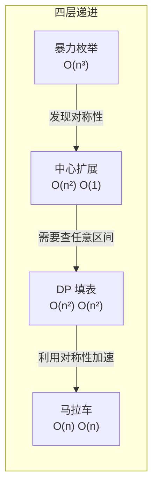
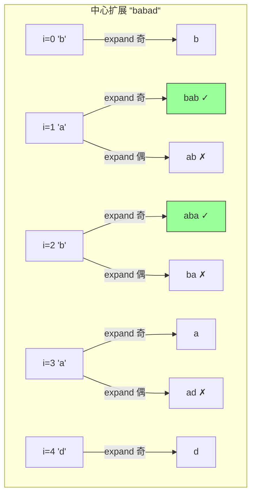

# 5. 最长回文子串

> 难度：中等 | 主题：中心扩展 / 动态规划

## 题目

给你一个字符串 s，找到 s 中最长的回文子串。

**示例**
输入：s = "babad"
输出："bab" 或 "aba"

---

## 思路

### 先讲个故事：照镜子

你对着镜子看自己的脸——左眼和右眼对称，鼻子在中间。突然发现：**"abba" 就像一张正脸——左右镜像一模一样**。而 "aba" 像是马路上的车标，左右对称但只有一个中心点。最长回文子串，就是在字符串里找"最正的那张脸"。

---

### 引导式推导：从动手数到找规律

拿 s = "babad" 手动找所有回文子串：

**长度为 1**：每个单字符都是回文——"b"、"a"、"b"、"a"、"d"，全部是回文，长度 1。

**长度为 2**：检查相邻对——"ba" ✗、"ab" ✗、"ba" ✗、"ad" ✗。咦，没有偶数回文？

**长度为 3**：检查——"bab" ✓（首尾 b=b，中间 "a" 是回文）、"aba" ✓（首尾 a=a，中间 "b" 是回文）。

**发现规律了吗？**

> 回文的核心洞察：**去掉首尾后，中间部分仍是回文**。
> - "bab"：首尾都是 'b'，中间 "a" 是回文 → "bab" 是回文
> - "aba"：首尾都是 'a'，中间 "b" 是回文 → "aba" 是回文

所以：一旦知道短串是不是回文，长串只需要看**首尾是否相等 && 内部短串是否回文**：

```text
isPalindrome(i, j) = (s[i] == s[j]) AND isPalindrome(i+1, j-1)
```

---

### 四层递进：从暴力到线性



**暴力枚举**：枚举所有子串 O(n²) × 判断回文 O(n) = O(n³)。n=1000 就接近 10 亿次操作，直接爆炸。

**中心扩展法**：每个字符（和两字符间隙）作为回文中心，向两边扩展。奇数回文中心 1 个字符（如 "aba" 的 'b'），偶数回文中心 2 个字符（如 "abba" 的 "bb"）。O(n²) 时间，O(1) 空间，首选。



**DP 填表法**：`dp[i][j]` 表示 s[i..j] 是否是回文子串。必须**按子串长度从小到大**遍历，因为 `dp[i][j]` 依赖 `dp[i+1][j-1]`（更短的子串）。时间 O(n²)，空间 O(n²) —— 空间换代码清晰度。

**马拉车（Manacher）**：巧用回文的对称性——如果当前中心 i 在已知回文右边界内，其对称点 i' 的回文半径可作为初始值。O(n) 时间但实现复杂，做进阶亮点即可。

---

## 代码

```python
class Solution:                                # 定义解法类
    def longestPalindrome(self, s: str) -> str:  # 主函数：输入字符串，返回最长回文子串
        def expand(l, r):                        # 辅助函数：从中心(l,r)向两边扩展，找回文边界
            while l >= 0 and r < len(s) and s[l] == s[r]:  # 不越界且左右字符相等，继续扩展
                l -= 1; r += 1                   # 左指针左移、右指针右移，扩大回文半径
            return l + 1, r - 1                  # 回退出界或不等，返回上一次合法位置(l+1, r-1)

        start, end = 0, 0                        # 记录全局最长回文的起始和结束索引
        for i in range(len(s)):                  # 遍历每个字符位置作为中心点
            l1, r1 = expand(i, i)                # 奇数长度回文：中心为单字符s[i]
            l2, r2 = expand(i, i + 1)            # 偶数长度回文：中心为s[i]与s[i+1]之间的间隙
            if r1 - l1 > end - start: start, end = l1, r1  # 若奇数回文更长，更新全局最优
            if r2 - l2 > end - start: start, end = l2, r2  # 若偶数回文更长，更新全局最优
        return s[start:end + 1]                  # 用切片返回最长回文子串（含end，故end+1）
```

---

## 复杂度

| 指标 | 值 | 解释 |
|------|----|------|
| 时间 | O(n²) | 每个中心扩展最多 O(n)，共 2n-1 个中心 |
| 空间 | O(1) | 只用常数个指针 |
| 暴力枚举 | O(n³) | 枚举 O(n²) × 判断 O(n) |

---

## 实战考量

### 频率分析

> **出现在**：字节/腾讯/阿里 高频，LeetCode 前 30 高频题。约 40% 的 AI Agent 常会从回文问题切入，考察**中心扩展的代码实现**和**对奇偶情况的处理**。

### 延伸思考

**Q：为什么每个位置要调两次 expand？**
A：回文分奇数长度（"aba"，中心是单字符 'b'）和偶数长度（"abba"，中心是 "bb" 之间的间隙）。只调一次会漏掉偶数回文——这是最常见的 bug，考的就是你记不记得这一点。

**Q：中心扩展和 DP 的优劣？**
A：中心扩展 O(n²) 时间 O(1) 空间，代码简洁；DP 同样 O(n²) 但 O(n²) 空间。**首选中心扩展**，写的代码少、不容易出错。

**Q：DP 为什么必须按子串长度从小到大遍历？**
A：`dp[i][j]` 依赖 `dp[i+1][j-1]`（内层更短的子串）。按长度遍历确保短子串先算完，长串查短串时结果就绪。如果两层 `i,j` 直接循环，长的会读到短的未初始化值。

**Q：如果只求回文子串的数量呢？（647 题）**
A：同样的中心扩展法，每次扩展成功就计数 +1，不用记录起止位置。代码几乎一样。

**Q：马拉车算法怎么做到 O(n)？**
A：核心是**利用对称性避免重复扩展**——用数组 p[i] 记录以 i 为中心的回文半径。维护当前最右回文边界 `right` 和对应的中心 `center`，当 i 在 right 内时，p[i] 至少等于对称点的值。加上中心扩展的微调，总复杂度 O(n)。

### 易错点

- 每个位置调两次 `expand(i,i)` 和 `expand(i,i+1)`，漏偶数回文是常见 bug
- `expand` 返回的是越界后的位置，需要 `l+1, r-1` 修正回合法位置
- `s[start:end+1]` 切片右边界要 +1

---

## 生活类比

> **回文 → 照镜子 → 中心扩展**
>
> 回文就像照镜子——你站在镜子前，左右完全对称。找最长回文就是在字符串里找"最宽的一张正脸"。中心扩展就是：从鼻尖（单字符中心）或两眼中间（两字符中心）开始，左右同时摸，摸到不对称为止。每个位置都是潜在的"脸的中心"，摸一遍取最宽的，就是答案。而马拉车算法就像——你照过一次镜子就不用重新摸：右边脸还没摸就知道它跟左边脸一样宽。

---

## 相关题目

| 题目 | 关系 |
|------|------|
| [[647回文子串]] | 同族简化版，只计数不记最长 |
| 131分割回文串 | 回文 DP 预处理 + 回溯枚举分割 |
| [[32最长有效括号]] | 同类子串 DP，按结尾位置定义状态 |
| 05最长回文子串 | 本题，中心扩展入门 |

---

→ 返回题单：[[LeetCode学习清单#十三、动态规划]]

## 速记卡（面试闪卡）

**Q1：一句话讲清「5. 最长回文子串」到底是什么？**
A：给你一个字符串 s，找到 s 中最长的回文子串。
**示例**
输入：s = "babad"
输出："bab" 或 "aba"
---

**Q2：题目 —— 怎么理解？**
A：给你一个字符串 s，找到 s 中最长的回文子串。
**示例**
输入：s = "babad"
输出："bab" 或 "aba"
---

**Q3：思路 —— 怎么理解？**
A：你对着镜子看自己的脸——左眼和右眼对称，鼻子在中间。突然发现：**"abba" 就像一张正脸——左右镜像一模一样**。而 "aba" 像是马路上的车标，左右对称但只有一个中心点。最长回文子串，就是在字符串里找"最正的那张脸"。
---
拿 s = "babad" 手动找所有回文子串：
**长度为 1**：每个单字符都是回文——"b"、"a"、"b"、"a"、"d"，全部是回文，长度 1。

**Q4：代码 —— 怎么理解？**
A：---

**Q5：复杂度 —— 怎么理解？**
A：| 指标 | 值 | 解释 |
|------|----|------|
| 时间 | O(n²) | 每个中心扩展最多 O(n)，共 2n-1 个中心 |
| 空间 | O(1) | 只用常数个指针 |
| 暴力枚举 | O(n³) | 枚举 O(n²) × 判断 O(n) |
---

**Q6：核心速记主线有哪些？**
A：抓住这几根：题目、思路、代码、复杂度、实战考量、生活类比。

