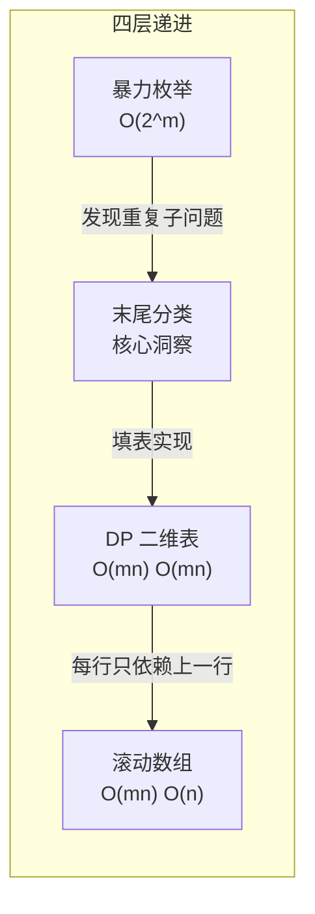
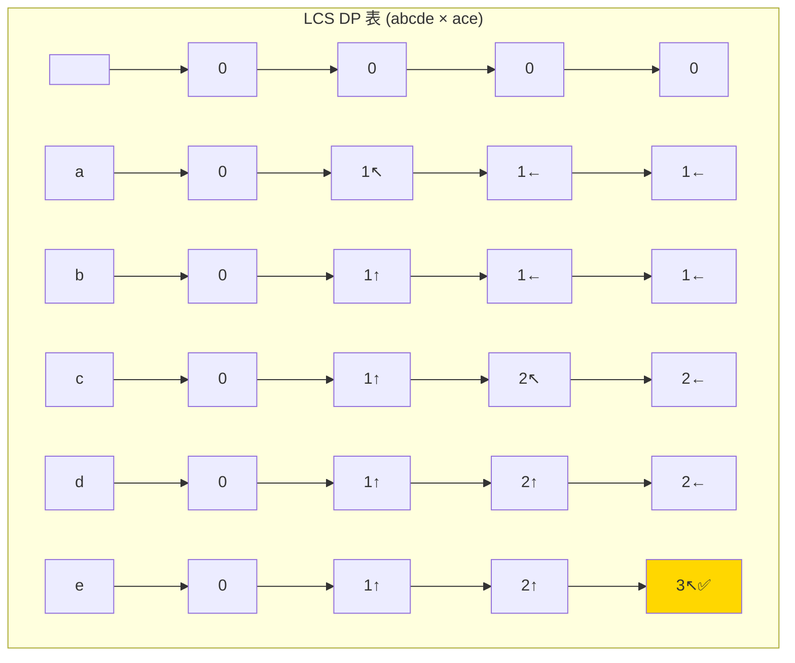

---

title: "最长公共子序列"

difficulty: 中等

category: 动态规划

tags:

  - leetcode

  - 动态规划

created: "2026-07-21"

---

# 1143. 最长公共子序列（Longest Common Subsequence）

> 难度：中等 | 主题：动态规划、字符串

## 题目

给定两个字符串 text1 和 text2，返回这两个字符串的最长公共子序列的长度。如果不存在公共子序列，返回 0。子序列是指在不改变其余字符顺序的情况下删除一些字符后得到的新字符串。

**示例**

输入：text1 = "abcde", text2 = "ace"

输出：3

解释："ace" 是最长公共子序列

---

## 思路
### 先讲个故事：两个人的朋友圈动态

小明和小红各自刷朋友圈，小明发的动态按时间顺序是：["早餐☕", "跑步🏃", "加班💻", "晚安😴"]，小红的是：["早餐☕", "加班💻", "追剧📺"]。

两个人的"共同生活轨迹"是：早餐☕ → 加班💻——顺序一致，中间可以跳过"跑步"和"追剧"，**不需要连续**。

这就是最长公共子序列（LCS）。对比最长公共子串（要求连续）——那是"必须有连续重叠的片段"。

---

### 引导式推导：从"abcde"和"ace"找规律

**看最后一个字符**，分两种情况：

**情况 1：末尾字符相等**（text1 末尾 e == text2 末尾 e）

这个字符一定属于 LCS！问题缩小为：求 "abcd" 和 "ac" 的 LCS + 1。

**情况 2：末尾字符不等**（比如 "abcd" 和 "ac"）

至少删一个末尾字符。要么把 text1 末尾 'd' 删掉（求 "abc" 和 "ac" 的 LCS），要么把 text2 末尾 'c' 删掉（求 "abcd" 和 "a" 的 LCS），取较大值。

**手动填表验证（"abcde" × "ace"）**：

```text

    ""   a   c   e

""   0   0   0   0

a    0   1   1   1    ← a=a → dp[1][1]=0+1=1

b    0   1   1   1    ← b≠c → max(↑1,←1)=1

c    0   1   2   2    ← c=c → dp[2][2]=1+1=2

d    0   1   2   2    ← d≠e → max(↑2,←2)=2

e    0   1   2   3    ← e=e → dp[4][3]=2+1=3 ✅

```

**发现规律**：

```text

dp[i][j] =

  dp[i-1][j-1] + 1          如果 text1[i-1] == text2[j-1]

  max(dp[i-1][j], dp[i][j-1])  否则

```

---

### 四层递进：从指数到线性



**暴力枚举**：枚举 text1 的所有子序列（2^m 个），检查每个是否在 text2 中。m=20 就百万级了，m=100 直接宇宙毁灭。

**末尾字符分类**：看最后一个字符是否相等。这步洞察是 LCS 的核心——**把问题缩小为更短的子问题**，不是"所有可能"而是"最后一步只有两种情况"。

**DP 二维表**：`dp[i][j]` 表示 text1[:i] 和 text2[:j] 的 LCS 长度。两层循环填表，时间和空间都是 O(mn)。

**滚动数组优化**：观察发现 `dp[i][*]` 只依赖 `dp[i-1][*]`（上一行）。可以用一维数组 + `prev` 变量保存左上角值。空间降到 O(n)。



---

## 代码

```python

def longestCommonSubsequence(self, text1, text2):  # 主函数：输入两个字符串，返回LCS长度

    m, n = len(text1), len(text2)            # m,n分别为两字符串长度，决定DP表大小

    # dp[j] 表示当前行的 LCS 长度

    dp = [0] * (n + 1)                       # 初始化一维DP数组，长度n+1，初始为0

    for i in range(1, m + 1):                # 外层遍历text1的每个字符（1-based索引）

        prev = 0                             # 保存 dp[i-1][j-1]，即左上角值，初始dp[0][0]=0

        for j in range(1, n + 1):            # 内层遍历text2的每个字符（1-based索引）

            temp = dp[j]                     # 保存当前dp[j]（更新前的dp[i-1][j]），下一轮作为prev

            if text1[i - 1] == text2[j - 1]: # 当前两字符相等，LCS可延长1

                dp[j] = prev + 1             # 用左上角值+1，即dp[i-1][j-1]+1

            else:                            # 字符不相等，继承上方或左方的较大值

                dp[j] = max(dp[j], dp[j - 1])  # dp[j]是上方，dp[j-1]是左方

            prev = temp                      # 将本轮的dp[j]（原dp[i-1][j]）作为下一轮j+1的左上角

    return dp[n]                             # 最后一个位置存储两字符串整体的LCS长度

```

---

## 复杂度

| 指标 | 值 | 解释 |

|------|----|------|

| 时间 | O(m×n) | 两层循环填表 |

| 空间 | O(n) | 一维 DP 数组 + 一个 prev |

| 二维 DP | O(mn) | 二维表空间，可先用二维再优化 |

---

## 实战考量
### 频率分析

> **出现在**：字节/美团/阿里 进阶，LeetCode 前 50 高频。字符串 DP 的经典代表题，约 35% 的 AI Agent 会涉及 LCS 或其变体（编辑距离、最长公共子串）。

### 延伸思考

**Q：`dp[i][j]` 的索引为什么减 1？**

A：`dp[i][j]` 表示 text1 前 i 个字符（text1[:i]）和 text2 前 j 个字符（text2[:j]）的 LCS。所以 text1 的第 i 个字符是 `text1[i-1]`，text2 的第 j 个字符是 `text2[j-1]`。索引对齐是写对 LCS 的第一关。

**Q：如果要求输出具体的 LCS 字符串呢？**

A：额外用一个方向表记录每个 dp[i][j] 是从哪个方向来的（↖左上、↑上、←左），最后回溯。空间 O(mn)，但写出思路即可。

**Q：如果要求最长公共子串（要求连续）呢？**

A：区别在于字符不相等时 `dp[i][j] = 0`（断了），记录全局最大值。LCS 是 max，子串是 0 + 记录 max。

**Q：三个字符串的 LCS 呢？**

A：三维 DP——`dp[i][j][k]`，状态转移类似。时间和空间 O(m×n×p)，指数增长，一般只讨论思路。

**Q：空间优化时 prev 的作用？**

A：当字符相等时，我们需要左上角 `dp[i-1][j-1]`。但一维数组更新时 `dp[j-1]` 已经被当前行覆盖了（变成 dp[i][j-1]），所以必须用一个变量 prev 预先保存左上角的值。

### 易错点

- `dp[i][j]` 对应 text1[:i] 和 text2[:j]，字符索引要 -1

- 空间优化时 `prev` 的更新时机：先存 `temp = dp[j]`，更新 dp[j]，再 `prev = temp`

- 相等时用 `prev + 1`，不是 `dp[j] + 1`

---

## 生活类比

> **LCS → 朋友圈共同动态 → 滚动数组**

>

> 两个人各自发了 n 条朋友圈，你想知道他们的"共同生活轨迹"。你不需要对比所有的动态组合（那是指数级的）——只需要一条一条看，每条要么是"两个人都发了这个内容"（LCS +1），要么是"至少一个人跳过了"（取最大的可能）。滚动数组优化就像——你只需要记住上一行，因为再往前的行已经被"max"吸收掉了。

---

## 相关题目

| 题目 | 关系 |

|------|------|

| 72编辑距离 | 同一 DP 框架，增删改三种操作 |

| [[583两个字符串的删除操作]] | LCS 应用：删除数 = m+n - 2×LCS |

| 05最长回文子串 | 回文串 DP，中心扩展思路不同但同属字符串 DP |

| 1143最长公共子序列 | 本题，LCS 入门 |

---

→ 返回题单：[[LeetCode学习路线图#十三、动态规划]]

## 速记卡（面试闪卡）

**Q1：一句话讲清「1143. 最长公共子序列（Longest Common Subsequence）」到底是什么？**

A：给两个字符串，找出它们最长的、顺序一致但不必连续的公共子序列长度。

**Q2：题目怎么理解？ —— 怎么理解？**

A：两人各自发朋友圈，找出共同的生活轨迹（早餐→加班），中间可跳过跑步和追剧、不必连续。这就是最长公共子序列（Longest Common Subsequence, LCS）。

**Q3：末尾字符怎么分类？ —— 怎么理解？**

A：看最后两个字符：相同就一起留下、长度+1；不同就各删一个尾巴取较大值。像拼图对尾，只分两种情况，不枚举所有可能。这是末尾分类（end-character case split）。

**Q4：DP 表怎么填？ —— 怎么理解？**

A：一张二维表，每个格子看：左上相等则 +1，否则取上或左的较大值，像记账本逐格填。dp[i][j] 表示两前缀的 LCS 长。这是动态规划二维表（DP 2D table）。

**Q5：复杂度和实战怎么理解？ —— 怎么理解？**

A：字节/美团/阿里前50高频，编辑距离等变体同源。时间 O(m×n)，空间可用一维滚动数组压到 O(n)，靠 prev 存左上角值。这是滚动数组优化（rolling array）。

**Q6：核心速记主线有哪些？**

- 题目：两串最长公共子序列(可不连续)长度

- 核心：末尾相等 +1，否则取上/左较大

- 优化：一维滚动数组 + prev 存左上角，空间 O(n)

- 实战：字节/美团高频，编辑距离等变体同源

**口诀**

A：最长公共子序列，

末尾相同加个一；

不同取大删尾巴，

滚动数组省内存。

## 相关链接

- [[笔记/Leetcode笔记/13_动态规划/300最长递增子序列|最长递增子序列]]

- [[笔记/Leetcode笔记/13_动态规划/05最长回文子串|最长回文子串]]

- [[笔记/Leetcode笔记/13_动态规划/32最长有效括号|最长有效括号]]

- [[笔记/Leetcode笔记/13_动态规划/70爬楼梯|爬楼梯]]

- [[笔记/Leetcode笔记/13_动态规划/63不同路径II|不同路径II]]

