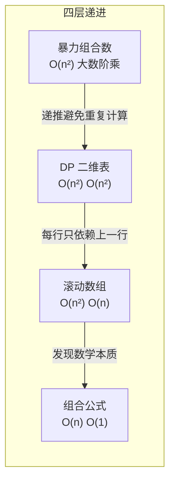

---

title: "杨辉三角"

difficulty: 简单

category: 动态规划

tags:

  - leetcode

  - 动态规划

created: "2026-07-21"

---

# 118. 杨辉三角（Pascal's Triangle）

> 难度：简单 | 主题：DP、数组

## 题目

给定 `numRows`，生成杨辉三角的前 `numRows` 行。

**示例：**

```python

输入：numRows = 5

输出：[[1],[1,1],[1,2,1],[1,3,3,1],[1,4,6,4,1]]

```

---

## 思路
### 先讲个故事：叠罗汉

学校运动会上，班里要排一个人体金字塔：最顶层 1 个人，第二层 2 个人，第三层 3 个人……每一层的人**站在下面两个人的肩膀上**。

- 最左边的人只被一个人撑着（最右边也是）——所以他们只管自己站着

- 中间的人被两个人撑着——他的重量 = 下面左肩 + 下面右肩

杨辉三角就是这种"叠罗汉"的数字版本：**每个数等于它左上方和右上方两个数之和**。

---

### 引导式推导：从手动搭金字塔到找公式

**第 0 行（n=0）**：塔尖——就 1 个人 → `[1]`

**第 1 行（n=1）**：两个人，每人站一边 → `[1, 1]`

**第 2 行（n=2）**：三个人——中间的人站在下面两个人（1 和 1）肩膀上 → `[1, 2, 1]`

**第 3 行（n=3）**：四个人——中间两个，左边 1+2=3，右边 2+1=3 → `[1, 3, 3, 1]`

**第 4 行（n=4）**：五个人——中间三个，3+3=6 → `[1, 4, 6, 4, 1]`

```text

      [1]           ← 第 0 行

     [1, 1]         ← 第 1 行

    [1, 2, 1]       ← 第 2 行     2 = 1+1

   [1, 3, 3, 1]     ← 第 3 行     3 = 1+2, 3 = 2+1

  [1, 4, 6, 4, 1]   ← 第 4 行     6 = 3+3

```

**发现规律**：第 i 行第 j 个数 = 第 i-1 行第 j-1 个数 + 第 i-1 行第 j 个数

```text

dp[i][j] = dp[i-1][j-1] + dp[i-1][j]

```

而且首尾永远是 1（只有一个肩膀的人撑着）。

---

### 四层递进：从建表到直接算



**暴力组合数**：第 n 行第 k 个数 = C(n,k) = n! / (k!×(n-k)!)。但算阶乘容易溢出，而且每次重新算——做了大量重复工作。

**DP 二维表**：每一行基于上一行计算，`dp[i][j] = dp[i-1][j-1] + dp[i-1][j]`。每个数只加一次。

**滚动数组**：发现 `dp[i]` 只依赖 `dp[i-1]`，只需要保存上一行。空间从 O(n²) 降到 O(n)。

**组合公式一横行输出**：如果只需要第 n 行（119 题），递推公式 C(n,k) = C(n,k-1) × (n-k+1) / k，O(n) 时间 O(1) 空间。

---

## 代码

```python

def generate(self, numRows):

    res = []                                   # 存储所有行（二维列表）

    for i in range(numRows):                   # 逐行生成：i 从 0 到 numRows-1

        row = [1] * (i + 1)                    # 初始化当前行：长度 = i+1，全部填充为 1（首尾自然为 1）

        for j in range(1, i):                  # 填充中间元素：j 从 1 到 i-1（跳过首尾的 1）

            row[j] = res[i-1][j-1] + res[i-1][j]  # 上一行相邻两数之和：左上方 + 右上方

        res.append(row)                        # 当前行加入结果列表

    return res

```

---

## 复杂度

| 指标 | 值 | 解释 |
|------|----|------|
| 时间 | O(n²) | 每行 j 循环次数递增，总和 = 1+2+...+n = n(n-1)/2 |
| 空间 | O(n²) | 存储所有行的结果 |
| 滚动数组 | O(n) | 只保留上一行，适合只求第 n 行（119题） |

---

## 实战考量
### 频率分析

> **出现在**：字节/阿里/腾讯 DP 入门题，约 20% 的 AI Agent 常会从杨辉三角开始热身。不是考你算法多难，而是看你能不能写出**整洁的递推循环**。

### 延伸思考

**Q：`row = [1] * (i + 1)` 为什么首尾不需要单独处理？**

A：列表初始化为全 1，首尾自动就是 1。中间元素后续会被覆盖。这种写法比手动设首尾 1 再填充中间更简洁。

**Q：如果只要求返回第 n 行（119 杨辉三角 II），怎么优化？**

A：滚动数组 + **从后往前更新**。`row[j] = row[j] + row[j-1]`，从右往左算避免覆盖。空间 O(n)。

**Q：杨辉三角第 n 行第 k 个数有数学公式吗？**

A：组合数 C(n,k)。可以用递推 C(n,k) = C(n,k-1) × (n-k+1) / k 避免大数阶乘。进阶亮点。

**Q：杨辉三角有哪些数学性质？**

A：每行对称（C(n,k) = C(n,n-k)）；每行和 = 2ⁿ；斜对角线和 = 斐波那契数列；第 n 行中间的数最大（二项式系数最大）。

**Q：杨辉三角在组合数学里有什么用？**

A：(a+b)ⁿ 展开的系数就是杨辉三角第 n 行。比如 (a+b)³ = a³ + 3a²b + 3ab² + b³，系数正是 `[1,3,3,1]`。

### 易错点

- `row = [1] * (i + 1)` 是全 1 初始化，不是 `[1]`

- `j` 范围是 `range(1, i)`（去掉首尾），不是 `range(0, i+1)`

- `res[i-1]` 有 i>=1 的前提条件

---

## 生活类比

> **杨辉三角 → 叠罗汉 → 组合数**

>

> 杨辉三角就像叠罗汉：最顶层 1 个人，每个人站在下面两个人的肩膀上。中间的受力 = 左肩 + 右肩。站在第 n 排第 k 个位置的人，头顶上有 C(n,k) 条"人链"通向塔尖——这就是组合数的物理意义。每一行就是对 (a+b)ⁿ 展开后各类项的"人数统计"。

---

## 相关题目

| 题目 | 关系 |
|------|------|
| [[300最长递增子序列]] | 同为一维 DP，状态转移思路可类比 |
| 120三角形最小路径和 | 三角形 DP，自底向上递推 |
| 70爬楼梯 | DP 入门，斐波那契递推 |
| 118杨辉三角 | 本题，DP 数组基础 |

---

→ 返回题单：[[LeetCode学习路线图#十三、动态规划]]

## 速记卡（面试闪卡）

**Q1：一句话讲清「118. 杨辉三角（Pascal's Triangle）」到底是什么？**

A：生成杨辉三角前 numRows 行，每个数等于它左上方和右上方两数之和，首尾恒为 1。

**Q2：叠罗汉与组合数（Pascal's Triangle） —— 怎么理解？**

A：类比：像叠罗汉——最顶层 1 个人，每人站在下面两人的肩膀上，中间受力 = 左肩 + 右肩。站在第 n 排第 k 个的人，头顶有 C(n,k) 条人链通向塔尖，这正是组合数，也是 (a+b)ⁿ 展开的系数。（Combination）

**Q3：递推公式（dp transition） —— 怎么理解？**

A：类比：状态转移 dp[i][j] = dp[i-1][j-1] + dp[i-1][j]，首尾永远是 1。代码里 row=[1]*(i+1) 全 1 初始化，中间元素再覆盖，比手动设首尾更简洁——初始化即把肩膀位先铺好。（dp[i][j] = up-left + up-right）

**Q4：优化与 119 题（rolling array） —— 怎么理解？**

A：类比：发现 dp[i] 只依赖上一行，可用滚动数组把空间从 O(n²) 降到 O(n)；若只求第 n 行（119 题），用组合数递推 C(n,k)=C(n,k-1)×(n-k+1)/k，做到 O(n) 时间 O(1) 空间。（Space O(n)）

**Q5：复杂度与数学性质（O(n²) time） —— 怎么理解？**

A：类比：时间 O(n²)、空间 O(n²)（滚动 O(n)）。数学亮点：每行对称、每行和 = 2ⁿ、斜对角线和 = 斐波那契数列、中间数最大。（Symmetry & 2ⁿ）

**Q6：核心速记主线有哪些？**

- 题目：生成前 numRows 行，肩上两数相加

- 思路：dp[i][j] = 左上 + 右上，首尾恒 1

- 优化：滚动数组降空间，119 题用组合数

- 性质：对称、行和 2ⁿ、斜线和 = 斐波那契

- 复杂度：时间 O(n²)、空间 O(n²)/O(n)

**口诀**

A：杨辉三角叠罗汉，

肩上两数相加算；

首尾恒一是 1，

组合数里见真章。

## 相关链接

- [[笔记/Leetcode笔记/13_动态规划/139单词拆分|单词拆分]]

- [[笔记/Leetcode笔记/13_动态规划/120三角形最小路径和|三角形最小路径和]]

- [[笔记/Leetcode笔记/13_动态规划/63不同路径II|不同路径II]]

- [[笔记/Leetcode笔记/13_动态规划/416分割等和子集|分割等和子集]]

- [[笔记/Leetcode笔记/13_动态规划/62不同路径|不同路径]]

