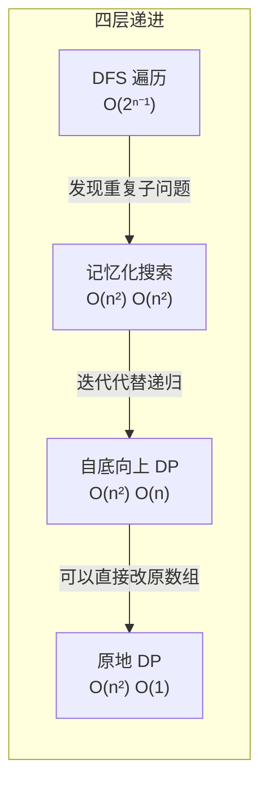
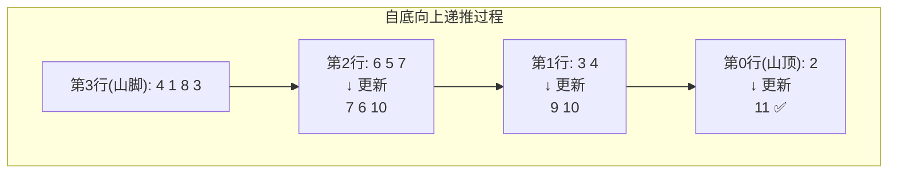

---

title: "三角形最小路径和"

difficulty: 中等

category: 动态规划

tags:

  - leetcode

  - 动态规划

created: "2026-07-21"

---

# 120. 三角形最小路径和（Triangle）

> 难度：中等 | 主题：动态规划、数组

## 题目

给定一个三角形 triangle，找出自顶向下的最小路径和。每一步只能移动到下一行中相邻的节点上。相邻的节点指的是下标与上一层节点下标相同或者等于上一层节点下标+1的两个节点。

**示例**

```python

输入：triangle = [[2],[3,4],[6,5,7],[4,1,8,3]]

输出：11

解释：2→3→5→1 路径最小和

```

---

## 思路
### 先讲个故事：下山选路

你和朋友去爬山，山顶到山脚有好多条路。规则是：**每次只能往左前方或右前方走一步**。你想找一条总体力消耗最小的下山路线。

山顶是 2，下一层左边 3、右边 4。选 3 还是 4？你看了眼山脚说："我不看眼前，我要看**从每个点走到山脚的最小消耗**。"这就是自底向上 DP 的核心思想——**先算清楚山脚，再倒推上去**。

---

### 引导式推导：从下往上倒推

拿示例三角形，从山脚开始：

```text

山脚（第 3 行）： [4, 1, 8, 3]

从这一层的每个位置走到山脚的最小和 = 它们自己（已经到山脚了）

```

**倒数第 2 行（第 2 行）**：`[6, 5, 7]`

- 从 6 出发：min(下一层左边 4, 下一层右边 1) + 6 = 1 + 6 = 7

- 从 5 出发：min(1, 8) + 5 = 1 + 5 = 6

- 从 7 出发：min(8, 3) + 7 = 3 + 7 = 10

- → 这层的最小和数组变为：`[7, 6, 10]`

**倒数第 3 行（第 1 行）**：`[3, 4]`

- 从 3 出发：min(7, 6) + 3 = 6 + 3 = 9

- 从 4 出发：min(6, 10) + 4 = 6 + 4 = 10

- → `[9, 10]`

**山顶（第 0 行）**：`[2]`

- 从 2 出发：min(9, 10) + 2 = 9 + 2 = 11 ✅

**核心洞察**：每个位置的最小路径和 = 当前值 + min(下一行两个相邻位置的最小路径和)。

```text

dp[j] = triangle[i][j] + min(dp[j], dp[j+1])

```

dp[j] 表示从当前行第 j 列走到最后一行的最小路径和。从下往上更新，dp 数组长度越来越短。

---

### 四层递进：从 DFS 到原地 DP



**暴力 DFS**：从山顶到山脚，每步 2 种选择，共 2^(n-1) 条路径。n=50 时比宇宙原子还多。

**记忆化搜索**：用 `memo[i][j]` 缓存从 (i,j) 到山脚的最小和，避免重复计算。O(n²) 时间和空间。

**自底向上 DP**：从倒数第二行往上推，每层只依赖下一层。用一维数组 dp 滚动更新，空间 O(n)。

**原地 DP**：直接在原三角形上修改，`triangle[i][j] += min(triangle[i+1][j], triangle[i+1][j+1])`。空间 O(1)。



---

## 代码

```python

def minimumTotal(self, triangle):            # 主函数：输入三角形，返回自顶向下的最小路径和

    n = len(triangle)                        # 获取三角形的行数

    # dp[j] 表示从当前行第 j 列走到最底层的最小路径和

    # 初始化为最底层

    dp = triangle[n - 1][:]                  # 初始化dp为最底层的一行副本，作为递推起点

    # 从倒数第二行开始往上递推

    for i in range(n - 2, -1, -1):           # 自底向上遍历每一行，从倒数第二行到第0行

        for j in range(i + 1):               # 遍历当前行的每一列（第i行有i+1个元素）

            # 当前位置的最小路径和 = 当前值 + 下一层两个相邻位置的较小值

            dp[j] = triangle[i][j] + min(dp[j], dp[j + 1])  # dp[j]和dp[j+1]是下一层的值

    return dp[0]                             # dp[0]最终存储从顶点到底部的最小路径和

```

---

## 复杂度

| 指标 | 值 | 解释 |

|------|----|------|

| 时间 | O(n²) | 遍历整个三角形 |

| 空间 | O(n) | 一维 DP 数组，长度 = 最底层长度 |

| 原地 DP | O(1) | 直接修改原数组，可提但慎用 |

---

## 实战考量
### 频率分析

> **出现在**：字节/美团 一面～二面，DP 入门进阶题。约 25% 的 AI Agent 会用三角形路径和来考察**自底向上思维**——这是区分"背模板"和"真懂 DP"的关键题。

### 延伸思考

**Q：为什么自底向上比自顶向下好？**

A：自顶向下需要处理边界——最左边只能从右上走来，最右边只能从左上走来，要单独判断。自底向上每个位置都有两个子节点（不存在边界问题），代码更统一简洁。

**Q：自顶向下怎么做？**

A：`dp[i][j] = triangle[i][j] + min(dp[i-1][j-1], dp[i-1][j])`，两侧特殊处理。最后遍历最后一层取 min。

**Q：如果要求输出具体路径呢？**

A：额外维护一个 `parent[i][j]` 记录从 (i,j) 往下选的是 j 还是 j+1，最后从顶到底回溯。

**Q：原地 DP 有什么风险？**

A：会修改原始数据。如果函数外部还要用原数据，就不能用。实践中提"可以原地优化"是个加分点，但最好用副本。

**Q：如果三角形不是标准等腰的（每行长度不递增）呢？**

A：自底向上仍然可用，但 `dp[j]` 和 `dp[j+1]` 需要小心边界。一般题目保证行 i 有 i+1 个元素。

### 易错点

- 自底向上从 `n-2` 开始，不是 `n-1`

- `dp[j]` 和 `dp[j+1]` 是下一层的值，更新后变成当前层的值

- 原地 DP 会影响外部数据

---

## 生活类比

> **最小路径和 → 下山选路 → 自底向上倒推**

>

> 下山时你站在山顶看不到哪条路最省力。但山脚的人可以告诉你"站在我这个位置到山脚已经很近了"（dp 基础值）。倒数第二层的人问山脚的人"我走左边还是右边到山脚更省力？"（min 选择），再往上类推。最终山顶的你说——我不需要试所有路，只要知道"站在每个位置到山脚的最优值"，一步步倒推回来就行。**先算好脚下，再决定上面**——这就是 DP 的精髓。

---

## 相关题目

| 题目 | 关系 |

|------|------|

| [[64最小路径和]] | 同样思路，网格版自底向上 |

| [[62不同路径]] | 路径计数，无权重版 |

| [[63不同路径II]] | 有障碍物的路径计数 |

| 118杨辉三角 | 三角形数据结构基础 |

| 120三角形最小路径和 | 本题，三角形 DP 入门 |

---

→ 返回题单：[[LeetCode学习路线图#十三、动态规划]]

## 速记卡（面试闪卡）

**Q1：一句话讲清「120. 三角形最小路径和（Triangle）」到底是什么？**

A：从三角形顶到每个点只能走相邻下一行，求最小路径和——自底向上 DP，每个点 = 自己 + min(左下, 右下)。

**Q2：题目本质 —— 怎么理解？**

A：像下山选路：每次只能往左前或右前走一步，找总体力消耗最小的路线。你站在山顶看不到哪条省力，但山脚的人能告诉你「站我这到山脚很近」——先算好脚下再决定上面。英语 Triangle Minimum Path Sum。

**Q3：思路：自底向上 DP —— 怎么理解？**

A：核心洞察：每个点最小路径和 = 当前值 + min(下一行两个相邻点的最小和)。从山脚倒推：dp[j] = triangle[i][j] + min(dp[j], dp[j+1])。自底向上每个位置都有两个子节点，无边界麻烦，比自顶向下更省心。

**Q4：四层递进：DFS→原地 DP —— 怎么理解？**

A：暴力 DFS 2^(n-1) 条路径爆炸 → 记忆化 O(n²) → 自底向上一维 dp 滚动 O(n) → 原地 DP 直接改原数组 O(1)。像剥洋葱从外往里，先算山脚再一层层推回山顶。

**Q5：复杂度与实战 —— 怎么理解？**

A：时间 O(n²)（遍历整三角形），空间 O(n)（一维 dp）；原地 DP O(1) 但要改原数据慎用。实战考自底向上思维，是区分「背模板」和「真懂 DP」的关键题。

**Q6：核心速记主线有哪些？**

- 每点最小和 = 自身 + min(左下, 右下) 相邻点

- 自底向上倒推，dp[j] = tri[i][j] + min(dp[j], dp[j+1])

- 从 n-2 行起推，dp 初始化为最底层

- 时间 O(n²)、空间 O(n)；原地 DP O(1) 慎用

**口诀**

A：三角形路径

自底向上倒着走

先算山脚再推顶

最小和值手里搂

## 相关链接

- [[笔记/Leetcode笔记/13_动态规划/64最小路径和|最小路径和]]

- [[笔记/Leetcode笔记/13_动态规划/63不同路径II|不同路径II]]

- [[笔记/Leetcode笔记/13_动态规划/62不同路径|不同路径]]

- [[笔记/Leetcode笔记/13_动态规划/221最大正方形|最大正方形]]

- [[笔记/Leetcode笔记/13_动态规划/746最小花费爬楼梯|最小花费爬楼梯]]

