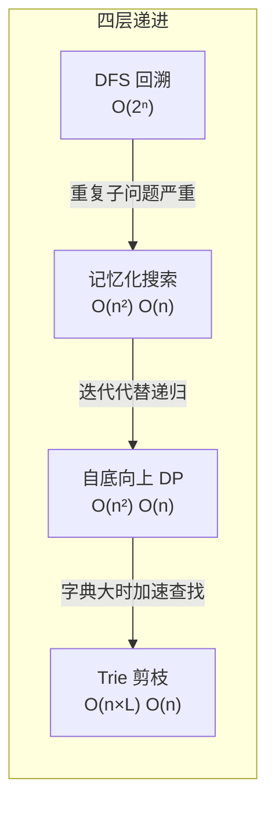
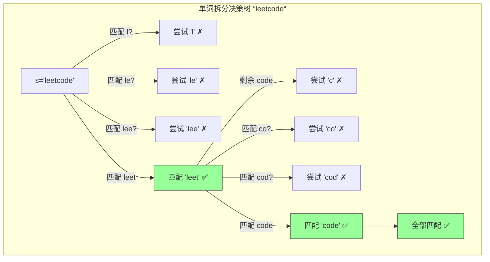

---

title: "单词拆分"

difficulty: 中等

category: 动态规划

tags:

  - leetcode

  - 动态规划

created: "2026-07-21"

---

# 139. 单词拆分（Word Break）

> 难度：中等 | 主题：动态规划、字符串、哈希

## 题目

给你一个字符串 s 和一个字符串列表 wordDict 作为字典。如果可以利用字典中出现的一个或多个单词拼接出 s 则返回 true。字典中的单词可以重复使用。

**示例**

输入：s = "leetcode", wordDict = ["leet","code"]

输出：true

---

## 思路
### 先讲个故事：拼乐高

你买了一盒乐高，说明书上写着最终成品是 "leetcoderocks"。你手里只有标准零件：["leet", "code", "rocks"]。能不能拼出来？

你把说明书从前往后比划：

- "leet" ← 有！→ 剩下 "coderocks"

- "code" ← 有！→ 剩下 "rocks"

- "rocks" ← 有！→ 完成 ✅

但如果你的零件只有 ["lee", "tco", "de"]，那怎么都对不上。单词拆分就是：**判断字符串能不能完全由字典中的单词拼接而成**，每个单词可以用任意多次。

---

### 引导式推导：从手动拼接到找公式

拿 s = "leetcode", wordDict = ["leet", "code"]，手动试试怎么拆：

**看前 4 个字符 "leet"**：在字典里 → s[:4] 可拆分 ✅

**看前 8 个字符 "leetcode"**：前 4 个可拆分 + 后 4 个 "code" 在字典里 → 整体可拆分 ✅

换个复杂点的例子 s = "applepenapple", wordDict = ["apple", "pen"]：

```text

i=5  "apple"  → 在字典里 → dp[5] = True

i=8  "applepen" → 枚举分割点 j=5: dp[5]=True + s[5:8]="pen"在字典里 → dp[8]=True

i=13 "applepenapple" → j=8: dp[8]=True + s[8:13]="apple"在字典里 → dp[13]=True ✅

```

**发现规律**：

```text

dp[i] = any(dp[j] AND s[j:i] in wordDict for j in range(i))

```

`dp[i]` 表示 s[:i]（前 i 个字符）能否被拆分。对于每个结束位置 i，**枚举一个分割点 j**，如果前段可拆分、后段是单词，则整体可拆分。

---

### 四层递进：从回溯到剪枝



**DFS 回溯**：从开头试每个单词，匹配成功就递归试剩下的。但 s="aaaaab", dict=["a","aa","aaa"]，匹配 "a"+"a"+"a" 和 "aa"+"a" 的剩余部分都是 "ab"，被重复算了无数遍。

**记忆化搜索**：用 `@lru_cache` 缓存已计算过的子串结果。时间 O(n²)，递归栈仍占空间。

**自底向上 DP**：`dp[i]` 表示 s[:i] 能否拆分。两层循环：外层遍历 i（结束位置），内层遍历 j（分割点）。找到一个合法分割就 break。

**Trie 树剪枝**：当 wordDict 很大时（十万级），枚举所有 j 并切片 s[j:i] 太慢。用 Trie 树从当前 i 向前匹配字典中的单词，只尝试字典中实际存在的单词长度。



---

## 代码

```python

def wordBreak(self, s, wordDict):

    word_set = set(wordDict)                   # 转集合：O(1) 查找，避免列表 O(n) 遍历

    n = len(s)

    dp = [False] * (n + 1)                     # dp[i] = s[:i] 能否被拆分，多开一位方便处理空串

    dp[0] = True                               # 空字符串可以被拆分，这是 DP 的基线条件

    for i in range(1, n + 1):                  # 遍历每个结束位置 i，即考察 s[:i]

        for j in range(i):                     # 遍历每个分割点 j，将 s[:i] 分成 s[:j] 和 s[j:i]

            if dp[j] and s[j:i] in word_set:   # 前段可拆分 且 后段是字典中的单词

                dp[i] = True                   # s[:i] 可拆分

                break                          # 找到一个就行，提前结束内层循环（剪枝）

    return dp[n]                               # 返回整个字符串 s[:n] 的可拆分性

```

---

## 复杂度

| 指标 | 值 | 解释 |

|------|----|------|

| 时间 | O(n²) | 两层循环，n 为字符串长度 |

| 空间 | O(n) | 一维 DP 数组 + set 空间 |

| 暴力回溯 | O(2ⁿ) | 指数爆炸，n=50 就完蛋 |

---

## 实战考量
### 频率分析

> **出现在**：字节/阿里 进阶，完全背包 DP 的代表题。约 30% 的 AI Agent 常会从这题考察**状态定义能力**——你能不能把"拼接"问题抽象成一维 DP。

### 延伸思考

**Q：为什么 `dp[0] = True`？**

A：空串是任何拆分的基础。如果 s[:j] 能拆且 s[j:i] 是单词，那 s[:i] 就能拆。当 j=0 时，我们需要 s[0:i] 本身就是单词，这要求 dp[0] 为 True 才能触发。

**Q：wordDict 为什么先转 set？**

A：列表的 `in` 是 O(m)，m 是字典大小。set 的 `in` 是 O(1)。如果 wordDict 有几千个单词，set 能省几千倍时间。

**Q：内层循环为什么用 break？**

A：本题只问"能不能"，找到一个合法分割点就证明可拆分，不需要继续枚举。这是典型的 **剪枝** 思想。

**Q：如果要求返回所有拆分方案呢？（140 题）**

A：回溯 + 记忆化（`@lru_cache`）。DP 只回答"能不能"（存在性问题），回溯告诉你"有哪些"（构造性问题）。先做 DP 预处理，再用 DFS 回溯所有方案。

**Q：如果 wordDict 非常大（十万级）怎么办？**

A：O(n²) 枚举所有 j 会太慢。用 **Trie 树** 从位置 i 向前匹配：只尝试字典中实际存在的单词长度，跳过不可能的分割点。

**Q：能不能用 BFS 做？**

A：可以。把每个位置 i 看作节点，从 i 出发能到达 i+len(w)（如果 s[i:i+len(w)] 在字典中）。BFS 从 0 出发，看能不能到达 n。但 DP 更直观，推荐 DP。

### 易错点

- `dp[0] = True` 不能忘，空串是可拆分的基线条件

- `wordDict` 要先转 `set`，否则性能会差一个数量级

- `s[j:i]` 切片左闭右开（不含 s[i]）

- 内层 `break` 只跳出内层循环，不影响外层

---

## 生活类比

> **单词拆分 → 拼乐高 → 一维 DP**

>

> 单词拆分就像拼乐高：你有一串长长的成品（s），手里有标准零件包（wordDict）。你从前往后拼，每拼好一段就问自己"前面拼好的部分能拼出来吗？"（dp[j]），然后看"手上这段是不是标准零件"（s[j:i] in word_set）。全部拼完就是 True。DP 优化就是——你不需要试所有拼接顺序，只需要记住"到第 i 步为止能不能拼出来"，一步步往前推。

---

## 相关题目

| 题目 | 关系 |

|------|------|

| 91解码方法 | 同为字符串 DP，一维状态定义可类比 |

| [[322零钱兑换]] | 完全背包模板，单词换成硬币 |

| [[300最长递增子序列]] | 一维 DP，状态定义类似 |

| 139单词拆分 | 本题，字符串 DP 入门 |

---

→ 返回题单：[[LeetCode学习路线图#十三、动态规划]]

## 速记卡（面试闪卡）

**Q1：一句话讲清「139. 单词拆分（Word Break）」到底是什么？**

A：判断字符串能否由字典单词拼成，用一维 DP 记前 i 个字符可否拆分。

**Q2：一、题目与拼接本质 —— 怎么理解？**

A：像手里有标准乐高零件，问能不能从前往后拼出整串成品。每个单词可重复使用，能拼出返回 true（Word Break）。

**Q3：二、一维 DP 思路 —— 怎么理解？**

A：像每拼好一段就记"到这步能不能拼出来"，逐步往前推。dp[i]=任意 dp[j] 且 s[j:i] 在字典，空串 dp[0]=True（1D DP）。

**Q4：三、集合与剪枝 —— 怎么理解？**

A：像把零件转成哈希表 O(1) 秒查，找到一处合法就 break 跳出。大字典可用 Trie 从前匹配加速（Set Lookup & Pruning）。

**Q5：四、复杂度与易错点 —— 怎么理解？**

A：像两层循环摸遍分割点，时间 O(n²) 空间 O(n)。易错在忘 dp[0]=True、wordDict 先转 set（Time/Space Complexity）。

**Q6：核心速记主线有哪些？**

- 判断字符串能否完全由字典单词拼接

- dp[i]：前 i 字符可否拆，dp[0]=True 基线

- wordDict 转 set 做 O(1) 查找，找到即 break

- 时间 O(n²) 空间 O(n)，大字典用 Trie

**口诀**

A：拼字如拼乐高，

逐段记可拆；

空集是基线，

字典查得快。

## 相关链接

- [[笔记/Leetcode笔记/13_动态规划/118杨辉三角|杨辉三角]]

- [[笔记/Leetcode笔记/13_动态规划/63不同路径II|不同路径II]]

- [[笔记/Leetcode笔记/13_动态规划/416分割等和子集|分割等和子集]]

- [[笔记/Leetcode笔记/13_动态规划/62不同路径|不同路径]]

- [[笔记/Leetcode笔记/13_动态规划/213打家劫舍II|打家劫舍II]]

