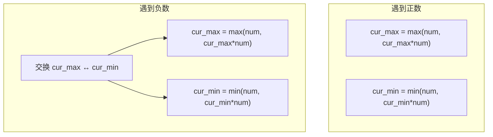

---

title: "乘积最大子数组"

difficulty: 中等

category: 动态规划

tags:

  - leetcode

  - 动态规划

created: "2026-07-21"

---

# 152. 乘积最大子数组（Maximum Product Subarray）

> 难度：中等 | 主题：动态规划、数组

## 题目

给你一个整数数组 `nums`，找出数组中乘积最大的**非空连续子数组**（至少包含一个数字），返回该子数组的乘积。

**示例**

```text

输入：nums = [2,3,-2,4]

输出：6

解释：子数组 [2,3] 积最大

```

---

## 思路
### 先讲个故事：股神的秘密武器

假设你是基金经理，每天盯着净值曲线。

基金经理甲只会加法——"今天涨了多少？累计涨了多少？跌了就清仓重来。" 这是 [[53最大子数组和]] 的思路。

但你是老江湖，知道一个秘密：**连着跌两天，有时反而比只跌一天赚得多**。

比如 -50%、-50%、+200%，三天合计还是正数。这就是"负负得正"。

所以你不能只看"最大涨幅"，还得盯着"最差表现"——因为最差的那个再遇到一个坏消息，会翻身变成最好的。

---

### 引导式推导：为什么一个变量不够？

**加法（53 题）的思维**很直接：`dp[i] = max(num, dp[i-1] + num)`，负数只会拖累，没有利用价值。

**但乘法不同**——手动枚举 `nums = [2, 3, -2, 4]`：

```text

子数组       乘积

[2]          2

[2,3]        6      ← 最大

[2,3,-2]     -12

[2,3,-2,4]   -48

[3]          3

...

```

**只跟踪最大值行不行？**

```text

i=0: cur_max = 2              → 没问题

i=1: cur_max = max(3, 6) = 6  → 没问题

i=2: cur_max = max(-2, -12) = -2  → 还行

i=3: cur_max = max(4, -8) = 4     → 答案 4，错了！最优是 6（[2,3]）

```

等等，这里我们虽然丢掉了全局最大 6，但多亏 `res` 已经记住了它。但换个场景就真出问题了：

```text

nums = [-2, 3, -4]

// 只跟踪最大值

i=0: cur_max = -2

i=1: cur_max = max(3, -6) = 3

i=2: cur_max = max(-4, -12) = -4   ← 答案 -4，但实际最优是 24（(-2)*3*(-4)）

```

**为什么？** 因为 `cur_max = 3` 时，遇到 `-4` 变成 `3 * (-4) = -12`。但潜在的最优解藏在"最小值"里——`cur_min` 在 i=1 时应该是 `min(3, -6) = -6`，遇到 `-4` 后 `(-6) * (-4) = 24`。

**核心洞察：必须同时维护最大值和最小值。**



**递推公式：**

```text

cur_max[i] = max(nums[i], nums[i]*cur_max[i-1], nums[i]*cur_min[i-1])

cur_min[i] = min(nums[i], nums[i]*cur_max[i-1], nums[i]*cur_min[i-1])

```

**为什么遇到负数要先交换？** 乘负数会反转大小关系。假设 `cur_max=6, cur_min=-12`，遇到 `num=-2`：

- 不交换：`cur_max * (-2) = -12`, `cur_min * (-2) = 24` —— 24 成了"最大值"，但实际 24 来自最小值路线

- 交换后：`cur_max=-12, cur_min=6` → `cur_max * (-2) = 24`, `cur_min * (-2) = -12` —— 正确

---

## 代码

```python

def maxProduct(self, nums):

    if not nums:

        return 0

    res = cur_max = cur_min = nums[0]

    for i in range(1, len(nums)):

        num = nums[i]

        if num < 0:

            cur_max, cur_min = cur_min, cur_max

        cur_max = max(num, cur_max * num)

        cur_min = min(num, cur_min * num)

        res = max(res, cur_max)

    return res

```

---

## 复杂度

| 指标 | 值 | 解释 |

|------|----|------|

| 时间 | O(n) | 一次遍历 |

| 空间 | O(1) | 三个滚动变量 |

---

## 实战考量
### 频率分析

> **出现在**：字节/美团/阿里 约 40% 的 AI Agent 常会考到这个。核心考察点不是代码本身，而是**你能否说清楚"为什么加法要一个变量，乘法要两个"**。

### 延伸思考

**Q：为什么不能像 53 题只维护一个最大值？**

A：加法单调，负数只会拖累。但乘法中两个负数相乘得正数，会出现"负负得正"的翻转。如果不跟踪最小值，遇到两个负数相隔的情况（如 [-2, 3, -4]），就会错过最优解 24。

**Q：遇到负数的代码逻辑为什么是先交换再计算？**

A：乘负数会反转大小关系。如果不交换，计算 `cur_max * num` 时用的是已经反转了的语义——本该从最小值路线取的值却出现在最大值路线。交换保证了语义正确。

**Q：`cur_max = max(num, cur_max * num)` 里的 `num` 代表什么？**

A：代表"从当前元素重新开始一个新子数组"。这是 Kadane 算法的核心决策——要么接上前面的子数组继续乘，要么抛弃历史自己重新来。

**Q：如果数组全负数呢？比如 [-3, -1, -2]？**

A：答案应该是 -1（单个最大负数）。初始化 `res = nums[0]` 保证了这一点。如果初始化为 0，`max(0, -3) = 0` 就错了——子数组不能为空。

**Q：数组中有 0 会怎样？**

A：遇到 0 时 `cur_max = cur_min = 0`，相当于"重置"。下一轮 `max(num, 0 * num) = num` 从当前元素重新开始。0 天然就是子数组的分隔符。

**Q：可以优化空间复杂度吗？**

A：已经是 O(1) 了。但如果你用 `dp_max[i]` 和 `dp_min[i]` 数组写，是 O(n) 空间。实践中先写数组版再优化到滚动变量，能展示优化意识。

### 易错点

- 遇到负数**先交换再计算**，顺序不能反

- `res` 初始化为 `nums[0]` 不是 0（防全负数数组）

- 交换的是变量值本身，不是乘积值

- 与 [[53最大子数组和]] 对比记忆：加法单变量，乘法双变量

---

## 生活类比

> **乘积最大值 → 双变量滚动 → 风险对冲**

>

> 管理投资组合时，你不仅要看"最好情况"，还得盯着"最坏情况"——因为最坏的那个再遇上坏消息，反而可能翻身做老大。

> 所谓风险管理，就是同时乐观和悲观两个角度，并在它们互换时及时调仓。

---

## 相关题目

| 题目 | 关系 |

|------|------|

| [[53最大子数组和]] | 同类 Kadane 算法，加法只需单变量 |

| 198打家劫舍 | 线性 DP 递推模板 |

| 70爬楼梯 | 一维 DP 入门，滚动变量优化思路一致 |

---

→ 返回题单：[[LeetCode学习路线图#十三、动态规划]]

## 速记卡（面试闪卡）

**Q1：一句话讲清「152. 乘积最大子数组（Maximum Product Subarray）」到底是什么？**

A：给一个整数数组，找乘积最大的非空连续子数组，返回该乘积。本质是带符号翻转的一维 DP。

**Q2：题目与风险对冲 —— 怎么理解？**

A：像基金经理管组合——不能只看「最好情况」，还得盯着「最坏情况」，因为最坏的那个再遇上一个坏消息，反而可能翻身做老大。乘法里「负负得正」会翻转最优解，这就是和加法题（53 题）的本质区别。

**Q3：思路与双变量 —— 怎么理解？**

A：加法的 53 题只需维护一个最大值，但乘法必须同时维护 cur_max 和 cur_min。原因是乘负数会反转大小关系：潜在最优解常常藏在「最小值」路线里。遇到负数要先交换 cur_max 与 cur_min 再计算。

**Q4：代码与易错点 —— 怎么理解？**

A：`res = cur_max = cur_min = nums[0]`——初始化成 nums[0] 而不是 0，否则全负数数组会出错（子数组不能为空）；`num < 0` 时先交换再算。Kadane 算法的核心是「要么接上前面，要么从当前元素重新开始」。

**Q5：复杂度与延伸 —— 怎么理解？**

A：时间 O(n)、空间 O(1)（三个滚动变量）。遇到 0 时 cur_max = cur_min = 0，相当于天然分隔符。与 53 题对比记忆：加法单变量，乘法双变量。

**Q6：核心速记主线有哪些？**

A：题目、双变量核心、遇负交换、res 初始化、0 重置、与 53 题对比。

**口诀**

A：乘积最大双变量，负负得正要提防；

遇负先换再计算，res 初值莫设零。

## 相关链接

- [[笔记/Leetcode笔记/13_动态规划/221最大正方形|最大正方形]]

- [[笔记/Leetcode笔记/13_动态规划/63不同路径II|不同路径II]]

- [[笔记/Leetcode笔记/13_动态规划/213打家劫舍II|打家劫舍II]]

- [[笔记/Leetcode笔记/13_动态规划/300最长递增子序列|最长递增子序列]]

- [[笔记/Leetcode笔记/13_动态规划/32最长有效括号|最长有效括号]]

