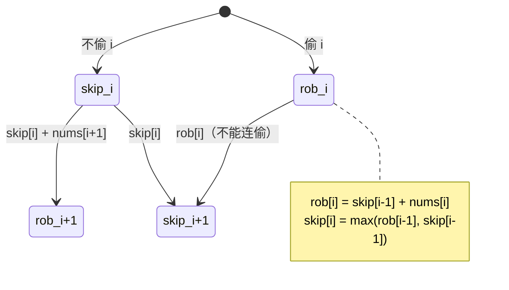

# 198. 打家劫舍（House Robber）

> 难度：中等 | 主题：动态规划、数组

## 题目

你是一个专业的小偷，计划偷窃沿街的房屋。每间房内都有现金，但**相邻的房屋**装有连通的防盗系统——如果同一晚上偷了两间相邻的房子，警报会响。

给定一个非负整数数组 `nums`（每间房的金额），计算**不触动警报**的情况下能偷到的最高金额。

**示例**
```text
输入：nums = [1,2,3,1]
输出：4
解释：偷第 1 间（1）+ 第 3 间（3）= 4
```

---

## 思路

### 先讲个故事：精致的邻居派对

你是一个派对达人，住在一排公寓楼里。今晚每层都在开派对，但规定很奇葩：**你不能连续参加两层楼的派对**——因为连续两层都出现会被邻居发现你翘班。

于是你开始盘算：今晚要去哪几层，才能吃到最多的美食？

---

### 引导式推导：从最后一层往前想

**第 1 步：对第 i 层，只有两个选项**

到第 i 层时，你面临经典的两难选择：

| 选择 | 后果 | 总美食 |
|------|------|--------|
| ✅ 参加 i 层派对 | 不能参加 i-1 层 | `nums[i] + dp[i-2]` |
| ❌ 跳过 i 层 | 可以自由参加 i-1 层 | `dp[i-1]` |

最优就是两者取大：`dp[i] = max(nums[i] + dp[i-2], dp[i-1])`

**第 2 步：手算验证**

```text
nums = [1, 2, 3, 1]

i=0：dp[0] = 1           ← 只有一层，必参加
i=1：dp[1] = max(1, 2) = 2    ← 参加第 2 层，放弃第 1 层
i=2：dp[2] = max(3+1, 2) = 4   ← 参加第 1、3 层
i=3：dp[3] = max(1+2, 4) = 4   ← 参加第 1、3 层，放弃第 4 层
```

**第 3 步：状态机视角（另一种理解方式）**

除了用 `dp[i]` 表示"到第 i 家为止的最大金额"，还可以用两个状态：

```text
rob[i]  = skip[i-1] + nums[i]     // 偷第 i 家 = 没偷上一家 + 当前
skip[i] = max(rob[i-1], skip[i-1]) // 不偷第 i 家 = 上一家偷或不偷的最大值
最终结果 = max(rob[n-1], skip[n-1])
```



**第 4 层：空间优化**

`dp[i]` 只依赖 `dp[i-1]` 和 `dp[i-2]`——两个滚动变量足矣。

```mermaid
graph LR
    a["a = dp[i-2]"] -->|迭代一次| b["b = dp[i-1]"]
    b --> c["max(b, nums[i] + a) = dp[i]"]
    c -->|下一轮: a=b, b=dp[i]| a
```

---

## 代码

```python
def rob(self, nums):
    if not nums:
        return 0
    if len(nums) <= 2:
        return max(nums)

    prev2 = nums[0]
    prev1 = max(nums[0], nums[1])

    for i in range(2, len(nums)):
        curr = max(prev1, nums[i] + prev2)
        prev2, prev1 = prev1, curr

    return prev1
```

---

## 复杂度

| 指标 | 值 | 解释 |
|------|----|------|
| 时间 | O(n) | 一次遍历 |
| 空间 | O(1) | 两个滚动变量 |

---

## 实战考量

### 频率分析

> **出现在**：字节/美团/腾讯 DP 题，约 50% 常会从这道题开始线性 DP 部分。它是"相邻决策"问题的**基础模板**，后续所有变体（环形、树形、带权重）都基于此。

### 延伸思考

**Q：为什么不能贪心——每次都偷不相邻的最大值？**
A：贪心的局部最优不等于全局最优。比如 `[2, 1, 1, 2]`，贪心先偷第 1 家（2），然后只能偷第 4 家（2），总和 4。但最优是偷第 2 家（1）+ 第 4 家（2）= 3……等等，不对。实际最优是偷第 1 家（2）+ 第 4 家（2）= 4。换个例子 `[2, 8, 9, 3]`：贪心选 9（第 3 家），左右都不能偷，总和 9。但最优是 8 + 3 = 11。贪心失败因为"选了这个就不能选那个"的约束需要全局权衡。

**Q：如果房子排成环形呢？**
A：见 213打家劫舍II——第一家和最后一家相邻，拆成两个线性子问题。

**Q：如果房子是二叉树结构呢？**
A：见 [[337打家劫舍III]]——树形 DP，每个节点返回 [偷, 不偷] 两个值，后序遍历递推。

**Q：如果要求输出偷了哪些家呢？**
A：额外维护一个 `choice` 数组记录每个位置的选择来源（偷/不偷），最后从末尾回溯。实践中这种"输出方案"的追问很常见。

**Q：空间复杂度还能优化吗？**
A：已经是 O(1) 了。但如果考虑"不能修改原数组"这个前提，O(1) 就是最优。

### 易错点

- 边界：空数组返回 0，1 个元素返回 `nums[0]`，2 个元素返回 `max(nums)`
- 滚动变量更新顺序：`prev2, prev1 = prev1, curr` 并行赋值（先算右边再赋左边）
- 递推公式的 `nums[i] + dp[i-2]` 中 `dp[i-2]` 不是 `dp[i-1]`

---

## 生活类比

> **打家劫舍 → 相邻约束 → 滚动变量**
>
> 就像安排旅行行程：你不能连续两天去两个不同的城市（赶不上车），所以每一天你都要决定"今天出发"还是"再住一天"。
> 所谓最优行程，就是每天都做这个简单选择，但全局结果最优。

---

## 相关题目

| 题目 | 关系 |
|------|------|
| 213打家劫舍II | 环形进阶，拆环为线 |
| [[337打家劫舍III]] | 树形 DP 版，后序遍历 |
| 70爬楼梯 | 同族一维 DP，计数变求 max |

---

→ 返回题单：[[LeetCode学习清单#十三、动态规划]]
