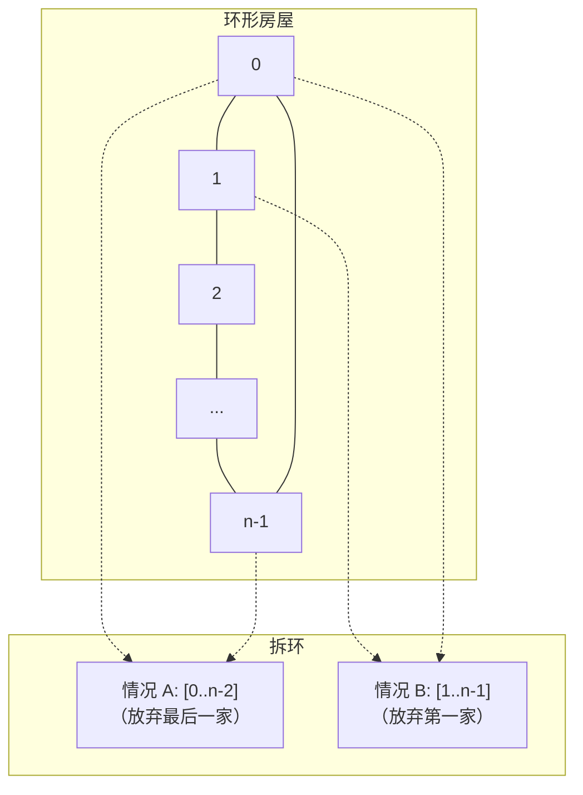

# 213. 打家劫舍 II（House Robber II）

> 难度：中等 | 主题：动态规划、环形数组

## 题目

你是一个专业小偷，沿街的房屋**围成一圈**（首尾相连）。相邻房屋装有连通的防盗系统，不能同一晚上偷两间相邻的房。

给定非负整数数组 `nums`，计算不触动警报的最高金额。

**示例**
```text
输入：nums = [2,3,2]
输出：3
解释：环形，不能同时偷首尾 → 偷第 2 间（3）
```

---

## 思路

### 先讲个故事：圆桌宴席

你参加一场圆桌晚宴，每道菜都放在不同位置，但规定：**不能吃相邻的两道菜**（太油腻了）。

问题来了——因为桌子是圆的，第一道菜和最后一道菜也是"相邻"的。

你不能既吃头盘又吃尾盘。怎么办？很简单：
- 方案 A：放弃尾盘，只看第 1 道到倒数第 2 道
- 方案 B：放弃头盘，只看第 2 道到最后一道

两种方案分别求最优，取更大的那个。

---

### 引导式推导：拆环为线

**核心变化：首尾相邻**

198打家劫舍 的直线排列可以同时偷第一家和最后一家。但本题是环形——不能同时选首尾。

**解决方案：分两种情况讨论**

```text
情况 1：不偷最后一家 → 在 nums[0..n-2] 上做 198 题 DP
情况 2：不偷第一家   → 在 nums[1..n-1] 上做 198 题 DP
取两者 max
```



**为什么这样覆盖了所有可能？**

最优解只有两种可能性：
1. 包含第一家 → 不能包含最后一家 → 在 `[0..n-2]` 上求解
2. 不包含第一家 → 可以包含最后一家 → 在 `[1..n-1]` 上求解

**没有第三种情况**——因为"包含第一家"和"不包含第一家"是互斥且完备的划分。

---

## 代码

```python
def rob(self, nums):
    def rob_range(start, end):        # 198 题线性 DP，偷 [start, end]
        prev2 = prev1 = 0
        for i in range(start, end + 1):
            cur = max(prev1, prev2 + nums[i])
            prev2, prev1 = prev1, cur
        return prev1

    n = len(nums)
    if n == 1:                        # 仅一间房，环形退化
        return nums[0]
    # 两种情况取最大值
    return max(rob_range(0, n - 2), rob_range(1, n - 1))
```

---

## 复杂度

| 指标 | 值 | 解释 |
|------|----|------|
| 时间 | O(n) | 两次线性扫描，各 O(n) |
| 空间 | O(1) | 滚动变量，不依赖 n |

---

## 实战考量

### 频率分析

> **出现在**：198 打家劫舍的**经典追问**，约 60% 的在考完 198 后会追问"如果是环形呢？"核心考察点不是 DP 本身，而是**"环形转线性"的拆解能力**。

### 延伸思考

**Q：为什么环形不能直接用 DP？**
A：因为首尾相邻，`dp[0]` 和 `dp[n-1]` 互相依赖，形成了循环依赖。直接递推会被环卡住——你不知道 `dp[0]` 该不该包含第一家，因为最后一家可能含也可能不含它。拆环成两个线性子问题是标准解法。

**Q：`n == 1` 为什么要单独处理？**
A：`rob_range(0, -1)` 的 `range(0, -1)` 是空 range，会返回 0。但 `rob_range(1, 1)` 会返回 `nums[1]`。如果 n=1，`max(0, nums[1])` 会 IndexError（索引越界）。所以必须单独处理。

**Q：两个子问题的结果取 max 还是 sum？**
A：**max**。因为最优解只属于其中一种情况（要么放弃第一家，要么放弃最后一家），不是两种情况的并集。

**Q：如果环形问题有三个以上约束呢？**
A：那可能需要更复杂的分类讨论，或者用状态机建模。打家劫舍 III（[[337打家劫舍III]]）就是树形结构，每个节点返回"偷/不偷"两个状态值，后序遍历合并。

**Q：跟 198 题比，代码复杂度增加了多少？**
A：只多了一个 `rob_range` 辅助函数和 `max(两种, 情况)` 的外壳。内部 DP 逻辑完全复用。这种"不变中求变"正是这道题的精髓。

### 易错点

- `n == 1` 必须单独处理（`rob_range(0, -1)` 会导致 range 为空）
- 两个子问题取 `max` 不是 `sum`
- `rob_range` 的参数是 `end`（闭区间），不是 `length`
- 复用 198 题的滚动变量写法时，`prev2` 和 `prev1` 初始化为 0（而非 `nums[0]`）

---

## 生活类比

> **环形打家劫舍 → 拆环为线 → 已学复用**
>
> 就像圆桌会议排座位——你不能让 CEO 和 CTO 相邻（吵起来）。
> 但因为桌子是圆的，你不能只排一边。解决方案：先假设 CEO 不在场排一次，再假设 CTO 不在场排一次，取最好的方案。
> 很多复杂约束问题，都可以通过"固定一个变量"来简化。

---

## 相关题目

| 题目 | 关系 |
|------|------|
| 198打家劫舍 | 线性基础版，核心状态转移相同 |
| [[337打家劫舍III]] | 树形 DP 版，每个节点有偷/不偷两种状态 |

---

→ 返回题单：[[LeetCode学习清单#十三、动态规划]]

## 速记卡（面试闪卡）

**Q1：一句话讲清「213. 打家劫舍 II（House Robber II）」到底是什么？**
A：你是一个专业小偷，沿街的房屋**围成一圈**（首尾相连）。相邻房屋装有连通的防盗系统，不能同一晚上偷两间相邻的房。
给定非负整数数组 ，计算不触动警报的最高金额。
**示例**
---

**Q2：题目 —— 怎么理解？**
A：你是一个专业小偷，沿街的房屋**围成一圈**（首尾相连）。相邻房屋装有连通的防盗系统，不能同一晚上偷两间相邻的房。
给定非负整数数组 ，计算不触动警报的最高金额。
**示例**
---

**Q3：思路 —— 怎么理解？**
A：你参加一场圆桌晚宴，每道菜都放在不同位置，但规定：**不能吃相邻的两道菜**（太油腻了）。
问题来了——因为桌子是圆的，第一道菜和最后一道菜也是"相邻"的。
你不能既吃头盘又吃尾盘。怎么办？很简单：
方案 A：放弃尾盘，只看第 1 道到倒数第 2 道
方案 B：放弃头盘，只看第 2 道到最后一道
两种方案分别求最优，取更大的那个。
---
**核心变化：首尾相邻**
198打家劫舍 的直线排列可以同时偷第一家和最后一家。

**Q4：代码 —— 怎么理解？**
A：---

**Q5：复杂度 —— 怎么理解？**
A：| 指标 | 值 | 解释 |
|------|----|------|
| 时间 | O(n) | 两次线性扫描，各 O(n) |
| 空间 | O(1) | 滚动变量，不依赖 n |
---

**Q6：核心速记主线有哪些？**
A：抓住这几根：题目、思路、代码、复杂度、实战考量、生活类比。

