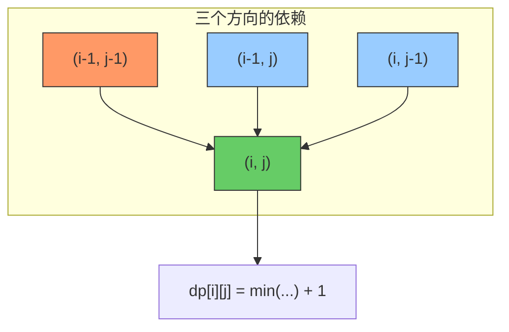

---

title: "最大正方形"

difficulty: 中等

category: 动态规划

tags:

  - leetcode

  - 动态规划

created: "2026-07-21"

---

# 221. 最大正方形（Maximal Square）

> 难度：中等 | 主题：动态规划、矩阵

## 题目

在一个由 `'0'` 和 `'1'` 组成的二维矩阵中，找到只包含 `'1'` 的**最大正方形**，返回其面积。

**示例**

```text

输入：

[["1","0","1","0","0"],

 ["1","0","1","1","1"],

 ["1","1","1","1","1"],

 ["1","0","0","1","0"]]

输出：4

```

---

## 思路
### 先讲个故事：铺地板

你装修新房，手里有一堆 1×1 的地砖。厨房图纸用 0 和 1 标出了哪些位置可以铺砖（1）哪些不行（0）。

你的目标是铺出一块**最大的正方形地面**。

你一边铺一边发现一个规律：**能不能在 (i,j) 处铺出一块更大的正方形，取决于它"左下角"、"右下角"、"右上角"三块地砖能不能接上。**

这就是"短板效应"——正方形的大小由最短的那块板决定。

---

### 引导式推导：从"角落"看问题

**关键问题：如何判断一个格子能否成为正方形的右下角？**

以 `(i,j)` 为右下角的正方形，需要三个方向都满足：

- 左边 `(i, j-1)` 能提供足够宽度的正方形

- 上边 `(i-1, j)` 能提供足够高度的正方形

- 左上角 `(i-1, j-1)` 能提供"左上角那块"正方形

三个方向的能力取**最小值**，再加上当前格子（`+1`），就是新的边长。

```text

dp[i][j] = min(dp[i-1][j], dp[i][j-1], dp[i-1][j-1]) + 1  （当 matrix[i][j] == '1'）

```

**图形化理解：**

```text

1  1          → 左边=1, 上边=1, 左上=1 → dp=2

1 [1]         （(i,j) 是右下角）

1  1  1

1  1  1       → 左边=2, 上边=2, 左上=2 → dp=3

1  1 [1]

```

**用 Mermaid 看依赖关系：**



**为什么是 min 不是 max？** 想象你在拼图——三个方向的"可扩展能力"只要有一个不够，整个正方形就缺了一块。正方形的约束是**所有边相等**，边长受限于最短的那条边。

**空间优化思路：** 二维 `dp[m][n]` → 一维 `dp[n]` + `prev` 变量（类似 [[64最小路径和]] 和编辑距离的空间优化）。

```text

dp[j] 表示当前行第 j 列的值（原二维 dp 中当前行的数据）

prev  保存 dp[i-1][j-1]（即左上角的值）

temp  暂存老 dp[j]（即 dp[i-1][j]），作为下一轮的 prev

```

---

## 代码

```python

def maximalSquare(self, matrix):

    if not matrix or not matrix[0]:

        return 0

    m, n = len(matrix), len(matrix[0])

    dp = [0] * (n + 1)          # 一维 DP，多开一位处理 j=0 边界

    max_side = 0

    prev = 0                    # 保存 dp[i-1][j-1]（左上角）

    for i in range(1, m + 1):

        for j in range(1, n + 1):

            temp = dp[j]        # 暂存更新前的 dp[j]（即 dp[i-1][j]）

            if matrix[i - 1][j - 1] == '1':

                dp[j] = min(dp[j], dp[j - 1], prev) + 1

                max_side = max(max_side, dp[j])

            else:

                dp[j] = 0       # 当前格为 '0'，不能构成正方形

            prev = temp         # 作为下一列 j+1 的左上角值

    return max_side * max_side

```

---

## 复杂度

| 指标 | 值 | 解释 |

|------|----|------|

| 时间 | O(m × n) | 遍历矩阵一次 |

| 空间 | O(n) | 一维 DP 数组，n 为列数 |

---

## 实战考量
### 频率分析

> **出现在**：美团/字节/快手 二面算法题，约 35% 的同类题会考二维 DP。核心考察点不是代码本身，而是**你能不能把"正方形"的几何约束翻译成 DP 状态转移**。

### 延伸思考

**Q：为什么状态转移是取 min 不是 max？**

A：正方形要求四边相等。以 `(i,j)` 为右下角的正方形，左、上、左上三个方向各延伸出一个矩形区域——三个方向中**最短的那块"短板"**决定了能扩展的最大边长。取 min 就是找短板。

**Q：如果找最大矩形（不是正方形）呢？**

A：那是 85最大矩形（困难题），解法不同——需要用单调栈。每行统计以该行为底的柱状图高度，然后对每一行用单调栈求最大矩形面积。这是因为矩形没有"等边"约束，自由度更高。

**Q：空间复杂度能优化到 O(1) 吗？**

A：可以——直接修改原矩阵（把 `matrix[i][j]` 当作 DP 数组用），将每个格子原地替换为以它为右下角的最大正方形边长。但实践中要说清楚这么做会破坏输入数据，通常不推荐。

**Q：如果矩阵很大（比如 10000×10000）呢？**

A：O(m×n) 的时间已经是最优了（至少得读完整个矩阵）。空间 O(n) 也比 O(m×n) 好得多。但如果列数也很大，可以选行数少的那一维做 DP（转置矩阵），进一步减少空间。

**Q：跟 [[64最小路径和]] 的空间优化有什么相似之处？**

A：完全相同。64 题也是二维矩阵 DP，用一维数组 + prev 保存左上角值。这种"二维转一维+prev"是矩阵 DP 空间优化的标准套路。

### 易错点

- 返回的是**面积**（`max_side²`），不是边长

- `prev` 保存的是上一行 j 列的值（`dp[i-1][j]`），作为下一列 `j+1` 的左上角

- `matrix[i-1][j-1]` 的索引偏移（代码里是 1-based 遍历，matrix 是 0-based）

- 空矩阵和单行/单列的边界处理

---

## 生活类比

> **最大正方形 → 短板效应 → 一维滚动**

>

> 就像一个木桶能装多少水取决于最短的那块板——正方形能有多大，取决于左、上、左上三个方向中最短的那个。

> DP 空间优化就是：铺地板时你不需要记住整层楼的图纸，只需要记住上一行和左边一格就够了。

---

## 相关题目

| 题目 | 关系 |

|------|------|

| [[64最小路径和]] | 二维矩阵 DP 同款优化思路 |

| 85. 最大矩形 | 进阶（单调栈解法），正方形变矩形 |

---

→ 返回题单：[[LeetCode学习路线图#十三、动态规划]]

## 速记卡（面试闪卡）

**Q1：一句话讲清「221. 最大正方形（Maximal Square）」到底是什么？**

A：在 0 和 1 组成的二维矩阵中，找只包含 1 的最大正方形，返回其面积。本质是二维 DP 的「短板效应」。

**Q2：题目与铺地板 —— 怎么理解？**

A：像铺地砖——能否在 (i,j) 铺出更大的正方形，取决于它左边、上边、左上三块地砖能不能接上。这就像木桶原理：正方形能有多大，受左、上、左上三个方向中最短的那块「短板」限制。

**Q3：思路与 min 转移 —— 怎么理解？**

A：状态转移 `dp[i][j] = min(左, 上, 左上) + 1`（当该格为 1）。取 min 是因为正方形四边必须相等，边长受最短边约束；只要有一个方向不够，整个正方形就缺一块。

**Q4：空间优化与易错 —— 怎么理解？**

A：用一维 `dp[n]` 加 `prev` 变量保存左上角，空间降到 O(n)。两个易错点：返回的是面积 `max_side²` 不是边长；`prev` 保存的是上一行同列值、作为下一列的左上角。

**Q5：复杂度与延伸 —— 怎么理解？**

A：时间 O(m×n)、空间 O(n)。进阶：找最大矩形（85 题困难）要用单调栈，因为没有「等边」约束自由度更高；也可直接原地改矩阵省空间，但会破坏输入数据一般不推荐。

**Q6：核心速记主线有哪些？**

A：题目、min 转移、短板效应、一维 + prev、返回面积、进阶矩形。

**口诀**

A：最大正方形短板定，左上前上取最小；

加一得边长平方，面积别忘二次方。

## 相关链接

- [[笔记/Leetcode笔记/13_动态规划/63不同路径II|不同路径II]]

- [[笔记/Leetcode笔记/13_动态规划/213打家劫舍II|打家劫舍II]]

- [[笔记/Leetcode笔记/13_动态规划/300最长递增子序列|最长递增子序列]]

- [[笔记/Leetcode笔记/13_动态规划/32最长有效括号|最长有效括号]]

- [[笔记/Leetcode笔记/13_动态规划/152乘积最大子数组|乘积最大子数组]]

