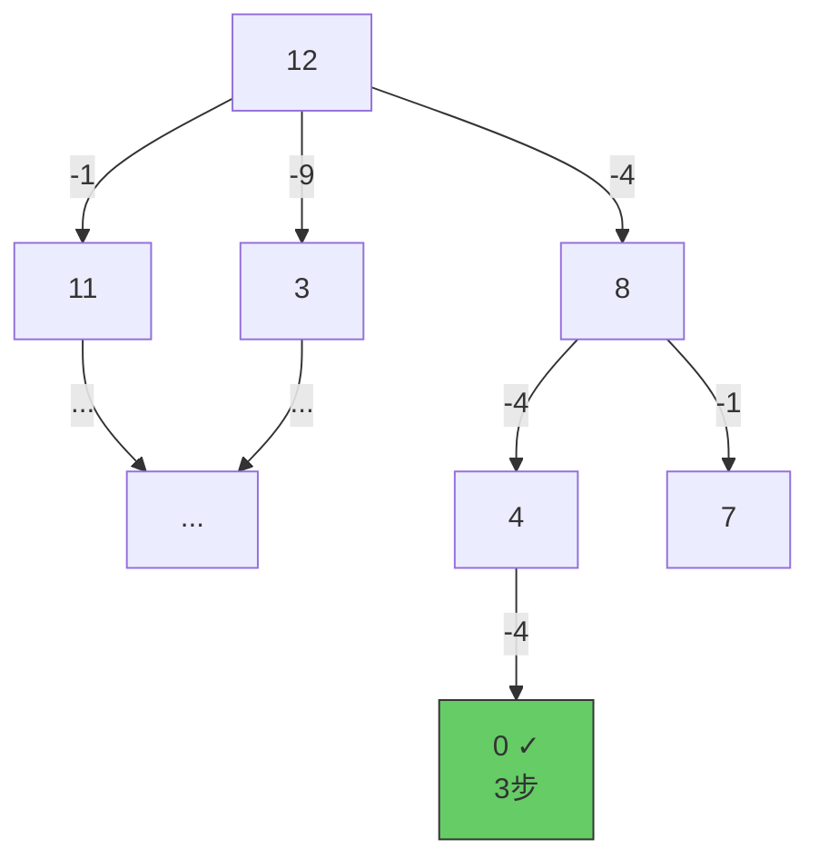

---

title: "完全平方数"

difficulty: 中等

category: 动态规划

tags:

  - leetcode

  - 动态规划

created: "2026-07-21"

---

# 279. 完全平方数（Perfect Squares）

> 难度：中等 | 主题：动态规划、数学、BFS

## 题目

给你一个整数 `n`，返回和为 `n` 的**完全平方数**的最少数量。完全平方数是 `1, 4, 9, 16, ...` 这种整数的平方。

**示例**

```text

输入：n = 12

输出：3

解释：12 = 4 + 4 + 4（3 个平方数）

```

---

## 思路
### 先讲个故事：奇怪的自动售货机

这台售货机只收 1 元、4 元、9 元、16 元…… 这种"完全平方数"面额的硬币（而且是无限的）。

你要买一瓶 n 元的饮料，想用**最少数量的硬币**付款。

这不就是找零钱问题吗？—— 没错，和 [[322零钱兑换]] 一模一样，只是硬币换成了平方数。

---

### 引导式推导：三重视角理解

**视角 1：完全背包**

每个完全平方数（1, 4, 9, 16...）是无限供应的物品，n 是背包容量，求装满的最少物品数。

```text

物品列表：[1², 2², 3², ..., (√n)²]

```

**视角 2：BFS 最短路**

把 `n` 看作起点，每次减去一个完全平方数，到达 0 的最少步数。

BFS 天然保证**第一次到达 0 时步数最少**（因为 BFS 层数 = 步数）。



**视角 3：DP 递推（最推荐）**

`dp[i]` 表示组成 `i` 需要的最少平方数个数。

```text

dp[i] = min(dp[i - j²] + 1)  对所有满足 j² ≤ i 的 j

```

初始化：

- `dp[0] = 0`：组成 0 不需要任何平方数（基线条件）

- `dp[1..n] = inf`：开始时所有数都"尚未找到方案"

**手算验证 n=12：**

```text

平方数列表：1, 4, 9

dp[0] = 0

dp[1] = min(dp[0] + 1) = 1                    // 1

dp[2] = min(dp[1] + 1) = 2                    // 1+1

dp[3] = min(dp[2] + 1) = 3                    // 1+1+1

dp[4] = min(dp[3]+1, dp[0]+1) = 1             // 4（直接一个平方数！）

dp[5] = min(dp[4]+1, dp[1]+1) = 2             // 4+1

...

dp[12] = min(dp[11]+1, dp[8]+1, dp[3]+1)

       = min(3+1, 2+1, 3+1)

       = 3                                    // 4+4+4

```

---

## 代码

```python

def numSquares(self, n):

    dp = [float('inf')] * (n + 1)

    dp[0] = 0

    for i in range(1, n + 1):

        j = 1

        while j * j <= i:                          # 枚举所有不超过 i 的平方数

            dp[i] = min(dp[i], dp[i - j * j] + 1)

            j += 1

    return dp[n]

```

---

## 复杂度

| 指标 | 值 | 解释 |

|------|----|------|

| 时间 | O(n × √n) | 外层 O(n)，内层枚举平方数 O(√n) |

| 空间 | O(n) | 一维 DP 数组 |

| BFS | O(n × √n) | 同等复杂度，但队列有额外开销 |

| 数学解法 | O(√n) | 四平方和定理，提一下就行 |

---

## 实战考量
### 频率分析

> **出现在**：字节/阿里/腾讯 二面 DP 题，约 30% 的会把它作为一个"变形的完全背包"来考。核心考察点是你**能不能认出它和 322 零钱兑换是同一道题**。

### 延伸思考

**Q：和 322 零钱兑换的关系是什么？**

A：**完全相同的 DP 模板**。322 是硬币（给定面额），279 是平方数（动态生成的面额）。代码几乎一样：

```python

# 322 零钱兑换

for i in range(1, amount + 1):

    for coin in coins:

        dp[i] = min(dp[i], dp[i - coin] + 1)

# 279 完全平方数

for i in range(1, n + 1):

    for j in range(1, int(sqrt(i)) + 1):

        dp[i] = min(dp[i], dp[i - j*j] + 1)

```

**Q：为什么 dp[0] = 0？**

A：组成 0 不需要任何平方数，个数为 0。这是递推的基线。当 `i = j²` 时，`dp[i - j²] = dp[0] = 0`，`dp[i] = min(inf, 0 + 1) = 1`，正确表示"一个平方数就够了"。

**Q：能不能用 BFS？**

A：可以。把 `n` 看作起点，每次减去一个平方数。BFS 第一次到达 0 时层数就是最少个数，不需要 DP 的 min 比较。但 BFS 需要维护 visited 集合防止重复访问，空间开销比 DP 大一些。

**Q：能不能用贪心——每次都选最大的平方数？**

A：不行。`n = 12` 时贪心选 `9 + 1 + 1 + 1 = 4` 个，但最优是 `4 + 4 + 4 = 3` 个。贪心在"硬币面额不是标准进制"时总会失败，[[322零钱兑换]] 也有同样的反例。

**Q：数学解法（四平方和定理）是什么？**

A：拉格朗日四平方和定理：**任何正整数都可以表示为不超过 4 个完全平方数的和**。基于此可以设计 O(√n) 的数学解法：

- 如果 n 本身是平方数 → 答案 1

- 如果 n = a² + b²（枚举 a）→ 答案 2

- 如果 n = 4^k(8m+7) → 答案 4（根据定理）

- 否则 → 答案 3

提一下即可，不用写码。

**Q：如果 n 非常大（10⁹）呢？**

A：DP 的 O(n√n) 会超时。此时数学解法 O(√n) 才是正解。但通常只要求 DP，数学解法作为知识储备提一下是进阶亮点。

### 易错点

- `dp[0] = 0` 不是 `dp[0] = 1`——组成 0 确实不需要任何平方数

- `dp` 初始化为 `float('inf')` 不是 0——0 表示"需要 0 个"，inf 表示"尚未找到方案"

- `j` 从 1 开始（1² = 1）不是从 0 开始

- 内层用 `while j * j <= i` 控制上限，不是 `j <= n`

---

## 生活类比

> **完全平方数 → 完全背包 → 四平方数和**

>

> 就像超市的"凑整"活动：只能用 1 元、4 元、9 元……这些特殊面额的代金券，每张券只能用一个，求最少用几张凑满 n 元。

> 跟用硬币找零一模一样——认识问题的本质比背模板更重要。

---

## 相关题目

| 题目 | 关系 |

|------|------|

| [[322零钱兑换]] | 完全相同的 DP 模板，硬币换平方数 |

| [[494目标和]] | 0/1 背包计数版，dp[j] += dp[j-num] |

| 70爬楼梯 | 一维 DP 入门，滚动变量优化思路一致 |

---

→ 返回题单：[[LeetCode学习路线图#十三、动态规划]]

## 速记卡（面试闪卡）

**Q1：一句话讲清「279. 完全平方数（Perfect Squares）」到底是什么？**

A：给整数 n，返回和为 n 的完全平方数（1、4、9、16……）的最少数量。本质是变形的完全背包。

**Q2：题目与售货机 —— 怎么理解？**

A：像一台只收 1 元、4 元、9 元……平方数面额硬币的自动售货机，求凑满 n 元最少用几张。它和 LeetCode 322 零钱兑换是同一道题，只是硬币换成了平方数——认出本质比背模板重要。

**Q3：思路与三视角 —— 怎么理解？**

A：三种等价视角——完全背包（平方数无限供应）、BFS 最短路（从 n 每次减一个平方数，首次到 0 的步数最少）、DP 递推 `dp[i] = min(dp[i-j²]+1)`。DP 最推荐：`dp[0]=0` 是基线，其余初始化为 inf。

**Q4：代码与易错 —— 怎么理解？**

A：内层 `while j*j <= i` 枚举所有不超过 i 的平方数。易错点：`dp[0]=0` 不是 1（组成 0 不需要任何平方数）；dp 初始化为 inf 不是 0；j 从 1 开始。

**Q5：复杂度与数学 —— 怎么理解？**

A：DP 时间 O(n√n)、空间 O(n)。贪心不行：`n=12` 贪心选 9+1+1+1=4 个，最优却是 4+4+4=3 个。数学亮点：拉格朗日四平方和定理——任何正整数 ≤ 4 个平方数之和，可做到 O(√n)，n 极大时才是正解。

**Q6：核心速记主线有哪些？**

A：题目、完全背包本质、DP 递推、dp[0]=0、贪心反例、四平方和定理。

**口诀**

A：完全平方数凑零钱，完全背包记心间；

dp0 为 0 初值 inf，四平方定理是上限。

## 相关链接

- [[笔记/Leetcode笔记/13_动态规划/322零钱兑换|零钱兑换]]

- [[笔记/Leetcode笔记/13_动态规划/63不同路径II|不同路径II]]

- [[笔记/Leetcode笔记/13_动态规划/213打家劫舍II|打家劫舍II]]

- [[笔记/Leetcode笔记/13_动态规划/221最大正方形|最大正方形]]

- [[笔记/Leetcode笔记/13_动态规划/300最长递增子序列|最长递增子序列]]

