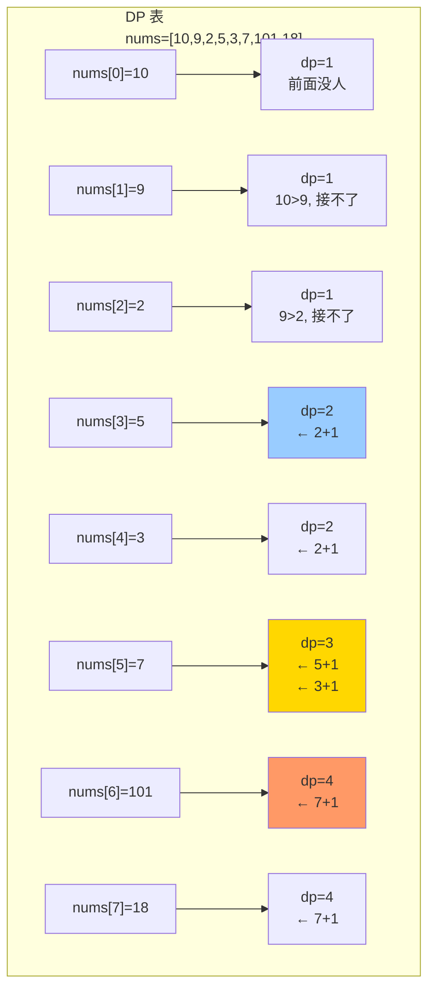
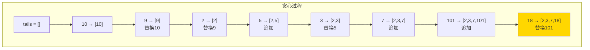
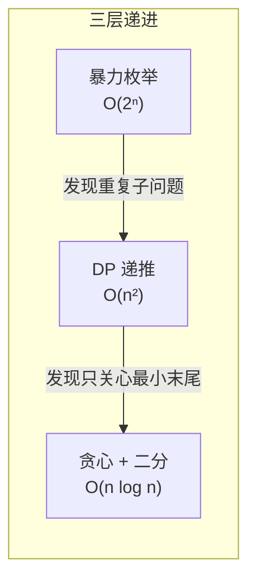

# 300. 最长递增子序列（Longest Increasing Subsequence）

> 难度：中等 | 主题：动态规划、二分查找、贪心

## 题目

给你一个整数数组 nums，找到其中最长严格递增子序列的长度。子序列是由数组派生而来的序列，删除（或不删除）数组中的元素而不改变其余元素的顺序。

**示例**
```text
nums = [10,9,2,5,3,7,101,18] → 输出 4
解释：[2,3,7,101] 长度为 4
```

---

## 思路

### 先讲个故事：社团选拔

学校话剧社要选演员，报名表按先后顺序排列。社长要求：**不能打乱报名顺序，且后一个人必须比前一个人高**——这样站在台上才好看。

问题：在不打乱报名顺序的前提下，最多能选多少人？这就是最长递增子序列。

身高：[10, 9, 2, 5, 3, 7, 101, 18]
选中的：[2, 3, 7, 101] → 4 人

---

### 引导式推导：从暴力到最优

**第 1 层（暴力枚举）**：枚举所有子序列（2ⁿ 种），检查是否递增。n=8 时 256 种还行，n=100 时宇宙炸了。

**第 2 层（DP O(n²)）**：思考方式——以每个人为"队尾"，看前面有谁比他矮。

```text
dp[i]：以 nums[i] 为结尾的最长递增子序列长度

对每个 i，往前看所有 j < i：
  如果 nums[j] < nums[i]（前一个人更矮），
  就可以把 i 接在 j 后面 → dp[i] = max(dp[i], dp[j] + 1)
```



**问题**：O(n²) 在大数据上太慢了。有没有更好的？

**第 3 层（贪心 + 二分 O(n log n)）**：改变思路——我们不关心"具体选了谁"，只关心"每种长度的子序列，最矮的队尾能有多矮"。

```text
tails[k]：长度为 k+1 的递增子序列的最小末尾值

维护规则：遍历每个人，在 tails 中找第一个 >= 当前身高的位置。
  - 没找到（所有人都比他矮）→ 他成为新长度的队尾
  - 找到了 → 替换那个位置的队尾（因为用更矮的人做队尾，后面更容易接人）
```



**为什么能替换？** 因为 tails 是递增的（长度为 k 的队尾一定 < 长度为 k+1 的队尾），所以二分查找。



---

## 代码

```python
import bisect

# 贪心 + 二分（推荐）
def lengthOfLIS(self, nums):
    tails = []                                    # tails[k] = 长度为k+1的LIS的最小末尾值
    for num in nums:
        idx = bisect.bisect_left(tails, num)      # 在 tails 中找第一个 >= num 的位置
        if idx == len(tails):                     # 比所有队尾都大 → 可以接在后面延长LIS
            tails.append(num)
        else:
            tails[idx] = num                      # 替换队尾，让后续更容易接人
    return len(tails)

# DP 版本（也应掌握）
def lengthOfLIS_DP(self, nums):
    n = len(nums)
    dp = [1] * n                                  # dp[i] = 以 nums[i] 结尾的 LIS 长度
    for i in range(1, n):
        for j in range(i):
            if nums[j] < nums[i]:
                dp[i] = max(dp[i], dp[j] + 1)
    return max(dp)
```

---

## 复杂度

| 解法 | 时间 | 空间 | 说明 |
|------|------|------|------|
| **贪心 + 二分（推荐）** | O(n log n) | O(n) | tails 数组长度 ≤ n，二分每次 O(log n) |
| DP | O(n²) | O(n) | 双重循环，n=10⁵ 时超时 |

---

## 实战考量

### 频率分析

> **出现在**：字节/腾讯/阿里 一面到约 40% 的 DP 面会考 LIS。常作为**从 O(n²) 到 O(n log n) 优化的经典范例**，考察你能否跳出 DP 定式想到贪心。

### 延伸思考

**Q：tails 数组为什么不一定是真实的 LIS 序列？**
A：tails 只记录"每种长度的最小末尾值"，不是实际序列。例如 [2,3,7,18] 中的 7 和 18 在原数组中顺序其实是 7→101→18，tails[3]=18 不代表 18 一定跟在 7 后面。要输出真实 LIS 需要用 DP 法回溯。

**Q：输出具体的 LIS 怎么做？**
A：DP 法可以回溯——额外记录 `prev[i]` 表示以 i 结尾时前一个元素的下标，最后从 dp 值最大的位置往前追溯。贪心法需要额外维护每个 tails 位置对应的原数组下标和前驱关系。

**Q：如果允许相等（非严格递增）呢？**
A：把 `bisect_left` 改成 `bisect_right`，这样相等的元素会追加到后面而不是替换，保证非递减。

**Q：二维 LIS（信封嵌套）怎么做？**
A：先按一维升序（相等时另一维降序）排序，再对另一维求 LIS。降序是为了避免同宽度的信封相互嵌套。

**Q：如果要求方案数呢？**
A：DP 时额外维护 `count[i]`，在更新 `dp[i]` 时同步累加计数。当 `dp[j] + 1 > dp[i]` 时 `count[i] = count[j]`，当相等时 `count[i] += count[j]`。

### 易错点

- `bisect_left`（严格递增）和 `bisect_right`（非严格递增）的区别
- tails 数组长度 = LIS 长度，但内容不一定等于 LIS 序列
- DP 法返回 `max(dp)` 不是 `dp[-1]`（LIS 不一定以最后一个元素结尾）
- 空数组/单元素数组的边界

---

## 生活类比

> **LIS → 贪心 + 二分**
>
> 像在整理书架：你只关心"每种厚度的书，最薄的那本放哪"。
> 越薄的放在外层，后面越容易插进去。
> 用两个字概括：**留底牌**——每种长度留最小的"底牌"，后面的数字更容易打出新高度。

---

## 相关题目

| 题目 | 关系 |
|------|------|
| 198打家劫舍 | 同为一维 DP 线性递推，但 LIS 需要双循环 |
| [[322零钱兑换]] | 完全背包一维 DP，外层循环和内层循环的先后讲究 |
| [[416分割等和子集]] | 0/1 背包 DP，目标从求最长变求能凑成某值 |
| — 354. 俄罗斯套娃信封问题 | 二维 LIS，先排序再求 LIS |
| — 673. 最长递增子序列的个数 | LIS 计数版，同时维护 dp 和 count |

---

→ 返回题单：[[LeetCode学习清单#十三、动态规划]]
