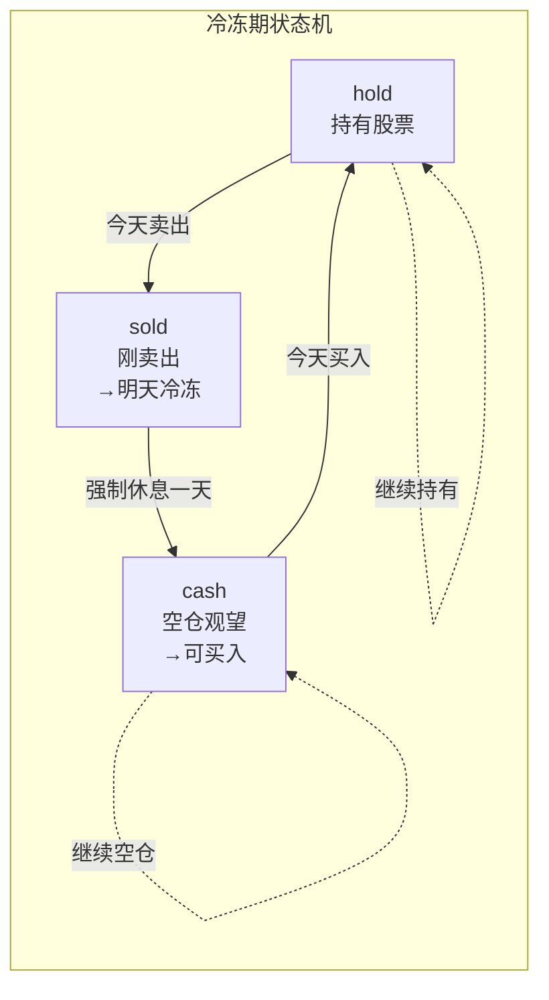
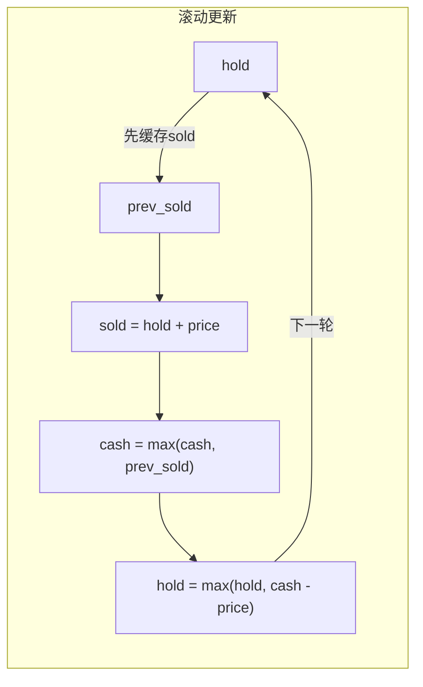

---

title: "最佳买卖股票时机含冷冻期"

difficulty: 中等

category: 动态规划

tags:

  - leetcode

  - 动态规划

created: "2026-07-21"

---

# 309. 最佳买卖股票时机含冷冻期（Best Time to Buy and Sell Stock with Cooldown）

> 难度：中等 | 主题：DP、状态机

## 题目

给定一个整数数组 prices，其中第 i 天的股票价格为 prices[i]。设计一个算法计算出最大利润。你可以尽可能地完成更多的交易（多次买卖一支股票），但卖出股票后无法在第二天买入（冷冻期为 1 天）。

**示例**

```text

prices = [1,2,3,0,2] → 输出 3

解释：买(1)→卖(3)→冷冻→买(0)→卖(2) = 3

```

---

## 思路
### 先讲个故事：水果摊老板的烦恼

老张开了一家水果摊，每天有三种状态：

- **囤货中**（hold）：冰箱里有水果，等贵了再卖

- **刚卖完**（sold）：今天刚清仓，明天城管规定不能进货（等于冷冻期）

- **空仓观望**（cash）：冰箱是空的，也没有限制，随时可以进货

老板的日常决策：

```text

囤货 → 卖完 → 休息一天 → 空仓 → 再次囤货

                                  ↑________↓ (也可以继续观望)

```

冷冻期约束让"刚卖完不能动"和"空仓随便买"变成了两种不同的状态——这就是引入**状态机**的原因。

---

### 引导式推导：从两状态到三状态

**经典股票题（无冷冻期）**只需要两个状态：

- `hold[i]`：第 i 天持有股票的最大利润

- `cash[i]`：第 i 天不持有股票的最大利润

转移：`hold[i] = max(hold[i-1], cash[i-1] - price[i])`，`cash[i] = max(cash[i-1], hold[i-1] + price[i])`。

**加入冷冻期**后，"不持有"这个状态需要拆成两个——因为你得知道"今天能不能买入"：



**状态定义**：

- `hold[i]`：第 i 天结束时**持有**股票的最大利润

- `sold[i]`：第 i 天**刚卖出**股票的最大利润（第 i+1 天不能买）

- `cash[i]`：第 i 天结束时**空仓且不在冷冻期**的最大利润

**状态转移方程**：

```text

hold[i] = max(hold[i-1], cash[i-1] - prices[i])

  ↑ 继续持有昨天的 或 从观望状态买入

sold[i] = hold[i-1] + prices[i]

  ↑ 只有持有才能卖出，卖完利润增加

cash[i] = max(cash[i-1], sold[i-1])

  ↑ 继续观望 或 昨天刚卖完今天强制休息后进入观望

```

**为什么是 cash[i-1] - prices[i] 而不是 sold[i-1] - prices[i]？**

因为冷冻期（刚卖完）的第二天**不能买**，必须等一天进入 `cash` 状态才能买。

---

### 空间优化：三个变量滚动

每个状态只依赖前一天的值，不需要数组：



**⚠️ 顺序陷阱**：必须先用 `prev_sold = sold` 缓存旧值，因为 `sold` 更新后就不能用来更新 `cash` 了。

---

## 代码

```python

def maxProfit(self, prices):

    if not prices:

        return 0

    hold = -prices[0]        # 第0天买入：利润 = -买入价

    cash = 0                 # 第0天空仓观望：利润0（没操作）

    sold = 0                 # 第0天不可能刚卖出：用0占位

    for i in range(1, len(prices)):

        price = prices[i]

        prev_sold = sold                     # ⚠️ 先缓存旧 sold

        sold = hold + price                  # 今天卖出

        hold = max(hold, cash - price)       # 继续持有 or 从观望买入

        cash = max(cash, prev_sold)          # 继续观望 or 冷冻期结束

    return max(cash, sold)                   # 最后一天持有不可能是最优

```

---

## 复杂度

| 指标 | 值 | 解释 |
|------|----|------|
| 时间 | O(n) | 一次遍历，每天 O(1) 计算 |
| 空间 | O(1) | 三个变量，不依赖数组长度 |

---

## 实战考量
### 频率分析

> **出现在**：字节/拼多多/快手 约 30% 的股票系列题会选择冷冻期版本。考察**状态拆分能力**——能不能意识到"不持有"必须拆成两个子状态。

### 延伸思考

**Q：为什么没有冷冻期时两个状态就够了？**

A：无冷冻期时，`cash` 状态可以**随时买入**，不需要知道前一天是否卖出。所以"不持有"是一个统一状态。冷冻期引入了一个延迟约束——卖出后必须等一天才能再买，所以"刚卖出不能买"和"观望可以买"是两个不同的状态。

**Q：`hold` 为什么用 `cash - price` 而不是 `prev_sold - price`？**

A：冷冻期约束——卖出的第二天（sold 状态的第二天）不能买入，必须先经过 `cash` 状态。用 `prev_sold` 更新的话会跳过冷冻期约束。

**Q：股票系列的状态机怎么统一？**

A：所有版本可以统一为 `dp[i][k][0/1]`——第 i 天，最多交易 k 次，持有(1)/不持有(0)。冷冻期相当于在卖出后加了一个"下一轮不能买"的延迟门控。

**Q：如果冷冻期是 k 天呢？**

A：需要记录"距离上次卖出了几天"——可以用一个大小为 k 的队列来推迟 `cash` 的更新，或者把状态扩展到 `dp[i][d]` 表示 i 天前刚卖出的不同天数。

**Q：最后为什么 `return max(cash, sold)`？**

A：最后一天持有股票（hold）等于没卖出，利润肯定不如卖出的情况好（价格非负）。所以最大利润一定在 `cash` 或 `sold` 中。

### 易错点

- 忘记缓存 `prev_sold`，导致 `cash` 用到了本轮的 `sold`

- `hold` 更新用 `cash - price` 而不是 `prev_sold - price`（冷冻期约束）

- `sold = hold + price` 不是 `cash + price`（只有持有才能卖出）

- 初始值：`hold = -prices[0]` 不能写成 `float('-inf')`

---

## 生活类比

> **冷冻期 → 状态机**

>

> 像开小吃店：囤货（冰箱有菜）、卖完（今天卖光、明天休市）、空仓（后天再进货）。

> 三个状态像三扇门，每天只能站在一扇门里。

> 用两个字概括状态机 DP：**拆状态**——把一个模糊的状态拆成更细的、有意义的子状态。

---

## 相关题目

| 题目 | 关系 |
|------|------|
| 121买卖股票的最佳时机 | 一次交易，贪心入门 |
| 122买卖股票的最佳时机II | 无限次交易，无冷冻期，两状态足矣 |
| 123买卖股票的最佳时机III | 最多两次交易，引入 k 维度 |
| — 188. 买卖股票的最佳时机 IV | 最多 k 次交易，通用状态机 |
| 198打家劫舍 | 同为状态机 DP（偷/不偷两状态） |

---

→ 返回题单：[[LeetCode学习路线图#十三、动态规划]]

## 速记卡（面试闪卡）

**Q1：一句话讲清「309. 最佳买卖股票时机含冷冻期（Best Time to Buy and Sell Stock with Cooldown）」到底是什么？**

A：309 题要求在卖出后隔一天才能再买的冷冻期约束下，用状态机动态规划求多次买卖股票的最大利润。

**Q2：思路 —— 怎么理解？**

A：像开水果摊：囤货(hold)、刚卖完(sold)、空仓(cash) 三种状态轮转，卖出后强制歇一天才能再买——这就是用状态机(State Machine)把"不持有"拆成两个子状态。

**Q3：代码 —— 怎么理解？**

A：像按三扇门滚动记账：用 hold/sold/cash 三个变量每天滚动更新，先缓存 prev_sold 再算新值，O(1) 空间实现状态转移(State Transition)。

**Q4：复杂度 —— 怎么理解？**

A：像跑一遍快递分拣：只扫一次数组、只留三个数，时间 O(n)、空间 O(1)(Time Complexity / Space Complexity)。

**Q5：实战考量 —— 怎么理解？**

A：像面试官爱挖的坑：字节/拼多多常考，关键看你能不能想到"不持有"要拆两状态；易错点是忘了缓存 prev_sold、hold 用 cash 而非 prev_sold 更新。

**Q6：核心速记主线有哪些？**

- 冷冻期本质：卖出后隔一天才能买，须把"不持有"拆成 sold 和 cash 两状态

- 三状态转移：hold=max(hold, cash-price)、sold=hold+price、cash=max(cash, prev_sold)

- 空间优化：三个变量滚动即可，O(1) 空间，先缓存 prev_sold 再更新

- 时间 O(n)、空间 O(1)；最后答案取 max(cash, sold)

**口诀**

A：冷冻期，拆状态，hold sold cash 三扇门

卖出后，隔天买，不持有两个子状态

三变量，滚着算，prev_sold 先缓存

时间 O(n) 空间一，末取 cash sold 最大

## 相关链接

- [[笔记/Leetcode笔记/13_动态规划/63不同路径II|不同路径II]]

- [[笔记/Leetcode笔记/13_动态规划/213打家劫舍II|打家劫舍II]]

- [[笔记/Leetcode笔记/13_动态规划/221最大正方形|最大正方形]]

- [[笔记/Leetcode笔记/13_动态规划/322零钱兑换|零钱兑换]]

- [[笔记/Leetcode笔记/13_动态规划/300最长递增子序列|最长递增子序列]]

