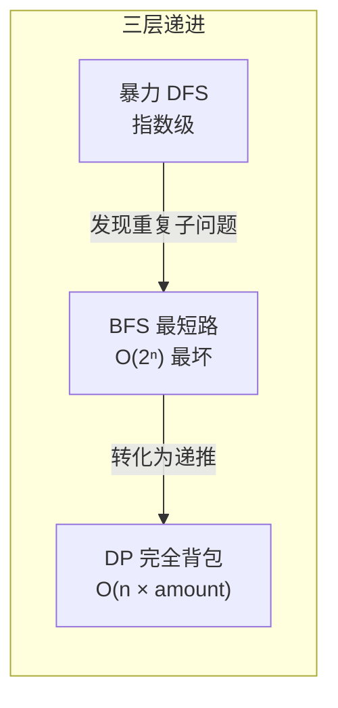

# 322. 零钱兑换（Coin Change）

> 难度：中等 | 主题：动态规划、完全背包

## 题目

给你一个整数数组 coins 表示不同面额的硬币，以及一个整数 amount 表示总金额。计算并返回可以凑成总金额所需的最少硬币个数。如果没有任何一种硬币组合能组成总金额，返回 -1。每种硬币的数量是无限的。

**示例**
```text
coins = [1,2,5], amount = 11 → 输出 3
解释：11 = 5 + 5 + 1（3 枚硬币）
```

---

## 思路

### 先讲个故事：自动售货机的烦恼

你买了一瓶 3 块钱的水，投了一张 20 元。机器要找你 17 元，但它的硬币箱里有 1 元、2 元、5 元三种硬币（每种无限多）。

机器想："怎么用最少枚硬币凑出 17 元？少吐几个硬币，我就少出故障。"

这就是零钱兑换——从无限硬币中选，凑出目标金额，要求硬币数最少。

---

### 引导式推导：四条路，越走越快

**第 1 条路（暴力 DFS）**：从 17 元开始，每次减一个面额，直到 0。画一下搜索树：

```text
        17
    /   |   \
  16   15   12        ← 减1、减2、减5
  /|\  /|\  /|\
 ...  ...  ...
```

重复计算多到爆炸——凑 12 的方式可以从 17→5→12、17→2→15→5→10→5→... 无数路径走到同一个子问题。

**第 2 条路（BFS 最短路）**：把 amount 看成起点，0 看成终点，每种硬币就是一条边。BFS 逐层扩展，第一次到达 0 时的层数就是最少硬币数。

```mermaid
graph TD
    subgraph bfs["BFS 最短路 (coins=[1,2,5], amount=11)"]
        direction LR
        amt11["11"] -->|"-1"| amt10["10"]
        amt11 -->|"-2"| amt9["9"]
        amt11 -->|"-5"| amt6["6"]
        amt10 -->|"-1"| amt9_2["9"]
        amt10 -->|"-2"| amt8["8"]
        amt10 -->|"-5"| amt5["5"]
        amt9 -->|"-1"| amt8_2["8"]
        amt9 -->|"-2"| amt7["7"]
        amt9 -->|"-5"| amt4["4"]
    end
    style amt11 fill:#f96
    style amt0["0"] fill:#ffd700
```

BFS 避免了无效枚举，但队列可能很大。

**第 3 条路（DP 递推）**：核心洞察——"凑 11 的最少硬币数"和"凑 10、凑 9、凑 6 的最少硬币数"之间有明确关系：

```text
dp[i] = 凑成金额 i 的最少硬币数

dp[i] = min(dp[i-1] + 1, dp[i-2] + 1, dp[i-5] + 1)
      = min(dp[i - coin] + 1)  for each coin
```

意思就是：凑 11 的最后一步，要么是凑 10 后再加 1 个 1 元，要么凑 9 加 1 个 2 元，要么凑 6 加 1 个 5 元——取最小。



**第 4 条路（完全背包细节）**：这是一个**完全背包**问题（硬币无限用）。有两个常见写法：

```python
# 写法 A：外层金额，内层硬币 → 求最少硬币数
for i in range(1, amount + 1):
    for coin in coins:
        ...

# 写法 B：外层硬币，内层金额 → 求组合数（不重复计数顺序）
for coin in coins:
    for i in range(coin, amount + 1):
        ...
```

求最少硬币数时两种写法结果一样。求方案数时，A 是排列数（考虑顺序），B 是组合数（不考虑顺序）。

---

## 代码

```python
def coinChange(self, coins, amount):
    dp = [float('inf')] * (amount + 1)     # dp[i] = 凑成 i 元的最少硬币数
    dp[0] = 0                              # 凑 0 元需要 0 个硬币

    for i in range(1, amount + 1):         # 从小到大算每个金额
        for coin in coins:                 # 试每种硬币
            if coin <= i:
                dp[i] = min(dp[i], dp[i - coin] + 1)

    return dp[amount] if dp[amount] != float('inf') else -1
```

---

## 复杂度

| 指标 | 值 | 解释 |
|------|----|------|
| 时间 | O(n × amount) | n 是硬币种类数，amount 是目标金额 |
| 空间 | O(amount) | 一维 DP 数组 |

---

## 实战考量

### 频率分析

> **出现在**：字节/腾讯/美团 一到约 35% 的 DP 面会考零钱兑换。常作为**完全背包入门题**，与 0/1 背包对比考察对"无限使用"的理解。

### 延伸思考

**Q：外层循环金额和内层循环硬币有什么区别？**
A：结果是相同的。但如果问你**方案数**，就有区别了。外层金额（A）得到的是排列数（1+2 和 2+1 算两种），外层硬币（B）得到的是组合数（1+2 和 2+1 算一种）。

**Q：如果每种硬币只能用一次呢？（0/1 背包）**
A：内层循环从 amount 往下走（倒序），避免同一个硬币被重复使用。

**Q：输出具体用了哪些硬币怎么做？**
A：额外维护一个 `choice[i]` 数组，记录凑 i 元最后用的硬币面额。然后从 amount 回溯到 0。

**Q：和 BFS 解法对比？**
A：BFS 适合硬币面额很小、amount 很大的情况（剪枝快）；DP 适合硬币面额分散、amount 中等的情况。优先写 DP，简洁稳定。

**Q：为什么初始化为 `inf` 而不是 -1？**
A：`inf` 在后续 `min` 运算中会被忽略（不影响结果），-1 会干扰 min 计算。最后再检查 dp[amount] 是否还是 `inf` 来判断是否可行。

### 易错点

- `dp[0] = 0` 不写的话全盘崩
- `float('inf')` 初始化而不是 -1
- 返回前要检查是否还是 `inf`，返回 -1
- 完全背包和 0/1 背包的内层循环顺序不要混淆

---

## 生活类比

> **零钱兑换 → 完全背包**
>
> 像自助餐厅选餐：同样的菜想吃几份都行（无限供应），但你要用最少的盘子装满指定热量。
> 钱就是盘子，硬币就是菜——怎么用最少盘子装出刚好 amount 卡路里？
> 用两个字概括：**复用**——硬币无限用，让 dp 可以反复扫描同一个面额。

---

## 相关题目

| 题目 | 关系 |
|------|------|
| 279完全平方数 | 同款 DP，硬币换成平方数，也是完全背包 |
| [[494目标和]] | 0/1 背包计数版，每个数只能用一次 |
| 139单词拆分 | 完全背包模板变体，硬币换成单词 |
| [[416分割等和子集]] | 0/1 背包，判断能否凑 target |
| — 518. 零钱兑换 II | 求方案数，完全背包的组合计数版 |

---

→ 返回题单：[[LeetCode学习清单#十三、动态规划]]
