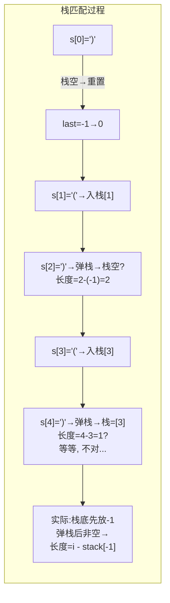
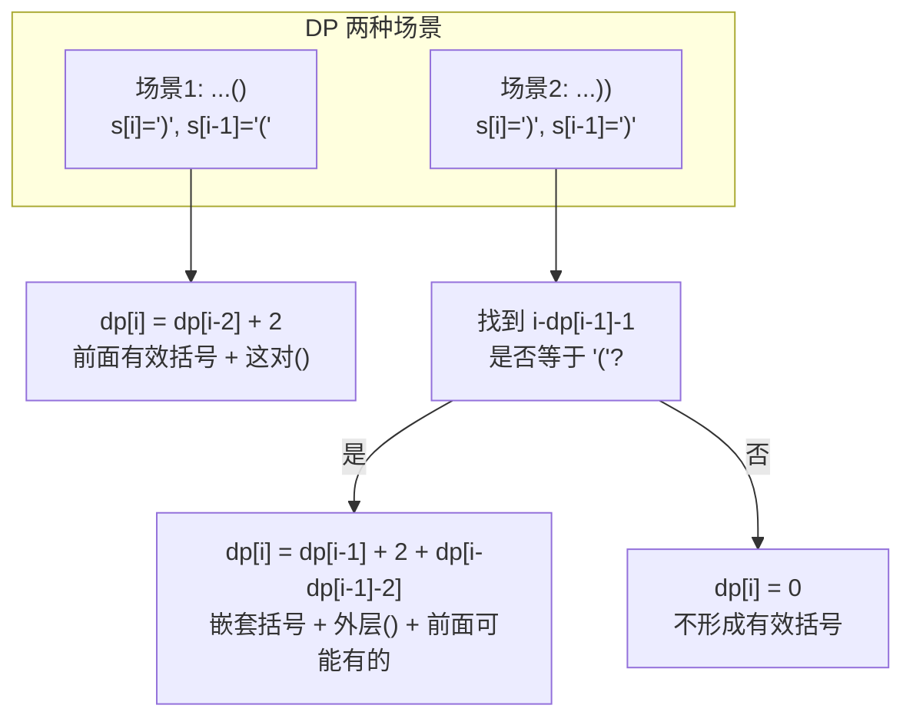
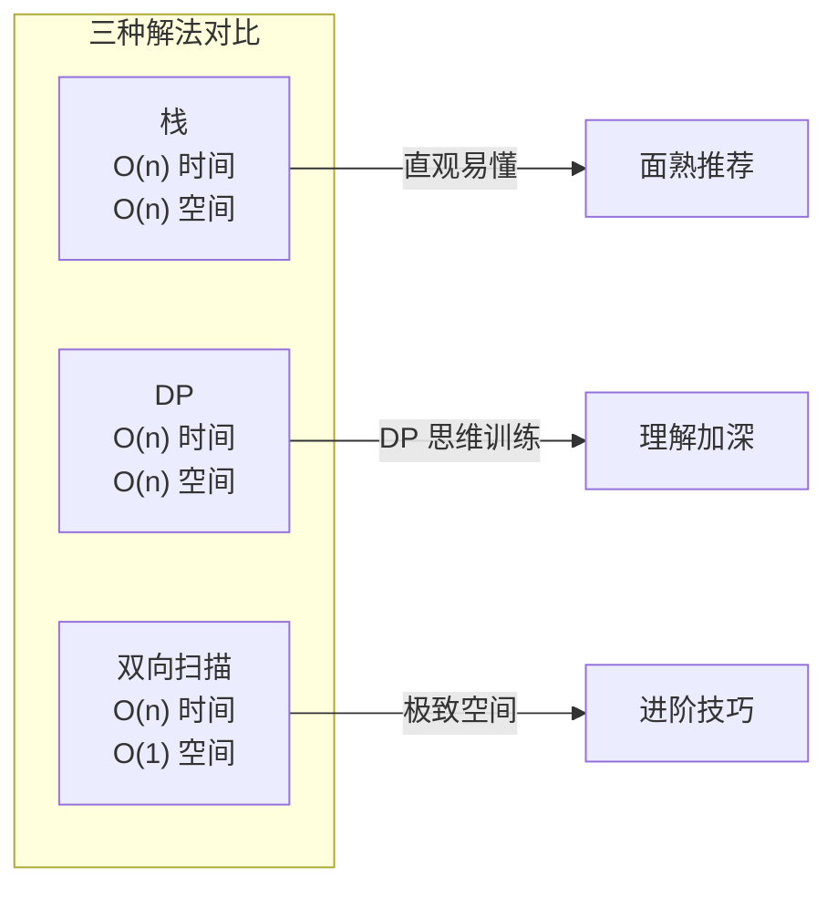

---

title: "最长有效括号"

difficulty: 困难

category: 动态规划

tags:

  - leetcode

  - 动态规划

created: "2026-07-21"

---

# 32. 最长有效括号（Longest Valid Parentheses）

> 难度：困难 | 主题：动态规划、栈、字符串

## 题目

给你一个只包含 '(' 和 ')' 的字符串，找出最长有效（格式正确且连续）括号子串的长度。

**示例**

```text

s = ")()())" → 输出 4

解释：最长有效括号子串是 "()()"

```

---

## 思路
### 先讲个故事：搭积木配对

你有一堆积木，红色是左括号 '('，蓝色是右括号 ')'。规则很简单：

- 一个红积木配一个蓝积木，且红必须在蓝左边

- 配对成功的积木之间不能有没配对的积木

- 你想找到**连续**的最长一段，里面的积木全部配对成功

就像搭拱桥：每个 '(' 是左边桥墩，')' 是右边桥墩，桥墩之间不能有悬空的。

---

### 引导式推导：三种解法，三种思路

**第 1 种（栈）**：直观但需要 O(n) 空间

遍历字符串，遇到 '(' 把下标压栈，遇到 ')' 就弹栈配对：



```text

初始化栈 = [-1]（哨兵，作为开始位置的前一个）

遍历 i from 0 to n-1：

  s[i] = '(' → 压入 i

  s[i] = ')' → 弹栈

    栈为空 → 压入 i（新的哨兵）

    栈非空 → max_len = max(max_len, i - stack[-1])

```

**第 2 种（DP）**：难想但优雅

`dp[i]`：以 s[i] **结尾**的最长有效括号长度。

关键洞察：只有 s[i] = ')' 才可能形成有效括号。分两种情况：



**场景 1：`...()`**

- 最后两个字符合起来就是一对

- `dp[i] = dp[i-2] + 2`

**场景 2：`...))`**

- 找到 s[i-1] 对应的左括号位置 `i - dp[i-1] - 1`

- 如果那个位置是 '('，就和当前 s[i] 配对

- `dp[i] = dp[i-1] + 2 + dp[i - dp[i-1] - 2]`

  - `dp[i-1]` = 嵌套在里面的有效长度

  - `+2` = 外面这层 `(...)`

  - `+dp[i - dp[i-1] - 2]` = 这对括号前面可能还有独立有效括号

例子 `"()(())"`：

```text

i=0 '(' → dp[0]=0

i=1 ')' → s[0]='(' → 场景1 → dp[1]=2

i=2 '(' → dp[2]=0

i=3 '(' → dp[3]=0

i=4 ')' → s[3]='(' → 场景1 → dp[4]=2

i=5 ')' → s[4]=')' → 场景2 → i-dp[4]-1=5-2-1=2 → s[2]='(' ✓

          dp[5] = dp[4] + 2 + dp[2-1] = 2+2+0 = 4

          ... 不对，让我再算：i-dp[4]-2 = 5-2-2 = 1 → dp[1]=2

          dp[5] = 2 + 2 + 2 = 6 ✓

```

**第 3 种（双向扫描）**：O(1) 空间，但不一定面熟会考

从左到右扫，`left` 和 `right` 计数。当 `left == right` 时更新答案，`right > left` 时重置。再从右到左扫一遍。



---

## 代码

```python

# DP 解法（推荐理解）

def longestValidParentheses(self, s):

    n = len(s)

    if n < 2:

        return 0

    dp = [0] * n                                  # dp[i] = 以 s[i] 结尾的有效括号长度

    max_len = 0

    for i in range(1, n):

        if s[i] == ')':                           # 只有 ')' 能作为有效括号的结尾

            if s[i-1] == '(':                     # 场景1: ...()

                dp[i] = (dp[i-2] if i >= 2 else 0) + 2

            else:                                 # 场景2: ...))

                if i - dp[i-1] - 1 >= 0 and s[i - dp[i-1] - 1] == '(':

                    dp[i] = dp[i-1] + 2

                    if i - dp[i-1] - 2 >= 0:      # 累加前面的独立有效括号

                        dp[i] += dp[i - dp[i-1] - 2]

            max_len = max(max_len, dp[i])

    return max_len

```

---

## 复杂度

| 解法 | 时间 | 空间 | 说明 |

|------|------|------|------|

| **DP** | O(n) | O(n) | 一次遍历，每个位置 O(1) |

| 栈 | O(n) | O(n) | 栈里存下标 |

| 双向扫描 | O(n) | O(1) | 两次遍历，不依赖额外空间 |

---

## 实战考量
### 频率分析

> **出现在**：字节/腾讯 二面到约 25% 的困难题会选这题。以"考察边界情况分析能力"著称——很多人知道 DP 公式，但写不对边界。

### 延伸思考

**Q：栈解法中为什么栈底要放 -1？**

A：-1 作为"哨兵"，表示有效括号开始位置的前一个下标。这样当配对完所有括号后，`i - (-1)` 就是完整长度。遇到栈空时，新压入的当前下标成为新的哨兵。

**Q：双向扫描法为什么能 O(1) 空间？**

A：不需要记录位置，只维护 `left` 和 `right` 两个计数器。左到右：`left==right` 时更新答案，`right > left` 时归零。但这样会漏掉 `"(()"` 这种情况，所以要从右到左再扫一遍（`left > right` 时归零）。

**Q：为什么场景 2 要加 `dp[i - dp[i-1] - 2]`？**

A：因为当前 `')'` 匹配到的 `'('` 前面可能已经有一段有效括号了。例如 `"()(())"` 最外层 `(` 前面已经有 `"()"` 了，不加就会漏掉。

**Q：那为什么场景 1 不用加？**

A：场景 1 的 `()` 是紧挨着的两个字符合并成一对，前面有没有有效括号直接看 `dp[i-2]` 就行——而 `dp[i-2]` 已经包含了前面的所有有效长度。

**Q：括号合法性判断和这题有什么关系？**

A：合法性判断只问"整个字符串是否有效"，一个计数器 `balance` 搞定。本题问的是"最长的连续有效子串"——需要记录位置或 DP。

### 易错点

- 场景 2 中 `i - dp[i-1] - 1 >= 0` 防止越界

- 场景 2 中 `dp[i]` 要累加 `dp[i - dp[i-1] - 2]`（前面的独立有效括号）——最容易被遗漏

- `n < 2` 返回 0

- 栈解法中哨兵 -1 压入后再弹栈为空时要压入新的哨兵

---

## 生活类比

> **有效括号 → DP**

>

> 像玩消消乐：每个 ')' 找到左边的 '(' 配对消除，配对成功的区域长度就是 dp[i]。

> 难点在于"嵌套"和"拼接"——内层消除后又可能和外层拼在一起。

> 用两个字概括：**接龙**——当前配对成功后，和左边的有效段接在一起形成更长的有效段。

---

## 相关题目

| 题目 | 关系 |

|------|------|

| 22括号生成 | 回溯生成所有合法括号序列，括号家族同源 |

| 05最长回文子串 | 同款按结尾位置定义 dp 的子串 DP |

| — 301. 删除无效的括号 | BFS/DFS 删除最少括号使字符串合法 |

---

→ 返回题单：[[LeetCode学习路线图#十三、动态规划]]

## 速记卡（面试闪卡）

**Q1：一句话讲清「32. 最长有效括号（Longest Valid Parentheses）」到底是什么？**

A：最长有效括号是求仅含括号的字符串中，格式正确且连续的最长有效子串长度的题目。

**Q2：题目 —— 怎么理解？**

A：像搭拱桥配对积木：给一串 '(' 和 ')'，找最长的一段连续且全部配对成功（左在右左、中间不悬空）的子串长度。Longest Valid Parentheses（最长有效括号）。

**Q3：思路 —— 怎么理解？**

A：像消消乐接龙：三种解法——栈（哨兵 -1 记起点）、DP（dp[i] 为以 i 结尾的有效长度，分 ...() 和 ...)) 两场景）、双向扫描（O(1) 空间）。核心是配对段和左边有效段接起来。Dynamic Programming（动态规划）。

**Q4：代码 —— 怎么理解？**

A：像按公式填表：DP 遍历，s[i]=')' 时若 s[i-1]='(' 则 dp[i]=dp[i-2]+2；否则看 i-dp[i-1]-1 是否 '('，配对则 dp[i]=dp[i-1]+2+dp[i-dp[i-1]-2]。Stack（栈）。

**Q5：复杂度 —— 怎么理解？**

A：像算三种账：DP 与栈都是 O(n) 时间 O(n) 空间；双向扫描 O(n) 时间 O(1) 空间（左右各扫一遍防漏）。Time/Space Complexity（时间与空间复杂度）。

**Q6：核心速记主线有哪些？**

- 题目：求最长连续有效括号子串长度

- 解法：栈、DP、双向扫描三种思路

- DP 关键：以 i 结尾，分 ...() 与 ...)) 两场景

- 复杂度：时间 O(n)，双向扫描空间 O(1)

**口诀**

A：括号配对连续段，最长子串怎么算

栈底哨兵压负一，弹空再压新起点

DP 结尾两种景，前接有效加二还

双向扫描省空间，左右各扫一遍全

## 相关链接

- [[笔记/Leetcode笔记/13_动态规划/300最长递增子序列|最长递增子序列]]

- [[笔记/Leetcode笔记/13_动态规划/63不同路径II|不同路径II]]

- [[笔记/Leetcode笔记/13_动态规划/213打家劫舍II|打家劫舍II]]

- [[笔记/Leetcode笔记/13_动态规划/221最大正方形|最大正方形]]

- [[笔记/Leetcode笔记/13_动态规划/494目标和|目标和]]

