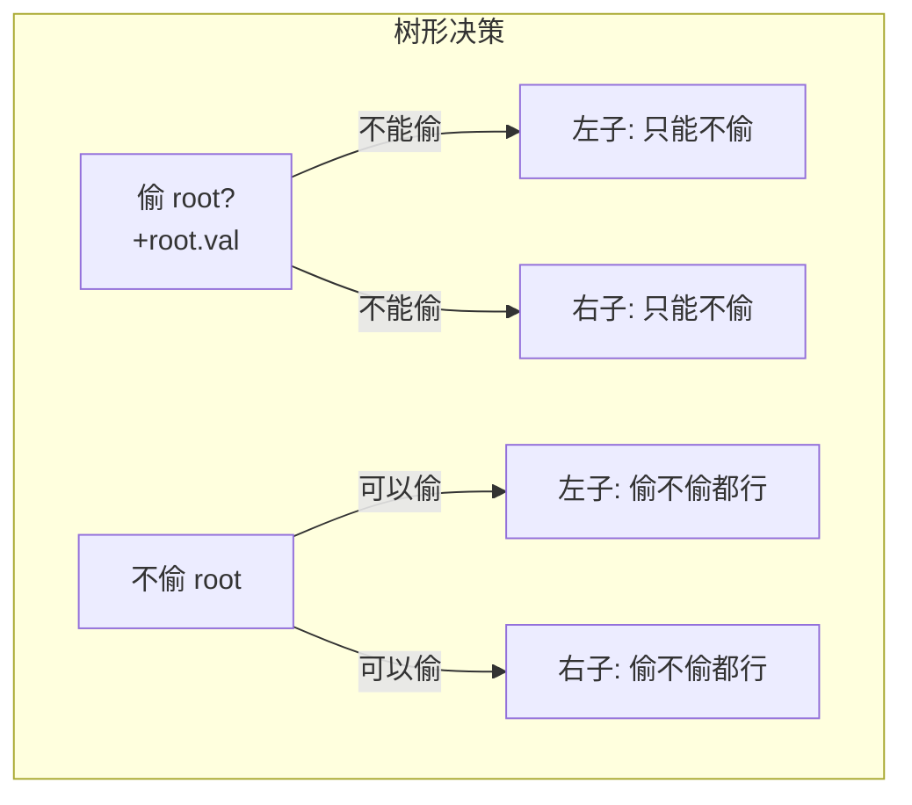
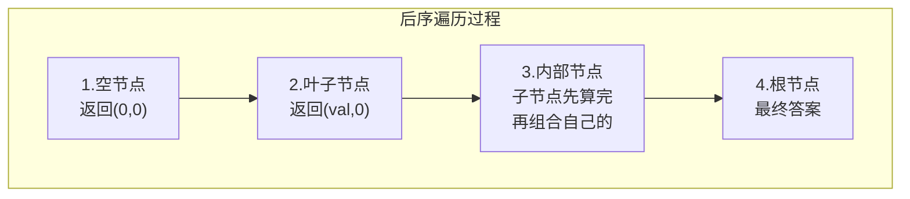
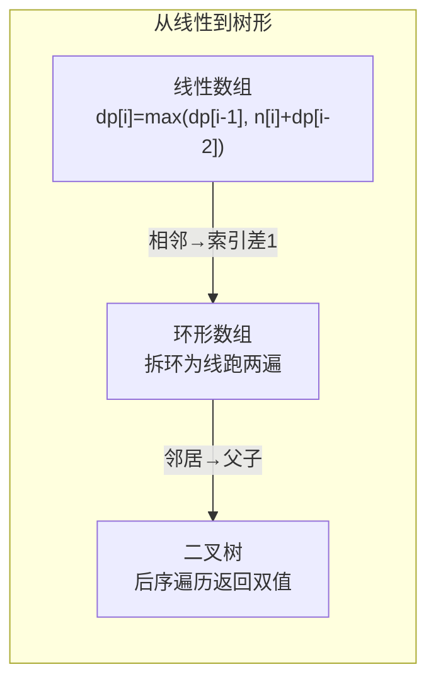

# 337. 打家劫舍 III（House Robber III）

> 难度：中等 | 主题：DP、树形DP、二叉树

## 题目

小偷又发现了一个新的可行窃的地区。这个地区只有一个入口，我们称之为 root。除了 root 之外，每栋房子有且只有一个父房子与之相连。如果两个直接相连的房子在同一天晚上被打劫，房屋将自动报警。给定一棵二叉树，返回在不触动警报的情况下小偷能够盗取的最高金额。

**示例**
```text
root = [3,2,3,null,3,null,1] → 输出 7
解释：偷 3(根) + 3(右子) + 1(右孙) = 7
     不能偷 2(左子) 因为和根直接相连
```

---

## 思路

### 先讲个故事：偷果园，从一排树到一棵树

第一代小偷打劫的是**一排房子**（198打家劫舍）——不能偷相邻的，用一维 DP 搞定。

第二代小偷遇到的是**环形小区**（213打家劫舍II）——拆环为线，跑两遍 DP。

第三代小偷面对的是一棵**二叉树果园**——每个树杈上都挂着果子，但不能同时摘相邻枝头的。这怎么偷？

你站在树根下往上望，突然发现：

> 这棵树本身就是一棵**决策树**——每个节点只需要知道两件事：
> 1. 如果我**偷**这棵子树，最多能得多少钱？
> 2. 如果我**不偷**这棵子树，最多能得多少钱？

---

### 引导式推导：从线性到树形

**线性版（198打家劫舍）**的 DP 长这样：
```text
dp[i] = max(dp[i-1], nums[i] + dp[i-2])
  ↑不偷i    ↑偷i(跳过一个)
```

一个位置只依赖前两个位置——在线性结构中"相邻"就是"索引差 1"。

**树形版**中的"相邻"变成了"父子关系"——偷了父节点就不能偷子节点：



每个节点需要返回两个值给父节点：

```text
                    父节点
                    /    \
               (rob, not_rob)  (rob, not_rob)
               左子节点        右子节点

父节点的决策：
  偷父节点   = 父.val + 左.not_rob + 右.not_rob
  不偷父节点 = max(左.rob, 左.not_rob) + max(右.rob, 右.not_rob)
```

**后序遍历**是必须的——父节点需要子节点的结果才能做决定，这正好是"先孩子后父亲"的后序遍历。



**举个例子**：root = [3, 2, 3, null, 3, null, 1]

```text
        3
       / \
      2   3
       \   \
        3   1
```

从叶子往上算：
```text
节点 3(左孙) ：rob=3, not_rob=0      → max=3
节点 2(左子) ：rob=2+0=2, not_rob=3  → max=3
节点 1(右孙) ：rob=1, not_rob=0      → max=1
节点 3(右子) ：rob=3+0=3, not_rob=1  → max=3
节点 3(根)   ：rob=3+3+1=7, not_rob=3+3=6  → max=7
```

---

### 四层递进



---

## 代码

```python
def rob(self, root):
    def dfs(node):
        # 返回 (偷node的最大值, 不偷node的最大值)
        if not node:
            return (0, 0)

        left = dfs(node.left)          # 左子树的 (rob, not_rob)
        right = dfs(node.right)        # 右子树的 (rob, not_rob)

        # 偷当前节点 → 子节点必须不偷
        rob = node.val + left[1] + right[1]

        # 不偷当前节点 → 子节点可选最大的
        not_rob = max(left) + max(right)

        return (rob, not_rob)

    return max(dfs(root))
```

---

## 复杂度

| 指标 | 值 | 解释 |
|------|----|------|
| 时间 | O(n) | 每个节点只遍历一次 |
| 空间 | O(h) | 递归栈深度，h 为树高。最坏 O(n)（链状），平均 O(log n) |

---

## 实战考量

### 频率分析

> **出现在**：字节/美团 约 20% 的树形 DP 题会选这题。如果你能主动联系 198打家劫舍 说明 DP 迁移能力，是进阶亮点。

### 延伸思考

**Q：为什么不用记忆化搜索而是返回两个值？**
A：记忆化搜索（对每个节点额外缓存 max）也能做，但返回双值更优雅——一次遍历解决，不需要额外存储，且直接利用了"每个节点只需要两个决策值"的结构特点。

**Q：如果树很大（10⁵ 节点）会栈溢出吗？**
A：会。递归深度 = 树高，链状树会递归 10⁵ 层导致栈溢出。可以用**迭代后序遍历**（显式栈）解决，或者把递归转为尾递归优化（Python 不原生支持）。

**Q：和 198打家劫舍 的核心区别是什么？**
A：198 是线性数组，"相邻"是一维的索引 -1/+1；337 是树形结构，"相邻"是父子关系。但核心思想完全一样——"偷了就不能偷邻居"。DP 结构从数组变成了树的后序遍历，状态从单个值变成了元组。

**Q：如果改成三叉树呢？**
A：一样！`rob = node.val + sum(child.not_rob)`，`not_rob = sum(max(child))`。树形 DP 的推广性很好，任何子树结构都可以这样处理。

**Q：输出偷了哪些节点怎么做？**
A：在返回 (rob, not_rob) 时额外返回一个路径集合。偷节点的路径 = {当前节点} ∪ 子节点的不偷路径；不偷节点的路径 = 子节点中选较大的那条路径。

**Q：为什么 BFS 不行？**
A：BFS（层序遍历）是从上往下的，但子节点的结果需要先算好，父节点才能用——依赖方向是自底向上的。后序遍历（DFS）满足这个依赖顺序，BFS 不满足。

### 易错点

- `left[1]`（子节点不偷的值）和 `left[0]`（子节点偷的值）别搞混
- `not_rob = max(left) + max(right)` 不是 `left[1] + right[1]`——不偷当前时，子节点有选择权
- 空节点返回 `(0, 0)`，不是 `None` 或 `(0,)` 
- 根节点的结果取 `max(rob, not_rob)`，两个都可能

---

## 生活类比

> **树形打家劫舍 → 后序遍历**
>
> 像公司年终奖发放：每个部门先算好内部怎么分，再报给上级汇总。
> 你不能跳过部门直接给整个公司定方案——必须自下而上，逐层汇总。
> 用两个字概括树形 DP：**上报**——每个节点只上报两个数，父节点拿这两个数做决策。

---

## 相关题目

| 题目 | 关系 |
|------|------|
| 198打家劫舍 | 线性 DP 版，核心状态转移思想相同 |
| 213打家劫舍II | 环形 DP 版，拆环为线跑两遍 |
| 104二叉树的最大深度 | 同款后序遍历框架，自底向上返回结果 |
| 124二叉树中的最大路径和 | 树形 DP 进阶，路径可以不从根开始 |

---

→ 返回题单：[[LeetCode学习清单#十三、动态规划]]

## 速记卡（面试闪卡）

**Q1：一句话讲清「337. 打家劫舍 III（House Robber III）」到底是什么？**
A：小偷又发现了一个新的可行窃的地区。这个地区只有一个入口，我们称之为 root。除了 root 之外，每栋房子有且只有一个父房子与之相连。如果两个直接相连的房子在同一天晚上被打劫，房屋将自动报警。给定一棵二叉树，返回在不触动警报的情况下小偷能够盗取的最高金额。
**示例**
---

**Q2：题目 —— 怎么理解？**
A：小偷又发现了一个新的可行窃的地区。这个地区只有一个入口，我们称之为 root。除了 root 之外，每栋房子有且只有一个父房子与之相连。如果两个直接相连的房子在同一天晚上被打劫，房屋将自动报警。给定一棵二叉树，返回在不触动警报的情况下小偷能够盗取的最高金额。
**示例**
---

**Q3：思路 —— 怎么理解？**
A：第一代小偷打劫的是**一排房子**（198打家劫舍）——不能偷相邻的，用一维 DP 搞定。
第二代小偷遇到的是**环形小区**（213打家劫舍II）——拆环为线，跑两遍 DP。
第三代小偷面对的是一棵**二叉树果园**——每个树杈上都挂着果子，但不能同时摘相邻枝头的。

**Q4：代码 —— 怎么理解？**
A：---

**Q5：复杂度 —— 怎么理解？**
A：| 指标 | 值 | 解释 |
|------|----|------|
| 时间 | O(n) | 每个节点只遍历一次 |
| 空间 | O(h) | 递归栈深度，h 为树高。最坏 O(n)（链状），平均 O(log n) |
---

**Q6：核心速记主线有哪些？**
A：抓住这几根：题目、思路、代码、复杂度、实战考量、生活类比。

