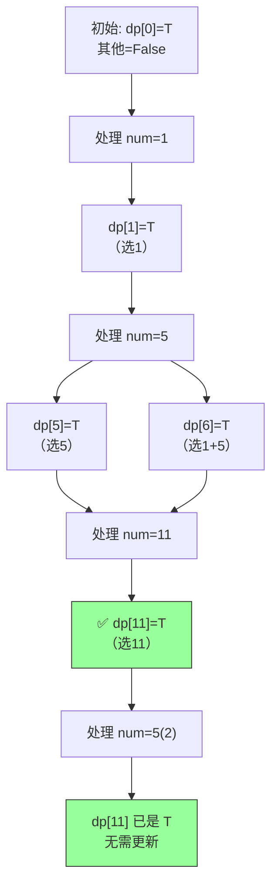

# 416. 分割等和子集（Partition Equal Subset Sum）

> 难度：中等 | 主题：动态规划、0/1 背包

## 题目

给你一个只包含正整数的非空数组 nums，请你判断是否可以将这个数组分割成两个子集，使得两个子集的元素和相等。

**示例**
输入：nums = [1,5,11,5]
输出：true
解释：可分割为 [1,5,5] 和 [11]

---

## 思路

### 先讲个故事：分蛋糕

你和朋友分一块嵌着草莓的蛋糕，蛋糕不能切碎草莓——**每颗草莓只能整颗归一个人**，且两人拿到草莓总重量要相等。

一堆正整数，分成两个和相等的子集。不是切蛋糕，是**分草莓**。

---

### 引导式推导：三个台阶

**第 1 步：问题转化**

总和 `total = sum(nums)`。要分两个和相等的子集 → 每个子集和是 `target = total // 2`。

问题等价：**能否从 nums 中选出一组数，恰好凑出 target？**

前提：total 必须为偶数。奇数直接 False。

**第 2 步：暴力枚举**

每个数选或不选，2ⁿ 种组合。n 稍大就爆炸。

**第 3 步：0/1 背包**

"选或不选" + "每个只能用一次" + "恰好凑满容量" → **0/1 背包**。

- 背包容量 = target
- 物品 = nums（重量 = 数值）
- `dp[j]` = 能否凑出和为 j

```text
dp[0] = True
for num in nums:
    for j in range(target, num-1, -1):  # 倒序！
        dp[j] = dp[j] or dp[j - num]
```

**为什么内层倒序？** 正序时同一 num 会被多次选取——相当于同一颗草莓拿了两次。倒序保证每个数字只考虑一次。

---

### 背包推演可视化



---

### 四层递进


---

## 代码

```python
def canPartition(self, nums):
    total = sum(nums)

    if total % 2 != 0:
        return False

    target = total // 2
    dp = [False] * (target + 1)
    dp[0] = True

    for num in nums:
        for i in range(target, num - 1, -1):
            dp[i] = dp[i] or dp[i - num]

    return dp[target]
```

---

## 复杂度

| 指标 | 值 | 解释 |
|------|----|------|
| 时间 | O(n × target) | n 数组长度，target 总和一半 |
| 空间 | O(target) | 一维 DP，滚动数组 |

---

## 实战考量

### 频率分析

> **出现在**：美团/字节/阿里 二面背包入门题。约 40% 的 AI Agent 常从这道题考**问题转化能力**——出题人故意披了件"分割"的外衣，内核是 0/1 背包。

### 延伸思考

**Q：为什么想到用 0/1 背包？**
A：三个特征——① "选或不选"（每数只能去一个子集）② "每个只能用一次" ③ "恰好凑满 target"。0/1 背包典型特征。

**Q：2D 怎么优化到 1D？**
A：`dp[i][j]` 只依赖 `dp[i-1][j]` 和 `dp[i-1][j-num]`（上一行）。用一维数组倒序更新，`dp[j]` 更新前就是上一行的值。

**Q：要求输出分割方案呢？**
A：额外维护二维布尔数组记录转移来源，最后回溯。

**Q：分成 k 个和相等的子集？**
A：698. 划分为k个相等的子集，用回溯 + 剪枝（从大到小排序、跳过重复值、提前剪枝），DP 状态维度太高。

**Q：和完全背包的区别？**
A：完全背包每个物品无限次，内层正序。0/1 背包每个一次，内层倒序。

### 易错点

- 忘记 `total % 2 != 0` 提前返回
- 内层正序 → 变成完全背包
- `dp[0] = True` 写成 False
- `dp[i] = dp[i] or dp[i-num]` 写成 `= dp[i-num]` → 丢"不选"分支

---

## 生活类比

> **分草莓 → 0/1 背包 → 滚动数组**
>
> target 克的容量要装满，每个数字是一颗草莓——要么放进去，要么不放。
> 滚动数组就是**桌上只留一行备忘录**，旧记录被新记录覆盖，省掉整本账本。
> 三个字：**省着用**。

---

## 相关题目

| 题目 | 关系 |
|------|------|
| [[494目标和]] | 同族变体，判断变计数，`dp[j] += dp[j-num]` |
| [[322零钱兑换]] | 完全背包求最小硬币数 |
| 698. 划分为k个相等的子集 | k 子集版，回溯 + 剪枝 |
| 474. 一和零 | 二维 0/1 背包 |

---

→ 返回题单：[[LeetCode学习清单#十三、动态规划]]

## 速记卡（面试闪卡）

**Q1：一句话讲清「416. 分割等和子集（Partition Equal Subset Sum）」到底是什么？**
A：给你一个只包含正整数的非空数组 nums，请你判断是否可以将这个数组分割成两个子集，使得两个子集的元素和相等。
**示例**
输入：nums = [1,5,11,5]
输出：true
解释：可分割为 [1,5,5] 和 [11]
---

**Q2：题目 —— 怎么理解？**
A：给你一个只包含正整数的非空数组 nums，请你判断是否可以将这个数组分割成两个子集，使得两个子集的元素和相等。
**示例**
输入：nums = [1,5,11,5]
输出：true
解释：可分割为 [1,5,5] 和 [11]
---

**Q3：思路 —— 怎么理解？**
A：你和朋友分一块嵌着草莓的蛋糕，蛋糕不能切碎草莓——**每颗草莓只能整颗归一个人**，且两人拿到草莓总重量要相等。
一堆正整数，分成两个和相等的子集。不是切蛋糕，是**分草莓**。
---
**第 1 步：问题转化**
总和 。要分两个和相等的子集 → 每个子集和是 。
问题等价：**能否从 nums 中选出一组数，恰好凑出 target？**
前提：total 必须为偶数。奇数直接 False。

**Q4：代码 —— 怎么理解？**
A：---

**Q5：复杂度 —— 怎么理解？**
A：| 指标 | 值 | 解释 |
|------|----|------|
| 时间 | O(n × target) | n 数组长度，target 总和一半 |
| 空间 | O(target) | 一维 DP，滚动数组 |
---

**Q6：核心速记主线有哪些？**
A：抓住这几根：题目、思路、代码、复杂度、实战考量、生活类比。

