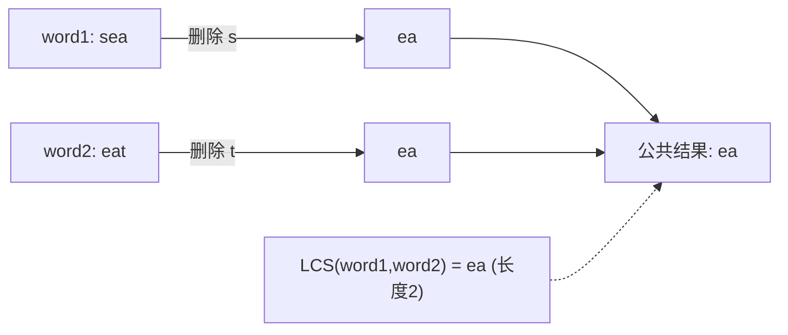
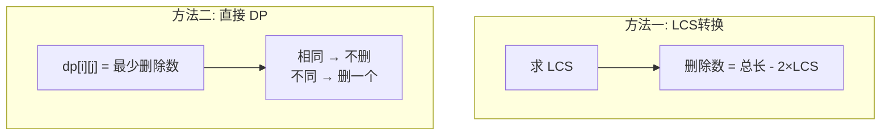

# 583. 两个字符串的删除操作

> 难度：中等 | 主题：DP——最长公共子序列

## 题目

给定两个单词 word1 和 word2，每一步可以删除任意一个字符串中的一个字符。返回使两个单词相同所需的最小步数。

**示例**
输入：word1 = "sea", word2 = "eat"
输出：2
解释：删除 "sea" 中的 's'（→"ea"），删除 "eat" 中的 't'（→"ea"）

---

## 思路

### 先讲个故事：两段纸条

你手上有两段英文句子打印在纸条上，你想让它们**变得一模一样**——但规则残酷：只能剪掉字符，不能添加或替换。

你很快意识到：**最少剪掉的字符 = 两段总长 - 2 × 最长共同片段**。

就像两条 DNA 序列比对——保留最长的匹配段，删掉两端不匹配的部分。

---

### 引导式推导：从暴力到 LCS

**第 1 步：暴力直觉**

尝试各种删除组合，看能匹配成什么。指数级，n=10 就受不了。

**第 2 步：转换视角**

删除后两个字符串相同 → 它们变成了一个**公共子序列**。删除字符最少 → **这个公共子序列最长**。

```text
minDelete = len(word1) + len(word2) - 2 × LCS(word1, word2)
```

LCS 就是 1143最长公共子序列。



**第 3 步：LCS 的 DP 推导**

定义 `dp[i][j]` = word1 前 i 个字符和 word2 前 j 个字符的 LCS 长度。

```text
if word1[i-1] == word2[j-1]:
    dp[i][j] = dp[i-1][j-1] + 1    # 字符匹配，LCS 长度 +1
else:
    dp[i][j] = max(dp[i-1][j],      # 跳过 word1[i-1]
                   dp[i][j-1])      # 跳过 word2[j-1]
```

---

### 也可以直接 DP：删除操作

不求 LCS，直接算最少删除次数：

初始化：一个空串要删掉另一个串的所有字符 → `dp[i][0] = i`, `dp[0][j] = j`

```text
if word1[i-1] == word2[j-1]:
    dp[i][j] = dp[i-1][j-1]          # 相同，不用删
else:
    dp[i][j] = 1 + min(dp[i-1][j],   # 删 word1[i-1]
                       dp[i][j-1])   # 删 word2[j-1]
```

---

### 两种方法对比



| 方法 | 思路 | 代码量 |
|------|------|--------|
| LCS 转换 | 先求 LCS，再换算 | 两段逻辑 |
| 直接 DP | 一步到位，直接算删除 | 一段逻辑 |

两者复杂度一样，LCS 转换更易懂，直接 DP 更紧凑。

---

## 代码

**LCS 转换法：**

```python
def minDistance(word1, word2):
    m, n = len(word1), len(word2)
    dp = [[0] * (n + 1) for _ in range(m + 1)]

    for i in range(1, m + 1):
        for j in range(1, n + 1):
            if word1[i-1] == word2[j-1]:
                dp[i][j] = dp[i-1][j-1] + 1
            else:
                dp[i][j] = max(dp[i-1][j], dp[i][j-1])

    lcs = dp[m][n]
    return m + n - 2 * lcs
```

**直接 DP 法：**

```python
def minDistance(word1, word2):
    m, n = len(word1), len(word2)
    dp = [[0] * (n + 1) for _ in range(m + 1)]

    for i in range(m + 1):
        dp[i][0] = i
    for j in range(n + 1):
        dp[0][j] = j

    for i in range(1, m + 1):
        for j in range(1, n + 1):
            if word1[i-1] == word2[j-1]:
                dp[i][j] = dp[i-1][j-1]
            else:
                dp[i][j] = 1 + min(dp[i-1][j], dp[i][j-1])

    return dp[m][n]
```

---

## 复杂度

| 指标 | 值 | 解释 |
|------|----|------|
| 时间 | O(m × n) | 双循环填表 |
| 空间 | O(m × n) | 二维 DP（可优化到 O(n)） |

---

## 实战考量

### 频率分析

> **出现在**：美团/字节/阿里 二三面，常作为 72编辑距离 的前置题。先让你做 583（只有删除），再追问"如果可以增/改怎么办"引出 72。

### 延伸思考

**Q：为什么想到转 LCS？**
A：删除操作的本质是保留公共部分。删除最少 → 保留最长公共子序列。这是"逆向思维"——从"删什么"变成"留什么"。

**Q：直接 DP 的初始化为什么是 dp[i][0] = i？**
A：word2 为空时，要把 word1 的前 i 个字符全删掉才能变成空串。所以需要 i 步。

**Q：空间能优化吗？**
A：可以。`dp[i][j]` 只依赖 `dp[i-1][j-1]`、`dp[i-1][j]`、`dp[i][j-1]`。用一维数组 + 左上角变量记录，降到 O(n)。

**Q：如果还能增加和替换字符（72 题）？**
A：操作集合从 1 种（删除）扩展到 3 种（增/删/改）。转移方程变成 `dp[i][j] = min(dp[i-1][j] + 1, dp[i][j-1] + 1, dp[i-1][j-1] + (0 if 相同 else 1))`。

### 易错点

- 初始化 `dp[i][0] = i` 和 `dp[0][j] = j` 不能忘
- LCS 法最后要 `总长 - 2×LCS`，不是 `总长 - LCS`
- 直接 DP 中字符相同时是 `= dp[i-1][j-1]`，不是 `= dp[i-1][j-1] + 1`（因为不删，不是加）

---

## 生活类比

> **两段纸条 → LCS → 删除数**
>
> 两段文字要变一样，就像两个乐高模型要变成同一个形状——你只能拆零件。
> 最省事的做法：**保留最长公共骨架**，拆掉骨架外的部分。
> 总零件数 - 2 × 公共骨架数 = 最少拆除数。

---

## 相关题目

| 题目 | 关系 |
|------|------|
| 1143最长公共子序列 | LCS 基础，本题核心子问题 |
| 72编辑距离 | 进阶版，可增/删/改三种操作 |

---

→ 返回题单：[[LeetCode学习清单#十三、动态规划]]
