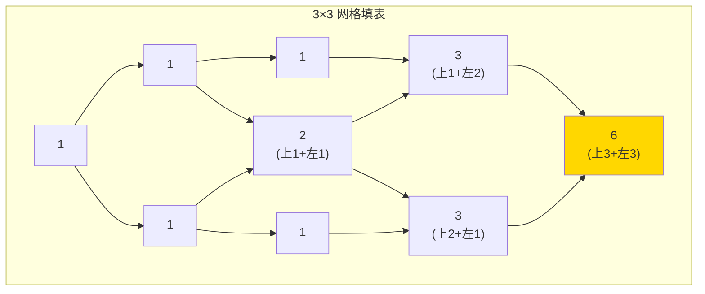
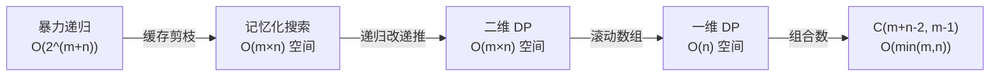

# 62. 不同路径（Unique Paths）

> 难度：中等 | 主题：DP、组合数学

## 题目

m x n 网格，机器人从左上角走到右下角，只能向右或向下，求不同路径数。

**示例**
输入：m = 3, n = 7
输出：28

---

## 思路

### 先讲个故事：迷宫导航

你站在一个网格迷宫左上角，手机导航说只能往右或往下走。走到右下角有多少种走法？

一开始你可能会想：每次到十字路口有 2 种选择...但等等，到同一个格子可能从左边来、也可能从上边来——**路径在这里汇合了**。

这不是选择题，是**路径计数**：每个格子记下"从起点到这儿有多少种走法"，然后往后传。

---

### 引导式推导：动手填表

**第 1 步（边界条件）**

第一行：只能一直往右 → 只有 1 条路径
第一列：只能一直往下 → 只有 1 条路径

**第 2 步（中间格子）**

要到达 `(i, j)`，上一步只可能来自：
- 上方 `(i-1, j)` → 往下走一步
- 左方 `(i, j-1)` → 往右走一步

这两种情况**互斥且覆盖所有可能**，所以路径数相加：

```text
dp[i][j] = dp[i-1][j] + dp[i][j-1]
```

**第 3 步（推广）**

3×3 网格填一圈：



---

### 四层递进：从暴力到最优



**暴力递归**：`f(i,j) = f(i-1,j) + f(i,j-1)`，但大量重复计算。

**记忆化搜索**：`@lru_cache` 搞定，时间 O(m×n) 但递归栈有开销。

**自底向上 DP**：从 (0,0) 填表到 (m-1,n-1)，二维数组。

**滚动变量**：观察 `dp[i][j]` 只依赖当前行左边 `dp[i][j-1]` 和上一行同列 `dp[i-1][j]`。用一维数组：

```text
dp[j] += dp[j-1]
```

`dp[j]` 更新前是上一行的值（上方），`dp[j-1]` 已被当前行更新（左方）。为什么 j 从左到右？因为需要 `dp[j-1]` 是当前行的新值。

**数学组合数**：总共 `(m-1)+(n-1)` 步，选 `(m-1)` 步向下，其余向右。`C(m+n-2, m-1)`，`math.comb` 一行搞定。

---

## 代码

```python
def uniquePaths(self, m, n):
    dp = [1] * n
    for i in range(1, m):
        for j in range(1, n):
            dp[j] += dp[j-1]
    return dp[n-1]
```

---

## 复杂度

| 指标 | 值 | 解释 |
|------|----|------|
| DP 时间 | O(m × n) | 双重循环遍历所有格子 |
| DP 空间 | O(n) | 一维数组滚动更新 |
| 组合数时间 | O(min(m,n)) | `math.comb` 计算一次 |
| 组合数空间 | O(1) | 不耗额外空间 |

---

## 实战考量

### 频率分析

> **出现在**：几乎所有公司一面必考 DP 题之一。约 50% 的 AI Agent 常从这道题开始 DP 轮——简单直观，方便追问优化。字节/美团/阿里一面的 DP 热身首选。

### 延伸思考

**Q：数学组合公式怎么推导？**
A：总共 `(m-1)+(n-1)` 步移动，选 `(m-1)` 步向下，其余向右。`C(m+n-2, m-1) = C(m+n-2, n-1)`。

**Q：为什么 `dp[j] += dp[j-1]` 能工作？**
A：`dp[j]` 保留上一行的值（从上方来），`dp[j-1]` 是当前行刚更新的值（从左方来）。利用了更新顺序复用值。

**Q：有障碍物（63 题）呢？**
A：障碍物处 `dp[j] = 0`。第一行/列遇障碍后后续全 0。初始化需要特殊处理。

**Q：组合数会溢出吗？**
A：Python 整数无上限。C++/Java 需要 `long long` 或 `BigInteger`。用组合数学要提溢出风险。

**Q：m,n 很大（如 10⁵）怎么办？**
A：DP 的 O(mn) 会超时，用组合数学 O(min(m,n))。

### 易错点

- `dp` 初始化为全 1（第一行全是 1）
- j 从 1 开始（第一列永远是 1，不更新）
- `dp[j] += dp[j-1]` 依赖 `dp[j-1]` 是当前行最新值（j 从左到右遍历正确）
- n=1 或 m=1 时循环不执行，直接返回 1

---

## 生活类比

> **迷宫导航 → DP 填表 → 滚动数组**
>
> 每个格子都记着"从起点到这儿有多少条路"——就像地铁站人流计数器，每个站累加前一个站的人数。
> 滚动数组就是**只带一行计数器**走完迷宫，走完一行丢掉上一行。
> 三个字：**累加传**。

---

## 相关题目

| 题目 | 关系 |
|------|------|
| [[63不同路径II]] | 有障碍物版 |
| [[64最小路径和]] | 求最小和 |
| 120三角形最小路径和 | 三角形 DP，同源递推 |

---

→ 返回题单：[[LeetCode学习清单#十三、动态规划]]

## 速记卡（面试闪卡）

**Q1：一句话讲清「62. 不同路径（Unique Paths）」到底是什么？**
A：m x n 网格，机器人从左上角走到右下角，只能向右或向下，求不同路径数。
**示例**
输入：m = 3, n = 7
输出：28
---

**Q2：题目 —— 怎么理解？**
A：m x n 网格，机器人从左上角走到右下角，只能向右或向下，求不同路径数。
**示例**
输入：m = 3, n = 7
输出：28
---

**Q3：思路 —— 怎么理解？**
A：你站在一个网格迷宫左上角，手机导航说只能往右或往下走。走到右下角有多少种走法？
一开始你可能会想：每次到十字路口有 2 种选择...但等等，到同一个格子可能从左边来、也可能从上边来——**路径在这里汇合了**。
这不是选择题，是**路径计数**：每个格子记下"从起点到这儿有多少种走法"，然后往后传。

**Q4：代码 —— 怎么理解？**
A：---

**Q5：复杂度 —— 怎么理解？**
A：| 指标 | 值 | 解释 |
|------|----|------|
| DP 时间 | O(m × n) | 双重循环遍历所有格子 |
| DP 空间 | O(n) | 一维数组滚动更新 |
| 组合数时间 | O(min(m,n)) |  计算一次 |
| 组合数空间 | O(1) | 不耗额外空间 |
---

**Q6：核心速记主线有哪些？**
A：抓住这几根：题目、思路、代码、复杂度、实战考量、生活类比。

