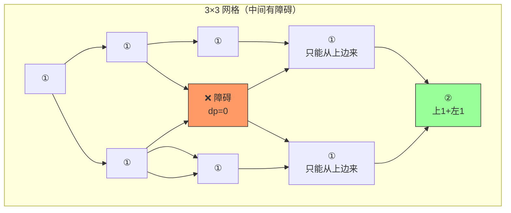

---

title: "不同路径II"

difficulty: 中等

category: 动态规划

tags:

  - leetcode

  - 动态规划

created: "2026-07-21"

---

# 63. 不同路径 II（Unique Paths II）

> 难度：中等 | 主题：动态规划、矩阵

## 题目

一个机器人位于一个 m x n 网格的左上角。每次只能向下或者向右移动一步。现在考虑网格中有障碍物。网格中的障碍物和空位置分别用 1 和 0 来表示。求机器人试图到达网格右下角有多少条不同的路径。

**示例**

```text

输入：obstacleGrid = [[0,0,0],[0,1,0],[0,0,0]]

输出：2

```

---

## 思路
### 先讲个故事：修路施工

你和 62 题一样在导航迷宫，但这次——**有些格子正在施工，不能进入**。

你发现：只要这个格子是工地，到这里的路径数就是 0。而如果第一行中间有工地，后面的格子都得绕路——但规则只允许往下或往右，所以绕不了，后面的格子也到不了。

这就是 63 题和 62 题的核心区别：**障碍物切断路径**。

---

### 引导式推导：从 62 到 63

**第 1 步：回顾 62 题**

无障碍时：`dp[j] += dp[j-1]`，第一行全 1，第一列全 1。

**第 2 步：加入障碍物**

核心变化只有一个：

```text

如果 (i,j) 是障碍物：

    dp[j] = 0          # 不可达

否则：

    dp[j] += dp[j-1]   # 上方 + 左方

```



**第 3 步：边界变化**

| 场景 | 62 题 | 63 题 |
|------|-------|-------|
| 第一行 | 全 1 | 遇障碍前 1，遇障碍后全 0 |
| 第一列 | 全 1 | 遇障碍前 1，遇障碍后全 0 |
| 中间格子 | `dp[j] += dp[j-1]` | 障碍物处 `dp[j] = 0` |

**为什么障碍物后全 0？** 只能向右/向下——不能绕路。一旦某格被堵，它后面的格子（同一行/列）就无法到达。

**第 4 步：起点判断**

起点 `(0,0)` 就有障碍物？直接返回 0。

---

## 代码

```python

def uniquePathsWithObstacles(self, obstacleGrid):

    m, n = len(obstacleGrid), len(obstacleGrid[0])

    dp = [0] * n

    dp[0] = 1 if obstacleGrid[0][0] == 0 else 0

    for i in range(m):

        for j in range(n):

            if obstacleGrid[i][j] == 1:

                dp[j] = 0

            elif j > 0:

                dp[j] += dp[j-1]

    return dp[n-1]

```

---

## 复杂度

| 指标 | 值 | 解释 |
|------|----|------|
| 时间 | O(m × n) | 遍历矩阵一次 |
| 空间 | O(n) | 一维 DP 数组 |

---

## 实战考量
### 频率分析

> **出现在**：通常作为 62 题的 follow-up 出现。约 30% 的 AI Agent 会在 62 题基础上追问"有障碍物怎么办"，考察**边界条件处理能力**。单独出题概率较低，多为附加问。

### 延伸思考

**Q：为什么空间可以优化到 O(n)？**

A：和 62 题一样——每行只依赖上一行。`dp[j]` 在更新前就是上一行的值（上方），`dp[j-1]` 是当前行刚更新的值（左方）。

**Q：起点就是障碍物？**

A：直接返回 0。没有路径。

**Q：终点是障碍物？**

A：不需要特殊处理——循环中终点格 `dp[n-1]` 自然是 0。

**Q：和 62 题的核心区别？**

A：62 无障碍，可用组合数学公式。63 有障碍只能用 DP——障碍物的位置随机，组合数学无法处理。

**Q：如果要求输出具体路径？**

A：额外维护二维数组记录每个位置从哪来（上/左），最后从终点回溯到起点。

### 易错点

- 起点也要判断障碍物

- `dp[0]` 每行都要更新（第一列可能有障碍阻断，`dp[0]` 会变成 0，下一行 `dp[0]` 应继承 0）

- 障碍物判断必须在累加之前——先 `dp[j] = 0`，再累加

- 一维数组时 `dp[0]` 的初始化不能简单地 `= 1`，要看起点有没有障碍

---

## 生活类比

> **带障碍迷宫 → 带约束 DP → 初始化陷阱**

>

> 还是那个导航迷宫，但有些格子是"施工中"。

> 施工格子路径数 = 0——就像河流中的礁石，船到不了这里。

> 第一行的施工会切断整行——因为船不能倒流。

> 三个字：**绕不过**。

---

## 相关题目

| 题目 | 关系 |
|------|------|
| [[62不同路径]] | 无障碍基础版，本题的前置知识 |
| [[64最小路径和]] | 同类型网格 DP，求最小路径和 |
| 120三角形最小路径和 | 三角形 DP，也是路径最值问题 |

---

→ 返回题单：[[LeetCode学习路线图#十三、动态规划]]

## 速记卡（面试闪卡）

**Q1：一句话讲清「63. 不同路径 II（Unique Paths II）」到底是什么？**

A：机器人从左上到右下只能下/右走，网格里有障碍物(1)，问有多少条可达路径。

**Q2：题目怎么理解？ —— 怎么理解？**

A：导航迷宫里有些格子在施工（障碍），船到不了礁石、后面的格子也绕不过——只能往右往下，所以施工会切断一整片。这是带障碍的网格路径（Unique Paths with Obstacles）。

**Q3：障碍物怎么处理？ —— 怎么理解？**

A：障碍那格直接标 dp=0（不可达），否则才 上方+左方 累加。像河道里放块礁石，船到不了这，路径数归零。这是障碍格置零（obstacle cell → dp=0）。

**Q4：边界为什么全 0？ —— 怎么理解？**

A：只能往右往下，第一行中途有施工，后面整行都被切断、绕不了，所以遇障后整行整列全 0。这是首行首列零值传播（first-row/col zero propagation）。

**Q5：复杂度和实战怎么理解？ —— 怎么理解？**

A：常作62题的 follow-up，约30%会追问"有障碍怎么办"，考你边界与初始化。时间 O(m×n)，空间 O(n)（一维数组）。

**Q6：核心速记主线有哪些？**

- 题目：带障碍网格，右下角可达路径数

- 核心：障碍格 dp=0，否则 上+左

- 边界：首行首列遇障后全0(无法绕)

- 实战：62题 follow-up，考边界与初始化

**口诀**

A：不同路径遇障碍，

礁石一格路归零；

首行施工断整排，

只能向下向右行。

## 相关链接

- [[笔记/Leetcode笔记/13_动态规划/62不同路径|不同路径]]

- [[笔记/Leetcode笔记/13_动态规划/213打家劫舍II|打家劫舍II]]

- [[笔记/Leetcode笔记/13_动态规划/221最大正方形|最大正方形]]

- [[笔记/Leetcode笔记/13_动态规划/300最长递增子序列|最长递增子序列]]

- [[笔记/Leetcode笔记/13_动态规划/32最长有效括号|最长有效括号]]

