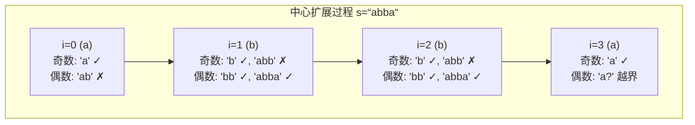
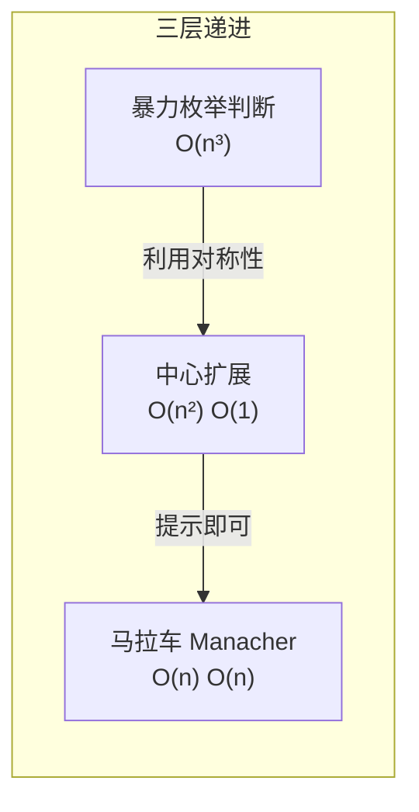

---

title: "回文子串"

difficulty: 中等

category: 动态规划

tags:

  - leetcode

  - 动态规划

created: "2026-07-21"

---

# 647. 回文子串（Palindromic Substrings）

> 难度：中等 | 主题：动态规划、字符串、中心扩展

## 题目

给你一个字符串 s，请你统计并返回这个字符串中回文子串的数目。回文字符串是正着读和倒过来读一样的字符串。

**示例**

```text

s = "abc" → 输出 3

解释："a","b","c" 三个单字符回文

s = "aaa" → 输出 6

解释："a","a","a","aa","aa","aaa"

```

---

## 思路
### 先讲个故事：两面镜子

你的书桌上摆了两面镜子面对面，你站在中间。

两面镜子里会反射出无数个你，越往深处越小——这是一种**对称的无限嵌套**。

回文子串也是对称的：`"aba"` 里，'b' 是镜子，两边的 'a' 互相对称。

如果两边各加一个 'c'，变成 `"cabac"`，那 'c' 和 'c' 又在更外层对称。

所以**每个回文都有一个"中心"**，从中心向两边扩展，只要字符相等就仍是回文。

找到所有中心，从每个中心尽可能向外扩展，每成功一步就找到一个回文子串。

---

### 引导式推导：从暴力到中心扩展

**第 1 步（暴力法）**：枚举所有子串 O(n²)，每个判断是否回文 O(n)。总 O(n³)。太慢了。

**第 2 步（发现对称性）**：回文是中心对称的。与其枚举子串再判断，不如**从中心向外生长**。

```text

s = "aba"

中心在 'b'（下标1）→ 向左右扩展

  l=1, r=1: "a" ✓  计数+1

  l=0, r=2: "aba" ✓ 计数+1

  l=-1, r=3: 越界，停

```

**第 3 步（两种中心）**：回文有两种——奇数长度（中心是字符）和偶数长度（中心在字符间隙）。

```text

奇数："aba" → 中心是 'b'

偶数："abba" → 中心在 "bb" 之间

```

每个位置需要调两次扩展：

- 奇数中心 `expand(i, i)`

- 偶数中心 `expand(i, i+1)`

共 **2n-1 个中心**（n 个奇数 + n-1 个偶数）。



---

### 三层递进：从 O(n³) 到 O(n)



**暴力枚举判断**：枚举所有子串 O(n²)，每个判断回文 O(n)。n=1000 时约 5 亿次操作，超时。

**中心扩展（首选）**：2n-1 个中心，每个最多扩展 O(n)。n=1000 时约 50 万次操作，秒过。

**马拉车（Manacher）**：O(n) 线性时间，通过插入 `#` 统一奇偶处理，维护最右回文边界做镜像复用。极少要求手写，提一句即可。

---

## 代码

```python

class Solution:

    def countSubstrings(self, s: str) -> int:

        n = len(s)

        count = 0

        for center in range(2 * n - 1):     # 2n-1 个中心：n 个奇数 + n-1 个偶数

            # 用整除和取模统一两种中心：

            left = center // 2              # 奇数中心：center=0 → left=0

            right = left + center % 2        # 奇数中心：center%2=0 → right=left

                                             # 偶数中心：center%2=1 → right=left+1

            while left >= 0 and right < n and s[left] == s[right]:

                count += 1                   # 发现一个回文子串

                left -= 1                    # 向两边扩展

                right += 1

        return count

```

**统一奇数/偶数中心的技巧**：`center // 2` 计算左指针，`center % 2` 决定右指针偏移。`center=0,2,4...` 是奇数中心，`center=1,3,5...` 是偶数中心。更简洁，但写两个 while 循环也更清晰。

---

## 复杂度

| 指标 | 值 | 解释 |
|------|----|------|
| 时间 | O(n²) | 2n-1 个中心，每个扩展 O(n) |
| 空间 | O(1) | 仅指针和计数器 |
| 暴力法 | O(n³) | 不推荐 |

---

## 实战考量
### 频率分析

> **出现在**：字节/腾讯/阿里 二面字符串题，约 20% 的 AI Agent 常会考到察回文类问题。中心扩展是最常考的实现，DP 解法用于引出后续问题。

### 延伸思考

**Q：和 05最长回文子串 有什么区别？**

A：框架完全一样，都是中心扩展。5 题在每次扩展时记录 `max_len` 和 `start/end`，本题在每次扩展成功时 `count += 1`。常见的问题是"如果求数量呢？"来考察对框架的理解深度——**会一个就会两个**。

**Q：DP 解法怎么写？**

A：`dp[i][j]` 表示 `s[i:j+1]` 是否回文。状态转移：

```text

dp[i][j] = (s[i] == s[j]) and (j - i <= 2 or dp[i+1][j-1])

```

`j-i <= 2` 覆盖基线：长度 1 恒真、长度 2 比首尾、长度 3 比首尾（中间不影响）。

必须按子串长度从小到大遍历，因为 `dp[i][j]` 依赖 `dp[i+1][j-1]`（更短的子串）。

**Q：DP 和中心扩展的优劣？**

A：中心扩展 O(n²) 时间 O(1) 空间，代码简洁，**首选**。DP 也是 O(n²) 但 O(n²) 空间。但 DP 可以一次性预处理所有子串的回文性，后续若需多次查询（如 131分割回文串 的回溯），DP 更划算——**一次预处理，多次查询**。

**Q：马拉车（Manacher）算法？**

A：O(n) 线性时间，插入 `#` 统一奇偶，维护当前最右回文边界 `rightmost` 和对应中心 `c`，利用对称性避免重复扩展。极少要求手写，提一句"有 O(n) 解法但实现复杂"即可。LeetCode 上 n≤1000，中心扩展足够。

**Q：如果字符串很长（10000+）呢？**

A：中心扩展 O(n²) 会超时（约 10⁸ 次操作），需要马拉车 O(n)。但通常 n≤1000 的题范围不需要。

### 易错点

- 每个位置**只调一次扩展**（漏掉偶数回文，最常见错误！）

- 偶数回文中心写成 `(center-1, center)` 而非 `(center, center+1)`

- 只在 while 循环结束时计数（会漏掉较短的回文——每次成功进入 while 都要计）

- DP 写法没有按子串长度遍历（直接 `for i for j` 会出错，因为 `dp[i+1][j-1]` 还没算）

---

## 生活类比

> **回文子串 → 中心扩展 → 两面镜子**

>

> 每一个回文就像两面镜子面对面反射出的无限镜像。

> 暴力法是：检查所有镜像对是否对称——要把每一对都从头开始比。

> 中心扩展是：从镜子中心开始，每次向外多反射一层——确认对称就继续往外走。

>

> 用四个字概括中心扩展的核心：**以点带面。**

---

## 相关题目

| 题目 | 关系 |
|------|------|
| 05最长回文子串 | 相同框架，找最长而非计数 |
| 131分割回文串 | DP 预处理所有回文 + 回溯枚举分割 |
| [[32最长有效括号]] | 同类子串 DP，按结尾位置定义状态 |
| [[647回文子串]] | 本题，中心扩展经典应用 |

---

→ 返回题单：[[LeetCode学习路线图#十三、动态规划]]

## 速记卡（面试闪卡）

**Q1：一句话讲清「647. 回文子串（Palindromic Substrings）」到底是什么？**

A：统计回文子串个数，从每个中心向两边扩展，奇偶中心共 2n-1 个，时间 O(n²)。

**Q2：两面镜子反射（center expansion） —— 怎么理解？**

A：类比：回文像两面镜子面对面，'b' 是镜、两边 'a' 对称。每个回文都有个中心，从中心向外扩、字符相等就仍是回文，每扩一步记一个。像从镜子中心往外每层确认对称。（Point-to-surface）

**Q3：奇偶两种中心（odd/even centers） —— 怎么理解？**

A：类比：奇数回文中心是字符（aba 的 b），偶数中心在字符缝（abba 的 bb 间）。每个位置要扩两次：expand(i,i) 和 expand(i,i+1)，共 2n-1 个中心，别漏掉偶数那个——这是最常见的坑。（Don't miss even）

**Q4：暴力与马拉车（Manacher） —— 怎么理解？**

A：类比：暴力枚举所有子串再判回文是 O(n³)，超时；中心扩展 O(n²) 首选；还有马拉车（Manacher）O(n) 线性，插 # 统一奇偶、镜像复用最右边界。LeetCode n≤1000 用中心扩展足够，提一句即可。（O(n) variant）

**Q5：DP 解法与复杂度（O(n²) time, O(1) space） —— 怎么理解？**

A：类比：中心扩展时间 O(n²)、空间 O(1)。DP 法 dp[i][j]=(s[i]==s[j]) and (j-i<=2 or dp[i+1][j-1])，也是 O(n²) 但 O(n²) 空间；胜在一次预处理、多次查询（如 131 分割回文串）。（DP for multi-query）

**Q6：核心速记主线有哪些？**

- 题目：统计字符串中回文子串数目

- 思路：每个中心向两边扩展（center expansion）

- 关键：奇偶两种中心，共 2n-1 个

- 进阶：暴力 O(n³)、Manacher O(n)

- 对比：DP 预处理适合多次查询

**口诀**

A：回文镜像两边排，

中心扩展向外推；

奇偶两心都照顾，

数清子串记一回。

## 相关链接

- [[笔记/Leetcode笔记/13_动态规划/05最长回文子串|最长回文子串]]

- [[笔记/Leetcode笔记/13_动态规划/63不同路径II|不同路径II]]

- [[笔记/Leetcode笔记/13_动态规划/300最长递增子序列|最长递增子序列]]

- [[笔记/Leetcode笔记/13_动态规划/62不同路径|不同路径]]

- [[笔记/Leetcode笔记/13_动态规划/221最大正方形|最大正方形]]

