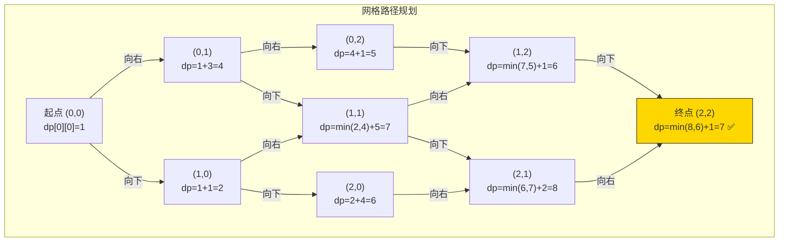
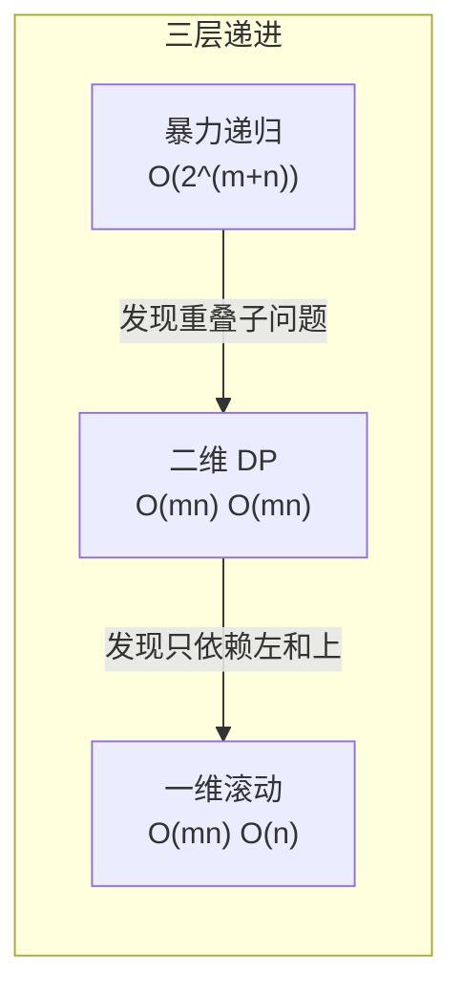

# 64. 最小路径和（Minimum Path Sum）

> 难度：中等 | 主题：动态规划、矩阵

## 题目

给定一个包含非负整数的 m x n 网格 grid，请找出一条从左上角到右下角的路径，使得路径上的数字总和最小。每次只能向下或者向右移动一步。

**示例**
```text
grid = [[1,3,1],
        [1,5,1],
        [4,2,1]]

输出：7
解释：1 → 3 → 1 → 1 → 1
```

---

## 思路

### 先讲个故事：放学回家有两条路

你家住在网格的左上角，学校在右下角。你每天放学回家只能向右或向下走，每个路口有个"堵车指数"（格子里的数字）。
你想找一条**总堵车指数最小**的路线。

这就像导航 App 里的路径规划——只是简化版：**只有两个方向，每个格子有代价，求最小代价路径**。

---

### 引导式推导：从加法到取 min

**第 1 步（暴力递归）**：到 (i,j) 的最小路径和 = 当前格子值 + min(从左边来, 从上边来)。

```text
到 (i,j) 的最小路径和 = grid[i][j] + min(到 (i-1,j) 的最小路径和,
                                           到 (i,j-1) 的最小路径和)
```

但暴力递归画一下递归树就会发现重复计算严重——和斐波那契一样。

**第 2 步（发现子问题重叠）**：到 (i,j) 的最小路径和只依赖上方和左方的结果。而且**路径具有无后效性**——不管之前怎么走到 (i,j) 的，到 (i,j) 之后的选择只依赖当前位置，不依赖之前的路径。

这就是 DP 的核心条件：**最优子结构 + 无后效性**。

**第 3 步（自底向上填表）**：定义 `dp[i][j]` = 到达 (i,j) 的最小路径和。

```text
dp[i][j] = grid[i][j] + min(dp[i-1][j], dp[i][j-1])
```



---

### 三层递进：从暴力到一维滚动



**暴力递归**：从起点到终点，每次选 min。画递归树会发现大量重复路径计算。

**二维 DP**：`dp[i][j] = grid[i][j] + min(dp[i-1][j], dp[i][j-1])`。先初始化第一行（只能从左来）和第一列（只能从上来），然后按行遍历填表。

**一维滚动**：`dp[j]` 在更新前是上一行的值（上方），`dp[j-1]` 当前行已更新（左方）。所以一行代码搞定：

```text
dp[j] = grid[i][j] + min(dp[j], dp[j-1])
#       ↑上方    ↑左方（已更新）
```

和 70爬楼梯 的滚动变量逻辑完全一样——**只留有用的，砍掉不需要的历史**。

---

## 代码

```python
def minPathSum(self, grid):
    m, n = len(grid), len(grid[0])

    dp = [0] * n                     # 一维滚动数组，长度 = 列数

    for i in range(m):               # 逐行遍历
        for j in range(n):           # 逐列遍历
            if i == 0 and j == 0:    # 起点
                dp[j] = grid[0][0]
            elif i == 0:             # 第一行：只能从左来
                dp[j] = dp[j - 1] + grid[i][j]
            elif j == 0:             # 第一列：只能从上来
                dp[j] = dp[j] + grid[i][j]   # dp[j] 此时是上一行的值
            else:                    # 普通位置：取 min(上方, 左方)
                dp[j] = grid[i][j] + min(dp[j], dp[j - 1])

    return dp[n - 1]                 # 右下角的最小路径和
```

**空间优化核心**：`dp[j]` 在更新前存储的是上一行同列的值（即"上方"），`dp[j-1]` 在当前行已更新（即"左方"）。

---

## 复杂度

| 指标 | 值 | 解释 |
|------|----|------|
| 时间 | O(mn) | 遍历整个矩阵一次 |
| 空间 | O(n) | 一维滚动数组，n 为列数 |
| 二维 DP | O(mn) | 可提但非最优 |

---

## 实战考量

### 频率分析

> **出现在**：美团/字节/阿里 二面 DP 题，约 25% 的同类题会考矩阵 DP。常作为 [[62不同路径]] 的进阶——从计数变求 min，考察对 DP 状态转移的灵活运用。

### 延伸思考

**Q：和 62 题（不同路径）的关系？**
A：框架完全一样——都是 `dp[i][j] = f(dp[i-1][j], dp[i][j-1])`。62 是计数（`+`），63 是有障碍（跳过障碍格子），64 是求最小路径和（`min`）。**会一个等于会三个**。

**Q：空间能优化到 O(1) 吗？**
A：可以——直接在原数组 `grid` 上原地修改。但会改变输入数据，实践中需和确认是否允许。

**Q：如果要求输出具体路径呢？**
A：额外用一个 `dir` 数组记录每个位置从哪来（上/左），最后从终点回溯到起点。这叫**记录决策的 DP**，在很多问题中都用到。

**Q：如果还可以向右上走呢？**
A：状态转移要多加一个右上来源 `dp[i-1][j+1]`，就不能只用一行滚动了——滚动方向冲突。需要两行缓存或二维数组。

**Q：如果格子值有负数呢？**
A：状态转移公式不变，但要注意初始化——`dp[j]` 初始值不能是 0（因为负路径和可能小于 0），需要初始化为无穷大或特殊处理。

### 易错点

- 第一行和第一列的初始化：第一行只能从左来，第一列只能从上来
- 空间优化后 `dp[j]` 的语义变化——更新前是上方，更新后是当前位置
- `dp[j-1]` 在当前行已更新，代表左方；`dp[j]` 未更新，代表上方——**两个值的来源不同**

---

## 生活类比

> **最小路径和 → 导航规划 → 记账本**
>
> 想象你在记账本上填数字：每个格子的最小路径和 = 格子本身的数字 + 左边和上边两个格子中更小的那个。
> 这就像写导航 App 的路径规划——每个路口的预估时间 = 当前路口耗时 + 左边和上面两个入口中最快的。
>
> 滚动数组就是：**只看上一行的账本，当前行的边算边写，算完上一行就扔掉。**
> 还是那四个字——**只留有用的。**

---

## 相关题目

| 题目 | 关系 |
|------|------|
| [[62不同路径]] | 路径计数版，同类框架 |
| [[63不同路径II]] | 有障碍物，跳过障碍格子 |
| [[64最小路径和]] | 本题，路径加权求最小 |
| 70爬楼梯 | 一维 DP 滚动优化同源 |

---

→ 返回题单：[[LeetCode学习清单#十三、动态规划]]
