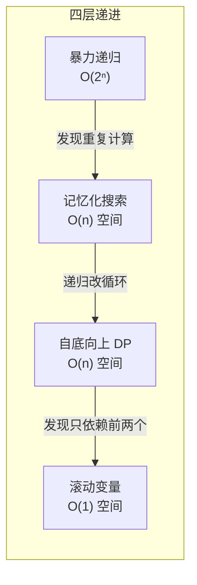
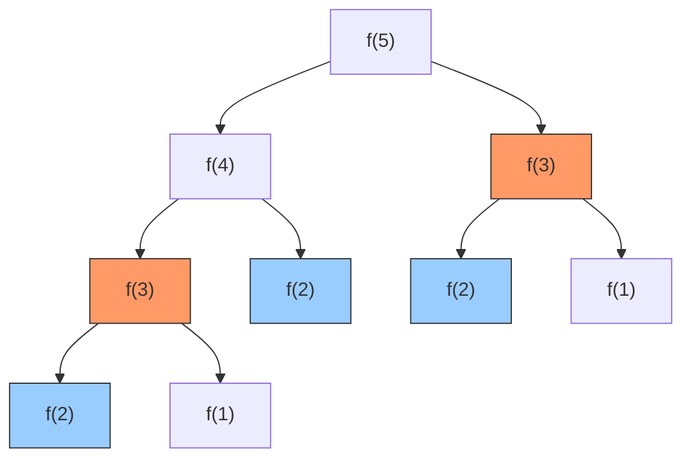
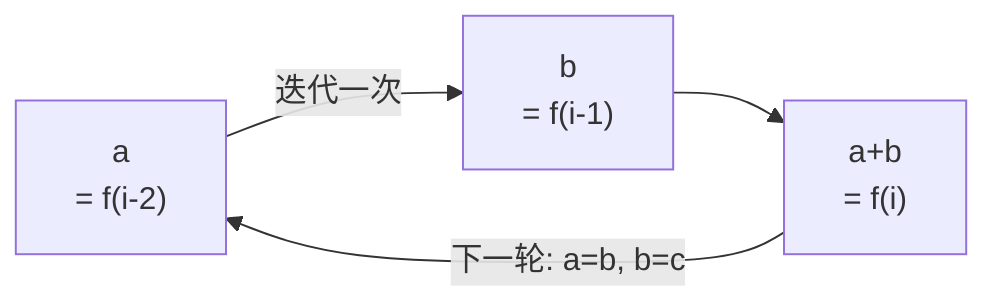

---

title: "爬楼梯"

difficulty: 简单

category: 动态规划

tags:

  - leetcode

  - 动态规划

created: "2026-07-21"

---

# 70. 爬楼梯

> 难度：简单 | 主题：动态规划

## 题目

假设你正在爬楼梯。需要 n 阶你才能到达楼顶。每次你可以爬 **1 或 2 个台阶**。有多少种不同的方法可以爬到楼顶？

**示例**

```text

n = 3 → 输出 3

解释：1+1+1, 1+2, 2+1 共三种

n = 4 → 输出 5

解释：1+1+1+1, 1+1+2, 1+2+1, 2+1+1, 2+2

```

---

## 思路
### 先讲个故事：三张钞票

假设你每天去便利店买早餐，兜里只有 **1 元和 2 元** 两种钞票。

老板说："今天总价正好是 n 元，你有多少种不同的付款方式？"

你突然发现：这和爬楼梯其实是一个问题——每次付 1 元（爬 1 步）或付 2 元（爬 2 步），凑够 n 元（爬到 n 级）有多少种方法。

---

### 引导式推导：从动手数到找规律

**第 1 步（n=1）**：只有 1 种——[1]

**第 2 步（n=2）**：2 种——[1+1] 或 [2]

**第 3 步（n=3）**：3 种——[1+1+1]、[1+2]、[2+1]

**发现规律了吗？**

n=3 的方法数 = n=2 的方法数 + n=1 的方法数 = 2 + 1 = 3

这不是巧合。思考方式是这样：

> 我要走到第 3 级，**最后一步**只有两种选择：

> - 从第 2 级跨 1 步上来 → 走到第 2 级有 2 种方法，每种后面再跨 1 步

> - 从第 1 级跨 2 步上来 → 走到第 1 级有 1 种方法，每种后面再跨 2 步

所以：`f(3) = f(2) + f(1)`

**推广到任意 n**：不管 n 多大，最后一步只有两种可能性：

- 从 n-1 跨 1 步上来（前面 f(n-1) 种方法）

- 从 n-2 跨 2 步上来（前面 f(n-2) 种方法）

这两种情况**互斥**且**覆盖了所有可能**，所以方法数**相加**：

```text

f(n) = f(n-1) + f(n-2)

```

斐波那契数列。

---

### 四层递进：从慢到最优



**暴力递归**：直接写递归 `f(n) = f(n-1) + f(n-2)`。但画一下递归树就会发现：f(3) 被算了好多次。n=50 时整个宇宙的原子加起来都算不完。



红色 f(3) 被算了 2 次，蓝色 f(2) 被算了 3 次。n 越大重复越多。

**记忆化搜索**：「算过的记下来，下次直接用」。`@lru_cache` 一行搞定。时间从 O(2ⁿ) 降到 O(n)，但递归栈 + 缓存还是占空间。

**自底向上 DP**：「既然子问题确定了父问题，那从小的开始往上推」。用一个数组 dp，dp[i] 表示走到第 i 级的方法数。循环从 2 推到 n。

**滚动变量**：「dp[i] 只依赖 dp[i-1] 和 dp[i-2]，要整个数组干嘛？」用两个变量滚动前进就行。



这个优化思路在各种 DP 题里反复出现——**观察依赖关系，砍掉不需要的历史**。

---

## 代码

```python

def climbStairs(n: int) -> int:

    a, b = 1, 1          # a=f(0), b=f(1)；从起点开始

    for _ in range(n - 1):   # 需要迭代 n-1 轮才能到 f(n)

        a, b = b, a + b      # Python 并行赋值：相当于

                             #   temp = a + b

                             #   a = b

                             #   b = temp

    return b                 # b 就是 f(n)

```

**为什么并行赋值能一次搞定？** Python 先计算右边的所有表达式，再同时赋给左边。所以 `a, b = b, a + b` 等价于：

1. 算好 b 的当前值（旧 b）→ 新 a

2. 算好 a + b（旧 a + 旧 b）→ 新 b

---

## 复杂度

| 指标 | 值 | 解释 |
|------|----|------|
| 时间 | O(n) | 循环 n-1 次 |
| 空间 | O(1) | 就两个变量 |
| 暴力递归 | O(2ⁿ) | n=50 就爆了 |

---

## 实战考量
### 频率分析

> **出现在**：字节/美团/阿里 DP 热身题，约 30% 的 AI Agent 常会从这种简单 DP 开始，看你**能不能从暴力优化到滚动变量**。

### 延伸思考

**Q：为什么不能用贪心？**

A：贪心适合"每一步选局部最优就能得到全局最优"的问题。但爬楼梯不是"选"——每一步没有选择空间（你既要爬 1 也要爬 2），而是要**计数**。计数问题通常用 DP 或组合数学。

**Q：如果每次可以爬 1、2、3 步呢？**

A：`f(n) = f(n-1) + f(n-2) + f(n-3)`，三个变量滚动。加了 3 步选项后方法数会显著增加（n=4 从 5 变成 7）。

**Q：如果某些台阶坏了怎么办？**

A：用数组记录坏台阶，`dp[i] = 0 if i in broken else dp[i-1]+dp[i-2]`。这引出一个重要概念：**状态转移可以带约束**。

**Q：如果 n 非常大（比如 10⁹）怎么办？**

A：O(n) 也慢了。用**矩阵快速幂**：斐波那契数列可以用 [[1,1],[1,0]]ⁿ 的矩阵乘法在 O(log n) 算出。这是加分点，不是必须。

**Q：你刚才说 Python `a, b = b, a + b` 是并行赋值，它比用 temp 变量快吗？**

A：底层还是 temp，但可读性更好、不易出错。实践中用体现 Python 风格可以加分。

### 易错点

- `f(2) = 2` 不是 1（两步可以：1+1 或 2）

- 滚动变量时 `range(n-1)` 的边界

- n=1 时循环 0 次，直接返回 b=1，正确

---

## 生活类比

> **爬楼梯 → 斐波那契 → 滚动变量**

>

> 把算法想象成记账：你只关心"前两天的账本"，更早的账本堆在仓库积灰。

> 滚动变量就是——每天把昨天的账本带在身上，前天的记在脑子里，大前天的扔掉。

> 用两个字概括 DP 优化的核心：**只留有用的。**

---

## 相关题目

| 题目 | 关系 |
|------|------|
| 746最小花费爬楼梯 | 同族进阶，加 cost 权重，计数变取 min |
| 198打家劫舍 | 相邻决策变体，从计数变求 max |
| 279完全平方数 | 一维 DP，状态转移类似 |
| 70爬楼梯 | 本题，斐波那契入门 |

---

→ 返回题单：[[LeetCode学习路线图#十三、动态规划]]

## 速记卡（面试闪卡）

**Q1：一句话讲清「70. 爬楼梯」到底是什么？**

A：每次可以爬 1 或 2 个台阶，求爬到 n 阶的方法数。本质是斐波那契数列的递推。

**Q2：题目与三张钞票 —— 怎么理解？**

A：像兜里只有 1 元和 2 元钞票，凑够 n 元有多少种付款方式。关键看「最后一步」：要么从 n-1 跨 1 步、要么从 n-2 跨 2 步，两种情况互斥且覆盖全部，于是 `f(n) = f(n-1) + f(n-2)`。

**Q3：思路与推导 —— 怎么理解？**

A：动手数：n=1 有 1 种、n=2 有 2 种、n=3 = f(2)+f(1) = 3 种。规律就是斐波那契（Fibonacci）——每个数等于前两个之和。

**Q4：优化与滚动 —— 怎么理解？**

A：暴力递归 O(2ⁿ) 会爆炸；记忆化 / 自底向上 DP 是 O(n)；再观察只依赖前两项，用 `a, b = 1, 1` 滚动，每轮 `a, b = b, a+b`（Python 并行赋值先算右边再赋左边），空间 O(1)。

**Q5：复杂度与延伸 —— 怎么理解？**

A：时间 O(n)、空间 O(1)。变体：每次可爬 1/2/3 步则三项相加；n 极大（10⁹）时用矩阵快速幂 `[[1,1],[1,0]]ⁿ` 做到 O(log n)。不能用贪心，因为是「计数」不是「选择」。

**Q6：核心速记主线有哪些？**

A：题目、斐波那契本质、最后一步分解、滚动变量、并行赋值、矩阵快速幂。

**口诀**

A：爬楼梯步一二，末步分解斐波那契；

滚动两量省空间，快速幂解超大 n。

## 相关链接

- [[笔记/Leetcode笔记/13_动态规划/746最小花费爬楼梯|最小花费爬楼梯]]

- [[笔记/Leetcode笔记/13_动态规划/05最长回文子串|最长回文子串]]

- [[笔记/Leetcode笔记/13_动态规划/62不同路径|不同路径]]

- [[笔记/Leetcode笔记/13_动态规划/300最长递增子序列|最长递增子序列]]

- [[笔记/Leetcode笔记/13_动态规划/63不同路径II|不同路径II]]

