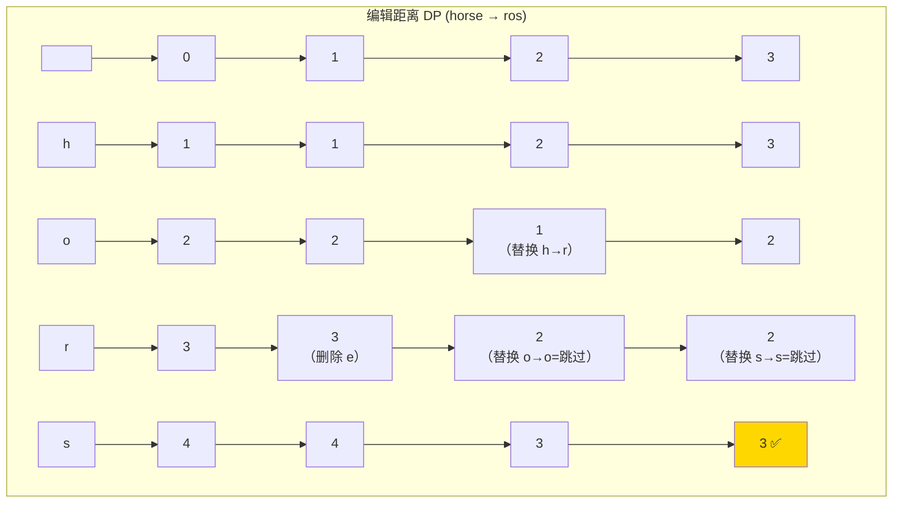
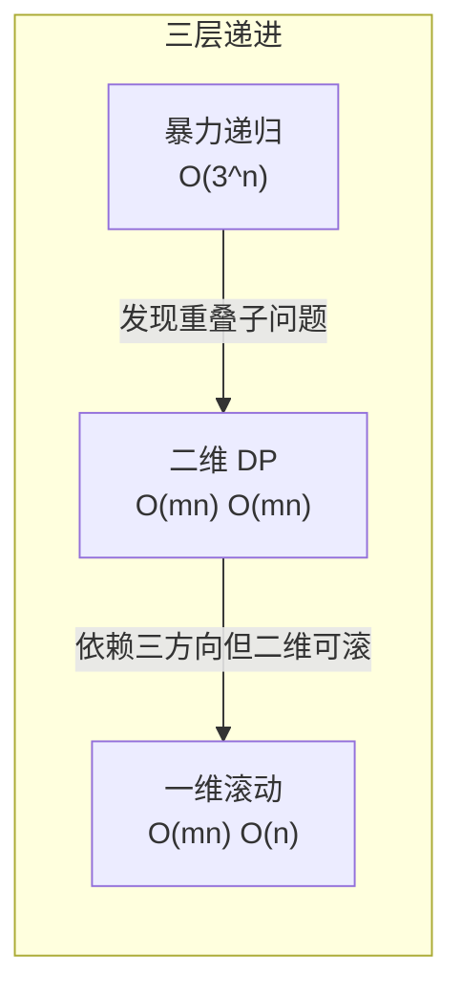

# 72. 编辑距离（Edit Distance）

> 难度：中等 | 主题：动态规划、字符串

## 题目

给你两个单词 word1 和 word2，请返回将 word1 转换成 word2 所使用的最少操作数。你可以对一个单词进行三种操作：插入一个字符、删除一个字符、替换一个字符。

**示例**
```text
word1 = "horse", word2 = "ros" → 输出 3
horse → rorse (替换 h → r)
rorse → rose (删除 r)
rose → ros (删除 e)
```

---

## 思路

### 先讲个故事：改稿子

你写了一篇英文文章交给编辑，编辑说："把 A 改成 B，最少改几处？"

你有三种修改手段：
- **删**：删掉一个多余的字母
- **增**：在某个位置插入一个漏掉的字母
- **改**：替换一个拼错的字母

这不就是编辑距离吗？**增、删、改三种操作，把一个字符串变成另一个，求最小操作次数。**

这其实是自然语言处理中最基础的问题——拼写纠错、DNA 序列比对都用它。

---

### 引导式推导：从末尾字符开始思考

**第 1 步（只看最后一个字符）**：想把 `word1[:i]` 变成 `word2[:j]`，先看两个字符串的**最后一个字符**。

```text
word1 = "horse" (i=5), word2 = "ros" (j=3)

最后一个字符：word1[4]='e', word2[2]='s'
不一样 → 需要操作。有 3 种选择：
```

**第 2 步（三种操作对应三个子问题）**：

| 操作 | 含义 | 子问题 |
|------|------|--------|
| 替换 | 把 'e' 改成 's'，然后匹配剩下的 | `dp[i-1][j-1]` + 1 |
| 删除 | 删掉 'e'，再匹配剩下的 | `dp[i-1][j]` + 1 |
| 插入 | 在末尾插入 's'（相当于 word2 少一个），再匹配剩下的 | `dp[i][j-1]` + 1 |

**如果最后一个字符相同**，什么都不用做，直接跳过：
```text
dp[i][j] = dp[i-1][j-1]   # 字符相同，不用操作
```

**第 3 步（完整状态转移）**：

```text
dp[i][j] =  word1[:i] → word2[:j] 的最小编辑距离

如果 word1[i-1] == word2[j-1]:
    dp[i][j] = dp[i-1][j-1]
否则:
    dp[i][j] = 1 + min(
        dp[i-1][j-1],   # 替换
        dp[i-1][j],     # 删除
        dp[i][j-1]      # 插入
    )
```

**边界**：空字符串转任意长度 = 插入全部。`dp[0][j] = j`，`dp[i][0] = i`。

---

### DP 填表演示



每个格子的值是左上(替换)、上(删除)、左(插入)三个方向的最小值 + (字符不同 ? 1 : 0)。

---

### 三层递进



**暴力递归**：`dp(i, j) = 1 + min(dp(i-1, j-1), dp(i-1, j), dp(i, j-1))`。每步 3 个分支，指数爆炸。

**二维 DP**：`dp[i][j]` 填表，O(mn) 时间 O(mn) 空间。

**一维滚动**：`dp[j]` 依赖左上、上、左三个方向。
- 左上（`dp[i-1][j-1]`）→ 用 `prev` 变量提前保存
- 上（`dp[i-1][j]`）→ 更新前的 `dp[j]`
- 左（`dp[i][j-1]`）→ 已更新的 `dp[j-1]`

---

## 代码

```python
def minDistance(self, word1, word2):
    m, n = len(word1), len(word2)

    dp = list(range(n + 1))               # 第一行：空 word1 → word2[:j] 需插入 j 次

    for i in range(1, m + 1):
        prev = dp[0]                      # 左上角 = dp[i-1][0]（上一轮的 dp[0]）
        dp[0] = i                         # 第一列：word1[:i] → 空需删除 i 次

        for j in range(1, n + 1):
            temp = dp[j]                  # 保存更新前的 dp[j]（即 dp[i-1][j]）

            if word1[i - 1] == word2[j - 1]:
                dp[j] = prev              # 字符相同，继承左上角
            else:
                dp[j] = 1 + min(
                    prev,                 # 替换（左上角）
                    dp[j],               # 删除（上方，未更新的 dp[j] = dp[i-1][j]）
                    dp[j - 1]            # 插入（左方，已更新的 dp[j-1] = dp[i][j-1]）
                )

            prev = temp                   # 下一轮的左上角 = 本轮未更新的 dp[j]

    return dp[n]
```

**关键**：`prev` 变量保存左上角的值。每一行开始时 `prev = dp[0]`（即上一行的 dp[0]），内层循环先 `temp = dp[j]` 存下上方值，更新完 `dp[j]` 后再赋给 `prev` 供下一列使用。

---

## 复杂度

| 指标 | 值 | 解释 |
|------|----|------|
| 时间 | O(mn) | 遍历两个字符串 |
| 空间 | O(n) | 一维滚动数组 |
| 二维 DP | O(mn) | 可提但非最优 |

---

## 实战考量

### 频率分析

> **出现在**：字节/腾讯/阿里 二面～高频题，约 40% 的同类题会考编辑距离或其变体。**这是字符串 DP 的标杆题**，常以此判断候选人对二维 DP 空间优化的掌握程度。

### 延伸思考

**Q：为什么替换对应左上角，删除对应上方，插入对应左方？**
A：替换是同时处理 word1[i-1] 和 word2[j-1] 两个字符（所以子问题是 `dp[i-1][j-1]`），删除是只处理 word1[i-1]（剩下的 word1[:i-1] 仍然要匹配 word2[:j]，所以子问题是 `dp[i-1][j]`），插入是相当于 word2 少了一个字符需要匹配（word1[:i] 匹配 word2[:j-1]，所以子问题是 `dp[i][j-1]`）。

**Q：如果操作代价不同呢？**
A：加权编辑距离——替换权重可能高（如 2），增删权重低（如 1）。公式从 `+1` 变成 `+cost`。这就是 DNA 序列比对的 Smith-Waterman 算法的基础。

**Q：如果只允许插入和删除呢？**
A：变成**最长公共子序列（LCS）**问题：`dp[i][j] = max(dp[i-1][j], dp[i][j-1])` 或 `dp[i-1][j-1] + 1（字符相等时）`。编辑距离和 LCS 是互通的——编辑距离中只留增删就是 LCS 的补集。

**Q：如果要求输出具体操作序列呢？**
A：额外用一个 `prev` 数组记录每个状态从哪转移来（替换/删除/插入），最后从 `dp[m][n]` 回溯到 `dp[0][0]`。

**Q：如何判断两个字符串相似度？**
A：可以用编辑距离归一化：`similarity = 1 - edit_distance / max(len1, len2)`。这其实就是搜索引擎中"拼写纠错"的底层原理——"您是不是想找 XXX？"

### 易错点

- `dp[i][j]` 对应 `word1[:i]` 和 `word2[:j]`，所以字符索引要 `-1`
- 空间优化中 `prev` 的更新时机——在 **替换 dp[j] 之前**先存下旧值
- 第一列 `dp[0] = i` 的赋值要在内层循环前
- 替换和删除/插入的区别：替换同时处理两个字符，增删只处理一个

---

## 生活类比

> **编辑距离 → 改稿子 → 对齐**
>
> 想象你在用 Git 做代码审查：你要把旧版本（word1）改成新版本（word2）。
> - 替换 = 改了一行代码
> - 删除 = 删了一行
> - 插入 = 加了一行
>
> 编辑距离就是**最少的 diff 行数**。Git diff 的算法底层用的就是类似的思想——两个文件的最小编辑距离。
>
> 或者说：**编辑距离是两个字符串之间的 Git diff。** 一个 diff，就是若干次替换、删除、插入操作的集合。

---

## 相关题目

| 题目 | 关系 |
|------|------|
| [[583两个字符串的删除操作]] | 只允许删除，编辑距离子集 |
| 1143最长公共子序列 | 只允许增删时的等价问题 |
| 72编辑距离 | 本题，编辑距离经典题 |

---

→ 返回题单：[[LeetCode学习清单#十三、动态规划]]
