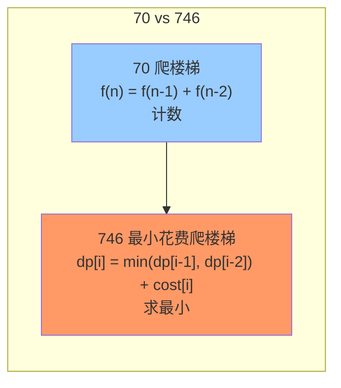
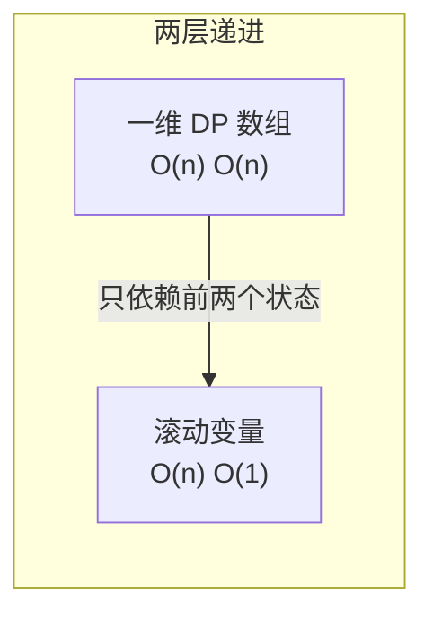

# 746. 最小花费爬楼梯

> 难度：简单 | 主题：动态规划 / 数组

## 题目

给你一个整数数组 cost，其中 cost[i] 是从楼梯第 i 个台阶向上爬需要支付的费用。一旦你支付此费用，即可选择向上爬一个或者两个台阶。你可以选择从下标为 0 或下标为 1 的台阶开始爬楼梯。请你计算并返回达到楼梯顶部的最低花费。

**示例**
```text
cost = [10, 15, 20] → 输出 15
解释：从下标 1 开始，支付 15 直接到顶（跨两步到达楼顶）

cost = [1, 100, 1, 1, 1, 100, 1, 1, 100, 1] → 输出 6
解释：从下标 0 开始，交替走 1 步和 2 步避开 100
```

---

## 思路

### 先讲个故事：收费站

假设有一条山路，每级台阶前有个收费站——付了钱才能继续往上走。
不同的是，你付了一级台阶的钱，可以选择爬 1 级或 2 级（像买通票一样）。
而且你可以在山脚（下标 0）或第一级台阶（下标 1）**免费入场**。

问：**到山顶最少要交多少钱？**

这和 70爬楼梯 的关系就像——70 题是"有多少种付钱方式"（计数），746 题是"怎样付钱最便宜"（取 min）。

---

### 引导式推导：从斐波那契到加权取 min

**第 1 步（和 70 题类比）**：70 题 `f(n) = f(n-1) + f(n-2)`，746 题把加法变成取 min 再加 cost。



**第 2 步（定义状态）**：`dp[i]` = 到达第 i 级台阶的最小花费。

到达第 i 级只有两种方式：
- 从 i-1 跨 1 步上来 → 花费 = `dp[i-1] + cost[i-1]`
- 从 i-2 跨 2 步上来 → 花费 = `dp[i-2] + cost[i-2]`

```text
dp[i] = min(dp[i-1] + cost[i-1], dp[i-2] + cost[i-2])
```

**注意**：`dp[i]` 是**到达**第 i 级的花费，不是**离开**第 i 级的花费。
付了 `cost[i]` 才能离开第 i 级继续往上走。

**第 3 步（边界条件）**：

| i | 含义 | 值 |
|---|------|-----|
| dp[0] | 站在地面（起点） | 0（免费入场） |
| dp[1] | 站在第 1 级（起点可选） | 0（免费入场） |

**第 4 步（楼顶在哪？）**：楼顶在**数组末尾之外**——索引 `len(cost)` 处。
最后一步：从 `len(cost)-1` 付 `cost[-1]` 跨 1 步，或从 `len(cost)-2` 付 `cost[-2]` 跨 2 步。

```text
目标 = dp[len(cost)] = min(dp[n-1] + cost[n-1], dp[n-2] + cost[n-2])
```

---

### 两层递进



**一维 DP**：`dp = [0] * (n + 1)`，循环迭代，O(n) 空间。

**滚动变量**：和 70 题一样——只用 `prev2`（dp[i-2]）和 `prev1`（dp[i-1]）两个变量。

---

## 代码

```python
class Solution(object):
    def minCostClimbingStairs(self, cost):
        prev2 = prev1 = 0                     # dp[0] = dp[1] = 0，免费入场

        for i in range(2, len(cost) + 1):    # 从第 2 级迭代到楼顶（len(cost)）
            curr = min(
                prev1 + cost[i - 1],          # 从 i-1 跨 1 步
                prev2 + cost[i - 2]           # 从 i-2 跨 2 步
            )
            prev2, prev1 = prev1, curr        # 滚动更新

        return prev1                          # 到达楼顶的最小花费
```

**循环边界为什么是 `len(cost) + 1`？** 因为楼顶索引是 `len(cost)`，需要迭代到目标位置。

---

## 复杂度

| 指标 | 值 | 解释 |
|------|----|------|
| 时间 | O(n) | 一次遍历 |
| 空间 | O(1) | 两个滚动变量 |
| DP 数组 | O(n) | 可提但非最优 |

---

## 实战考量

### 频率分析

> **出现在**：字节/美团DP 热身题，常作为 70 题的追问："如果每一级有花费呢？" 约 20% 常会从 70 题自然延伸到 746 题，考察对 DP 的灵活理解。

### 延伸思考

**Q：和 70 题的区别？**
A：70 是斐波那契数列——计数（`+`）。746 是加权最短路径——求最小（`min` + 权重）。70：`dp[i] = dp[i-1] + dp[i-2]`；746：`dp[i] = min(dp[i-1]+cost[i-1], dp[i-2]+cost[i-2])`。**同一个框架，不同的目标函数**。

**Q：为什么不能用贪心？每一步选最便宜的台阶不行吗？**
A：不行。贪心是"眼前最优"，但本题的每一步选择会影响后续的可达范围。
```text
cost = [1, 100, 1, 1, 1, 100, 1, 1, 100, 1]
```
贪心：第一步走 1 步（花 1），下一步站在 100 上 → 惨。正确做法：先走 2 步跳过这个 100。**局部最优 ≠ 全局最优**。

**Q：为什么 dp[0] = dp[1] = 0？**
A：因为"可以选择从下标为 0 或 1 的台阶开始爬楼梯"——站在起点不需要花钱。`dp[i]` 表示**到达**第 i 级的花费，不是离开的花费。

**Q：楼顶为什么是 `len(cost)` 不是 `len(cost)-1`？**
A：楼顶在数组最后一个元素之后。你站在最后一个台阶上还不是楼顶——你还需要再付一次钱跨出去才能到楼顶。`dp[len(cost)]` 就是跨出数组后的位置。

### 易错点

- `dp[0] = dp[1] = 0`，不是 `cost[0]` 和 `cost[1]`
- 楼顶是 `len(cost)` 不是 `len(cost)-1`
- 循环边界是 `range(2, len(cost) + 1)`
- 不能用贪心——台阶花费不均匀时贪心必定翻车
- 状态转移是 `min(dp[i-1]+cost[i-1], dp[i-2]+cost[i-2])`，不是 `min(dp[i-1], dp[i-2]) + cost[i]`

---

## 生活类比

> **最小花费爬楼梯 → 收费站 → 买通票跳过天坑**
>
> 想象你在玩大富翁，每块地都有过路费：
> - 有些地很便宜（1 块钱），有些地巨贵（100 块）
> - 你每次可以走 1 步或 2 步
> - 你想用最少的路费到达终点
>
> 贪心就是每次都只走 1 步——"省下眼前的过路费"——结果踩到 100 块的天坑。
> DP 是"跳着看两步"——付了这块地的钱，看看能不能顺便跳过下个天坑。
>
> 还是那句话：**不要只看脚下，要看两步之外。**

---

## 相关题目

| 题目 | 关系 |
|------|------|
| 70爬楼梯 | 基础版，无 cost 权重，只计数 |
| 198打家劫舍 | 相邻决策变体，从路程变选择 |
| 746最小花费爬楼梯 | 本题，带权重爬楼梯经典题 |

---

→ 返回题单：[[LeetCode学习清单#十三、动态规划]]
