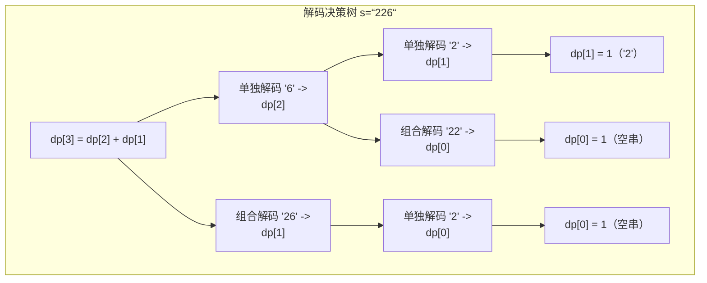
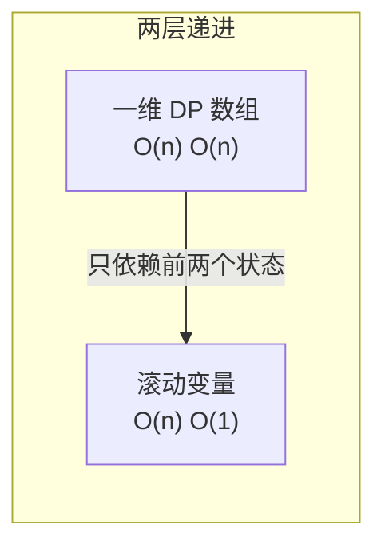

# 91. 解码方法（Decode Ways）

> 难度：中等 | 主题：动态规划、字符串

## 题目

一条包含字母 A-Z 的消息通过以下映射进行了编码：'A' → 1, 'B' → 2, ..., 'Z' → 26。给你一个只含数字的非空字符串 s，请计算并返回解码方法的总数。

**示例**
```text
s = "226" → 输出 3
解释：
  "BZ"  (2, 26)
  "VF"  (22, 6)
  "BBF" (2, 2, 6)

s = "06" → 输出 0
解释："06" 不能解码，"6" 可以但 "0" 不可以
```

---

## 思路

### 先讲个故事：破译密码

你收到一条密文，满是数字："1226"。
你知道密码本：1→A, 2→B, ..., 26→Z。

问题来了："12" 可以是一个整体（L）也可以是两个数字（1→A, 2→B）。
"26" 同理。
但 "0" 就不行——密码本没有 0。

所以你需要统计：**给定数字字符串，有多少种解码方式？**

这就是解码问题——**把字符串分段，每段映射到 1~26，统计全部分割方案数。**

---

### 引导式推导：从末尾一位和两位开始

**第 1 步（只看最后一个字符）**：前 i 个字符 `s[:i]` 的解码方式数 = `dp[i]`。

最后一个字符 `s[i-1]` 有两种处理方式：
- **单独解码**：`s[i-1]` 作为 1 位数 → 前提是 `s[i-1] != '0'`
- **组合解码**：`s[i-2:i]` 作为两位数 → 前提是数字在 10~26 之间

这两种情况**互斥且覆盖所有可能**，所以方式数**相加**。

**第 2 步（状态转移）**：

```text
dp[i] = 0
if s[i-1] != '0':                     # 单独解码
    dp[i] += dp[i-1]
if i >= 2 and '10' <= s[i-2:i] <= '26':  # 组合解码
    dp[i] += dp[i-2]
```



**第 3 步（边界条件）**：

| i | 含义 | 值 | 原因 |
|---|------|-----|------|
| dp[0] | 空字符串 | 1 | 空字符串有 1 种解码方式——什么都不做 |
| dp[1] | 第一个字符 | 1（如果 s[0] != '0'） | 单个非零数字只有 1 种解码 |

---

### 两层递进



**一维 DP**：`dp = [0] * (n + 1)`，循环 O(n) 填表。

**滚动变量**：`dp[i]` 只依赖 `dp[i-1]` 和 `dp[i-2]`——和斐波那契一样。用 `prev1` 和 `prev2` 两个变量滚动。

---

## 代码

```python
def numDecodings(self, s):
    if not s or s[0] == '0':          # 空串或以 0 开头 → 无法解码
        return 0

    n = len(s)
    prev2 = 1                          # dp[0] = 1（空字符串）
    prev1 = 1                          # dp[1] = 1（第一个字符非 0）

    for i in range(2, n + 1):
        curr = 0

        # 单独解码当前字符 s[i-1]
        if s[i - 1] != '0':
            curr += prev1              # 继承 dp[i-1] 的所有方式

        # 组合解码前两个字符 s[i-2:i]
        two_digit = int(s[i - 2:i])
        if 10 <= two_digit <= 26:
            curr += prev2              # 继承 dp[i-2] 的所有方式

        prev2 = prev1                  # 滚动更新
        prev1 = curr

    return prev1                       # dp[n] = 整个字符串的解码方式数
```

---

## 复杂度

| 指标 | 值 | 解释 |
|------|----|------|
| 时间 | O(n) | 一次遍历字符串 |
| 空间 | O(1) | 两个滚动变量 |
| DP 数组 | O(n) | 可提但非最优 |

---

## 实战考量

### 频率分析

> **出现在**：字节/腾讯/美团 二面字符串 DP 题，约 15% 的同类题会考解码问题。常作为"爬楼梯"的字符串版本——都是斐波那契式递推，只是加了个"有效范围"约束。

### 延伸思考

**Q：和 70爬楼梯 的关系？**
A：本质上是一样的！70 题：`f(n) = f(n-1) + f(n-2)`（无条件加）。91 题：`dp[i] = dp[i-1] + (如果组合有效则 + dp[i-2])`——**带条件的斐波那契**。区别就是多了个"组合必须在 10~26 之间"的约束。

**Q：'0' 的处理为什么特殊？**
A：'0' 不能单独解码（密码本没有 0）。但 '0' 可以和前面的 '1' 或 '2' 组合成 '10' 或 '20'。所以：
- 当前字符是 '0' → 不能单独解码，`+= dp[i-1]` 不触发
- 前一个字符是 '0' → 组合如 '00' 或 '30' 不在 10~26 内，`+= dp[i-2]` 不触发
- 连续的 '0'（如 "100"）→ 中间两位 "00" 不可解码 → 整体解码方式为 0

**Q：如果要求输出所有解码方案呢？**
A：改成回溯（DFS）——每步尝试取 1 位或 2 位，和 131分割回文串 的框架相同。复杂度从 O(n) 变成 O(2ⁿ)，因为枚举所有方案。

**Q：如果允许数字对应多个字母呢？**
A：这是带通配符的变体（LeetCode 639）。`'*'` 可以代表 1~9，组合解码 `'*' + 某个数字` 或 `'1*' + '*'` 时有多种对应，方案数需要相乘。常作为进阶追问。

**Q：字符串很长（10⁵）怎么办？**
A：O(n) 已经最优了。注意 Python 的整数不会溢出，但其他语言可能需要注意用取模（如 mod 10⁹+7）。

### 易错点

- 当前字符 '0' 不能单独解码（只可能和前面组合成 10 或 20）
- 两位组合必须在 **10~26** 范围内（01 不行，10 可以，27 不行）
- `dp[0] = 1`（空字符串有一种解码方式——什么也不做）
- 以 '0' 开头的字符串直接返回 0
- 滚动变量时 `prev2` 和 `prev1` 的初始值及更新顺序

---

## 生活类比

> **解码方法 → 破译密码 → 中文拼音**
>
> 想想中文输入法的拼音到汉字的映射："beijing"
> - 可以分成 bei-jing（北京）
> - 也可以分成 be-i-jing（无意义）
> - 还可以分成 b-e-i-j-i-n-g（一堆字母）
>
> 解码问题就是：**给定一串拼音字母，有多少种合理的中文分词方式？**
>
> 只不过这里的"拼音"变成了 1~26 的数字密码，"汉字"变成了 A~Z 的字母。
> 而 0 就像一个无法单独发音的声母——它必须依附在前面的韵母上。

---

## 相关题目

| 题目 | 关系 |
|------|------|
| 70爬楼梯 | 同源递推，无条件加法 vs 带条件加法 |
| 198打家劫舍 | 相邻决策变体 |
| 131分割回文串 | 回溯输出所有解码方案时框架相同 |
| 639. 解码方法二（带 \* 通配符） | 进阶版，带通配符的计数乘法 |
| 91解码方法 | 本题，带约束的斐波那契 |

---

→ 返回题单：[[LeetCode学习清单#十三、动态规划]]

## 速记卡（面试闪卡）

**Q1：一句话讲清「91. 解码方法（Decode Ways）」到底是什么？**
A：一条包含字母 A-Z 的消息通过以下映射进行了编码：'A' → 1, 'B' → 2, ..., 'Z' → 26。给你一个只含数字的非空字符串 s，请计算并返回解码方法的总数。
**示例**
---

**Q2：题目 —— 怎么理解？**
A：一条包含字母 A-Z 的消息通过以下映射进行了编码：'A' → 1, 'B' → 2, ..., 'Z' → 26。给你一个只含数字的非空字符串 s，请计算并返回解码方法的总数。
**示例**
---

**Q3：思路 —— 怎么理解？**
A：你收到一条密文，满是数字："1226"。
你知道密码本：1→A, 2→B, ..., 26→Z。
问题来了："12" 可以是一个整体（L）也可以是两个数字（1→A, 2→B）。
"26" 同理。
但 "0" 就不行——密码本没有 0。
所以你需要统计：**给定数字字符串，有多少种解码方式？**
这就是解码问题——**把字符串分段，每段映射到 1~26，统计全部分割方案数。

**Q4：代码 —— 怎么理解？**
A：---

**Q5：复杂度 —— 怎么理解？**
A：| 指标 | 值 | 解释 |
|------|----|------|
| 时间 | O(n) | 一次遍历字符串 |
| 空间 | O(1) | 两个滚动变量 |
| DP 数组 | O(n) | 可提但非最优 |
---

**Q6：核心速记主线有哪些？**
A：抓住这几根：题目、思路、代码、复杂度、实战考量、生活类比。

