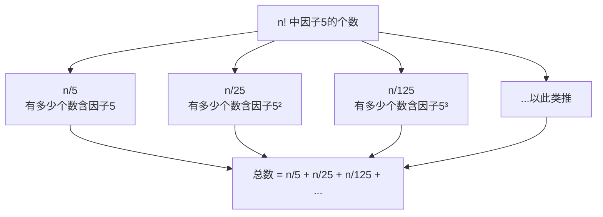

---

title: "阶乘后的零"

difficulty: 中等

category: 数学与位运算

tags:

  - leetcode

  - 数学与位运算

created: "2026-07-21"

---

# 172. 阶乘后的零（Factorial Trailing Zeroes）

> 难度：中等 | 主题：数学

## 题目

给定整数 n，返回 n! 结果中尾部零的数量。

**示例**

```text

输入：n = 5

输出：1

解释：5! = 120，末尾 1 个 0

```

---

## 思路
### 先讲个故事：末尾的零从哪来

你写了个大数 1234567890，末尾的 0 是怎么来的？是因子 2 × 5 = 10 产生的。要凑出末尾的 0，需要同时有因子 2 和因子 5。

问题是：n! 里因子 2 多还是因子 5 多？每 2 个数就有因子 2，每 5 个数才有因子 5——所以因子 5 更稀缺。末尾零的数量 = 因子 5 的数量。

---

### 引导式推导：数因子 5



为什么 n//=5 循环？因为 25 贡献两个 5，125 贡献三个 5，要累加。

---

## 代码

```python

def trailingZeroes(self, n):

    count = 0

    while n > 0:

        n //= 5

        count += n

    return count

```

---

## 复杂度

| 指标 | 值 | 解释 |
|------|----|------|
| 时间 | O(log n) | 每次 n 除以 5 |
| 空间 | O(1) | 只用了 count 变量 |

---

## 实战考量
### 频率分析

> **出现在**：数学类经典题。考察对因子分解的理解。美团/阿里常考。

### 延伸思考

**Q：为什么只统计因子 5？**

A：因子 2 远多于 5（每 2 个数一个因子 2，每 5 个数一个因子 5），所以末位零数量由更稀缺的因子 5 决定。

**Q：n/5 + n/25 + n/125 的逻辑？**

A：分层统计：n/5 统计至少有一个因子 5 的数；n/25 统计至少有两个因子 5 的数（补上第二个因子 5）；以此类推，每个数恰好被统计了它包含的因子 5 的个数次。

**Q：n 很大时 count 会溢出吗？**

A：Python 中 int 无上限，不会溢出；C++/Java 用 long long。

### 易错点

- `n //= 5` 不是 `n //= 10`

- `count += n` 不是 `count += 1`

---

## 生活类比

> **数因子 5 → 从稀有资源倒推**

>

> 工厂造零件需要两种原料 A 和 B，A 随处可见，B 很稀缺。仓库能造多少成品？不看 A 有多少，只数 B 有多少——因为 B 是瓶颈。因子 5 就是那个稀缺的 B。

---

## 相关题目

| 题目 | 关系 |
|------|------|
| 136只出现一次的数字 | 数学类 |
| 191位1的个数 | 数学计数 |
| 793. 阶乘函数后 K 个零 | 反向问题：二分查找 |

---

→ 返回题单：[[LeetCode学习路线图#十四、数学与位运算]]

## 速记卡（面试闪卡）

**Q1：一句话讲清「172. 阶乘后的零（Factorial Trailing Zeroes）」到底是什么？**

A：求 n! 末尾零的个数，等于因子 5 的个数，累除 5 即得。

**Q2：题目理解 —— 末尾零从哪来？ —— 怎么理解？**

A：像数零件：末尾零由 2×5=10 产生，因子 2 满地都是、因子 5 稀缺，所以零的个数由 5 决定。英文：Trailing Zeroes。

**Q3：核心思路 —— 怎么数因子 5？ —— 怎么理解？**

A：像数稀缺原料：n/5 含一个 5 的数、n/25 补第二个、n/125 补第三个，循环累除 5 全加上。英文：Count Factor 5。

**Q4：代码实现 —— 一行循环怎么写？ —— 怎么理解？**

A：像逐层倒料：while n>0: n//=5; count+=n。每轮把指数折一层，25、125 多贡献的因子自然累加。英文：Divide-by-5 Loop。

**Q5：复杂度与实战 —— 溢出与反向？ —— 怎么理解？**

A：像查库：时间 O(log n)、空间 O(1)；Python 不溢出，C++/Java 用 long long；反向题可二分找 K 个零。英文：Reverse Binary Search。

**Q6：核心速记主线有哪些？**

- 末尾零 = 因子 2×5 对数，由更稀缺的因子 5 数量决定

- 累除：count = n/5 + n/25 + n/125 + ...

- 代码：while n>0: n//=5; count+=n

- 时间 O(log n)、空间 O(1)

- 反向问题：给定 K 个零用二分查找最小的 n

**口诀**

A：阶乘零数因子生，

二多五寡定输赢；

累除五层层层计，

对数时空一并轻。

## 相关链接

- [[笔记/Leetcode笔记/14_数学与位运算/231-2的幂|2的幂]]

- [[笔记/Leetcode笔记/14_数学与位运算/191位1的个数|位1的个数]]

- [[笔记/Leetcode笔记/14_数学与位运算/136只出现一次的数字|只出现一次的数字]]

- [[笔记/Leetcode笔记/14_数学与位运算/470用Rand7实现Rand10|用Rand7实现Rand10]]

- [[笔记/Leetcode笔记/14_数学与位运算/202快乐数|快乐数]]

