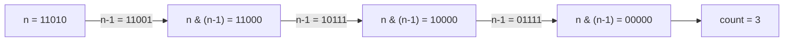

---

title: "位1的个数"

difficulty: 简单

category: 数学与位运算

tags:

  - leetcode

  - 数学与位运算

created: "2026-07-21"

---

# 191. 位1的个数

> 难度：简单 | 主题：位运算

## 题目

编写一个函数，输入是一个无符号整数（以二进制串的形式），返回其二进制表达式中数字位数为 '1' 的个数（也被称为汉明重量）。

**示例**

```text

输入：n = 11（二进制 1011）

输出：3

```

---

## 思路
### 先讲个故事：灭灯游戏

一排灯泡，有的亮（1）有的灭（0）。你要数有多少盏亮着的灯。你不会一盏盏查——你用一个技巧：每次按一下开关，把最右边的亮灯灭掉。按几次灭完，就有几盏灯亮过。

`n & (n-1)` 就是"灭掉最右边那盏亮灯"的魔法操作。

---

### 引导式推导：n & (n-1) 的魔力

`n & (n-1)` 把最低位的 1 变成 0。每次消去一个 1，消完为止。



原理：`n-1` 会把 n 最低位的 1 变成 0，该位后面的所有 0 变成 1。`n & (n-1)` 后，最低位 1 及其后面的位全部归零。

| 方法 | 时间 | 空间 |

|------|------|------|

| **`n & (n-1)`** | O(k)（k 为 1 的个数） | O(1) |

| 逐位检查 | O(32) | O(1) |

| `bin(n).count('1')` | O(log n) | O(log n) |

---

## 代码

```python

def hammingWeight(self, n):

    count = 0

    while n:

        n &= (n - 1)

        count += 1

    return count

```

---

## 复杂度

| 指标 | 值 | 解释 |

|------|----|------|

| 时间 | O(k) | k 为二进制中 1 的个数，每次循环消除一个 1 |

| 空间 | O(1) | 只用了常数个变量 |

---

## 实战考量
### 频率分析

> **出现在**：位运算经典题。考察 `n & (n-1)` 技巧，是常客。字节/美团常考。

### 延伸思考

**Q：`n & (n-1)` 为什么能消除最低位 1？**

A：以 n=12 (1100) 为例：n-1=11 (1011)，n & (n-1) = 1000。n-1 把最低位 1 变 0、后面的 0 全变 1，`&` 操作后最低位 1 及后面的位全部归零。

**Q：如果不用 `n & (n-1)`，逐位检查怎么做？**

A：`for i in range(32): count += n & 1; n >>= 1`。O(32) 固定，不如 `n & (n-1)` 灵活。

**Q：`n & (n-1)` 还有哪些应用场景？**

A：(1) 判断 2 的幂：`n & (n-1) == 0`（231 题）；(2) 计算汉明距离：`x ^ y` 后统计 1 的个数。

### 易错点

- `while n` 而非 `while n > 0`（处理 n 被当负数的情况）

- `n & (n-1)` 的括号不能漏

---

## 生活类比

> **n & (n-1) → 灭灯计数**

>

> 一排灯泡亮着，你每按一次开关就灭掉最右边那盏亮灯。数按了几次，就是亮灯总数。`n & (n-1)` 就是那个"精准灭最右亮灯"的开关。

---

## 相关题目

| 题目 | 关系 |

|------|------|

| 231-2的幂 | `n & (n-1) == 0` 同族技巧 |

| 136只出现一次的数字 | 异或位运算 |

---

→ 返回题单：[[LeetCode学习路线图#十四、数学与位运算]]

## 速记卡（面试闪卡）

**Q1：一句话讲清「191. 位1的个数」到底是什么？**

A：数一个无符号整数二进制表达里，有多少个比特是 1。

**Q2：思路：n&(n-1) 灭最右亮灯 —— 怎么理解？**

A：一排灯泡亮着，每按一次开关就灭掉最右边那盏亮灯——`n & (n-1)` 就是这魔法开关。位运算（Bit Manipulation）把最低位 1 清零，按几次就是几盏灯。

**Q3：代码：循环清零计数 —— 怎么理解？**

A：while n: n &= (n-1); count++。每次消去一个 1，消完 n 变 0 循环停。汉明重量（Hamming Weight）就这一行搞定，干净利落。

**Q4：复杂度：时间与空间 —— 怎么理解？**

A：只跟 1 的个数 k 有关，时间复杂度（Time Complexity）O(k) 精准打击；空间复杂度（Space Complexity）O(1) 不占地，比逐位扫 32 次更灵。

**Q5：生活类比：灭灯计数游戏 —— 怎么理解？**

A：位 1 的个数（Number of 1 Bits）像灭灯游戏：亮灯是 1、灭灯是 0，每次精准灭最右亮灯（Bit Manipulation），数按了几次开关就是答案。

**Q6：核心速记主线有哪些？**

- n&(n-1) 消最低位 1

- 循环几次就有几个 1

- 时间 O(k) 空间 O(1)

- 还能判 2 的幂

**口诀**

A：亮灯几盏数一数，

n&(n-1) 灭右珠。

循环几次灯皆无，

位运算里藏妙术。

## 相关链接

- [[笔记/Leetcode笔记/14_数学与位运算/231-2的幂|2的幂]]

- [[笔记/Leetcode笔记/14_数学与位运算/136只出现一次的数字|只出现一次的数字]]

- [[笔记/Leetcode笔记/14_数学与位运算/172阶乘后的零|阶乘后的零]]

- [[笔记/Leetcode笔记/14_数学与位运算/470用Rand7实现Rand10|用Rand7实现Rand10]]

- [[笔记/Leetcode笔记/14_数学与位运算/202快乐数|快乐数]]

