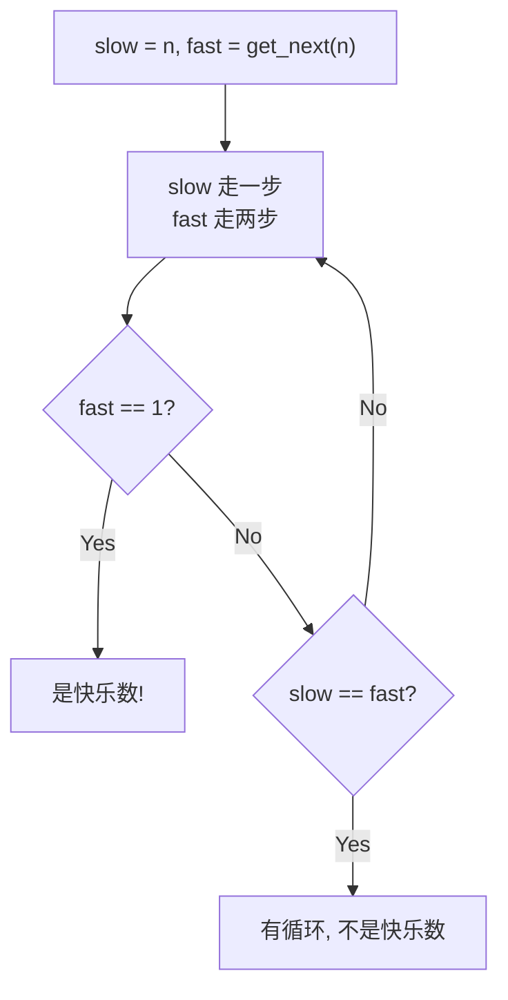

---

title: "快乐数"

difficulty: 简单

category: 数学与位运算

tags:

  - leetcode

  - 数学与位运算

created: "2026-07-21"

---

# 202. 快乐数（Happy Number）

> 难度：简单 | 主题：数学、哈希、快慢指针

## 题目

判断一个数 n 是不是快乐数。快乐数定义：每次将数字替换为其各位平方和，重复直到变成 1（是快乐数），或无限循环（不是快乐数）。

**示例**

```text

输入：n = 19

输出：true

解释：1²+9²=82, 8²+2²=68, 6²+8²=100, 1²+0²+0²=1

```

---

## 思路
### 先讲个故事：操场跑圈

你在操场跑步，每步往前走的步数由你当前的步数决定（取各位平方和）。如果你跑到 1 步——恭喜，你是快乐数，永远停在 1 步（因为 1²=1）。如果你发现开始重复走过的步数——你陷入了循环，不是快乐数。

怎么检测循环？和检测链表有没有环一样：一个人跑得快，一个人跑得慢，如果他们相遇了——有环。

---

### 引导式推导：快慢指针检测循环



核心子函数 `get_next(num)`：逐位取平方和。

为什么一定有循环？鸽巢原理：各位平方和范围有限（最大 243），有限步内必然重复。

| 方法 | 时间 | 空间 |
|------|------|------|
| **快慢指针（推荐）** | O(log n) | O(1) |
| 哈希表 | O(log n) | O(log n) |

---

## 代码

```python

def isHappy(self, n):

    def get_next(num):

        total = 0

        while num > 0:

            digit = num % 10

            total += digit * digit

            num //= 10

        return total

    slow = n

    fast = get_next(n)

    while fast != 1 and slow != fast:

        slow = get_next(slow)

        fast = get_next(get_next(fast))

    return fast == 1

```

---

## 复杂度

| 指标 | 值 | 解释 |
|------|----|------|
| 时间 | O(log n) | 每次 get_next 需要 O(log n) 位操作 |
| 空间 | O(1) | 快慢指针只用了两个变量 |

---

## 实战考量
### 频率分析

> **出现在**：数学+快慢指针的经典结合题。考察空间优化意识和链表环检测的迁移能力。

### 延伸思考

**Q：为什么用快慢指针而不是哈希表？**

A：快慢指针 O(1) 空间，哈希表 O(log n) 空间。考察空间优化意识。

**Q：为什么一定会有循环？**

A：鸽巢原理：各位平方和的范围有限（最大 243 对应 999...），遍历有限步后必然出现重复值。

**Q：快乐数一定会到 1 吗？**

A：是的，如果到 1 则后续永远为 1（1^2 = 1），所以快慢指针相遇时如果是 1 就是快乐数。

### 易错点

- `fast` 初始化为 `get_next(n)` 不是 `n`

- `get_next` 中 `num //= 10` 不是 `num /= 10`

- `while` 条件要同时判断 `fast != 1` 和 `slow != fast`

---

## 生活类比

> **快乐数 → 操场跑圈检测**

>

> 你和朋友在操场跑步，你每次跑 1 步，朋友跑 2 步。如果操场有终点（到达 1），你们永远追不上。如果没终点（循环），朋友迟早追上你——因为他在绕圈。追上了就说明没终点。

---

## 相关题目

| 题目 | 关系 |
|------|------|
| 141环形链表 | 快慢指针找环，同族算法 |
| 136只出现一次的数字 | 数学类 |

---

→ 返回题单：[[LeetCode学习路线图#十四、数学与位运算]]

## 速记卡（面试闪卡）

**Q1：一句话讲清「202. 快乐数（Happy Number）」到底是什么？**

A：202 题判断一个数反复取各位平方和后能否收敛到 1，不能则在有限步内陷入循环。

**Q2：思路 —— 怎么理解？**

A：像操场跑圈：你每步跑"各位平方和"步数，跑到 1 就停(快乐)，重复踩到旧脚印就是循环(不快乐)——用快慢指针(Fast-Slow Pointer)检测环，两人速度不同相遇即有环。

**Q3：代码 —— 怎么理解？**

A：像派两个人跑步：slow 每次走一步、fast 每次走两步，循环到 fast==1 或 slow==fast 为止，O(1) 空间实现 get_next 取平方和。

**Q4：复杂度 —— 怎么理解？**

A：像查有限个格子：每次 get_next 是 O(log n) 位操作，快慢指针只留两个变量，时间 O(log n)、空间 O(1)(Time/Space Complexity)。

**Q5：实战考量 —— 怎么理解？**

A：像面试常挖的坑：为什么必有循环？鸽巢原理(Pigeonhole Principle)——平方和上限 243，有限步必重复；fast 初始化取 get_next(n) 而非 n。

**Q6：核心速记主线有哪些？**

- 快乐数：反复取各位平方和，到 1 即停，否则入环

- 快慢指针：slow 一步、fast 两步，相遇即环，O(1) 空间

- 必有循环：平方和范围有限(≤243)，鸽巢原理保证重复

- 时间 O(log n)、空间 O(1)；fast 初值取 get_next(n)

**口诀**

A：快乐数，跑圈圈，平方和步到 1 停

快慢指针两人跑，相遇即有环分明

平方和，上限小，鸽巢原理必重复

时间 logn 空间一，fast 先走一步赢

## 相关链接

- [[笔记/Leetcode笔记/14_数学与位运算/231-2的幂|2的幂]]

- [[笔记/Leetcode笔记/14_数学与位运算/191位1的个数|位1的个数]]

- [[笔记/Leetcode笔记/14_数学与位运算/136只出现一次的数字|只出现一次的数字]]

- [[笔记/Leetcode笔记/14_数学与位运算/172阶乘后的零|阶乘后的零]]

- [[笔记/Leetcode笔记/14_数学与位运算/470用Rand7实现Rand10|用Rand7实现Rand10]]

