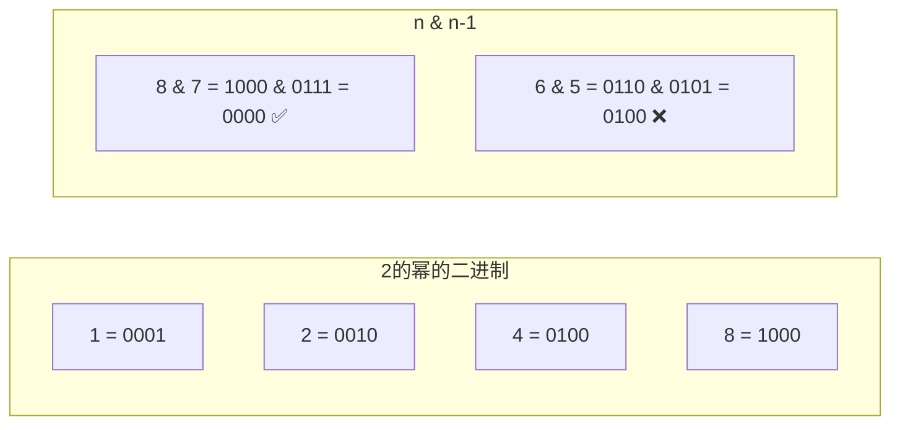

# 231. 2的幂

> 难度：简单 | 主题：位运算、数学

## 题目

给你一个整数 n，请你判断 n 是否为 2 的幂次方。如果是，返回 true；否则返回 false。如果存在一个整数 x 使得 n == 2^x，则认为 n 是 2 的幂次方。

**示例**
```text
输入：n = 1
输出：true
解释：1 = 2⁰
```

---

## 思路

### 先讲个故事：掰巧克力

一块巧克力是 2 的幂（1, 2, 4, 8, 16 块）。你每次只能对半掰。如果能恰好掰成两半，再把每一半恰好掰成两半……一直掰到最后只剩一块——那就是 2 的幂。

在二进制里，2 的幂只有一个 1：1=1, 2=10, 4=100, 8=1000。`n & (n-1)` 清掉这个 1 后，结果必须是 0。

---

### 引导式推导：n & (n-1) == 0

**核心：`n & (n-1) == 0`**。2 的幂的二进制表示有且只有一个 1。



同时需要 `n > 0` 排除 0 和负数：0 不是 2 的幂，且 `0 & (-1) == 0` 会误判。

| 方法 | 时间 | 空间 |
|------|------|------|
| **`n & (n-1)`** | O(1) | O(1) |
| 循环除 2 | O(log n) | O(1) |

---

## 代码

```python
def isPowerOfTwo(self, n):
    return n > 0 and (n & (n - 1)) == 0
```

---

## 复杂度

| 指标 | 值 | 解释 |
|------|----|------|
| 时间 | O(1) | 一次位运算 |
| 空间 | O(1) | 无额外空间 |

---

## 实战考量

### 频率分析

> **出现在**：位运算经典题。考察 `n & (n-1)` 的理解。字节/美团常考。

### 延伸思考

**Q：`n & (n-1) == 0` 为什么能判断 2 的幂？**
A：2 的幂的二进制只有最高位是 1，其余是 0（如 8 = 1000）。n-1 把最高位 1 变成 0、后面的 0 全变成 1（7 = 0111）。n & (n-1) = 1000 & 0111 = 0000 = 0。

**Q：为什么还要 `n > 0`？**
A：0 不是 2 的幂。`0 & (0-1)` = `0 & (-1)` = `0`，会错误返回 True。负数的二进制补码表示中有多个 1，也不满足。

**Q：不用位运算怎么做？**
A：循环除 2：`while n % 2 == 0: n //= 2; return n == 1`，O(log n)。

### 易错点

- 必须 `n > 0`（0 和负数）
- `n & (n-1) == 0` 括号不能漏（`==` 优先级高于 `&`）

---

## 生活类比

> **2 的幂 → 完美的对称**
>
> 2 的幂就像一个完美的金字塔：最顶层 1 块，第二层 2 块，第三层 4 块……每一层都是上一层的两倍。在二进制里，它只有一个 1，孤零零地站在最高位——像金字塔的尖顶。

---

## 相关题目

| 题目 | 关系 |
|------|------|
| 191位1的个数 | `n & (n-1)` 同族技巧 |
| 136只出现一次的数字 | 位运算经典题 |

---

→ 返回题单：[[LeetCode学习清单#十四、数学与位运算]]
