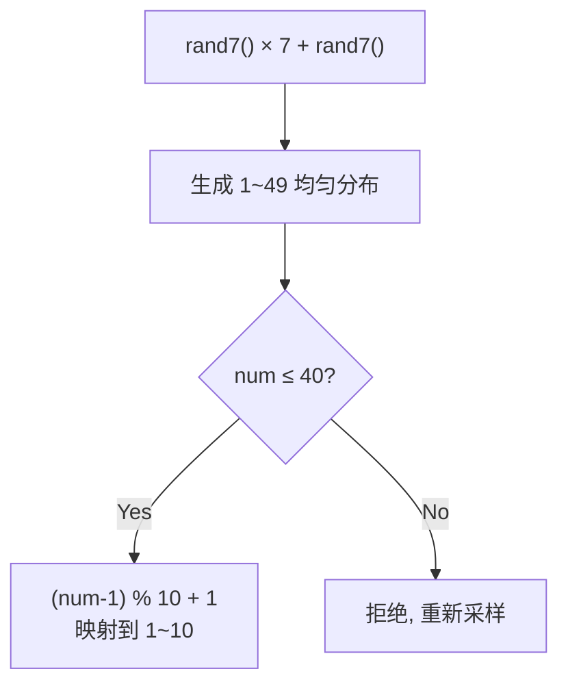

# 470. 用 Rand7 实现 Rand10

> 难度：中等 | 主题：数学、概率、拒绝采样

## 题目

已有 `rand7()` 生成 1~7 均匀随机整数，实现 `rand10()` 生成 1~10 均匀随机整数。

**示例**
```text
输入：n = 1
输出：[1,10] 范围内的均匀随机整数
```

---

## 思路

### 先讲个故事：抽奖转盘

你有一个 7 格的转盘（rand7），想做一个 10 格的转盘（rand10）。直接映射不行——7 和 10 不整除，概率不均匀。

你的办法：转两次 7 格转盘，组成一个 7×7=49 格的大转盘。然后只取前 40 格（40 是 10 的倍数），映射到 1~10。剩下 9 格不要，重新转。这就是拒绝采样。

---

### 引导式推导：构造均匀分布



为什么 `(rand7()-1)*7 + rand7()` 生成 1~49？等概率生成 0~6 再乘 7 = 0,7,14,21,28,35,42，再加 1~7 → 1~49。

---

## 代码

```python
def rand10(self):
    while True:
        num = (rand7() - 1) * 7 + rand7()
        if num <= 40:
            return (num - 1) % 10 + 1
```

---

## 复杂度

| 指标 | 值 | 解释 |
|------|----|------|
| 期望调用次数 | O(1) | 成功概率 40/49，期望 ≈ 1.225 次 |
| 空间 | O(1) | 几个变量 |

---

## 实战考量

### 频率分析

> **出现在**：数学+概率经典题。考察拒绝采样的思想和构造能力。字节/Google 常考。

### 延伸思考

**Q：为什么用 `(rand7()-1)*7 + rand7()`？**
A：这是生成 1~49 均匀分布的经典构造。第一个 rand7 决定 7 个"区间"，第二个 rand7 决定区间内的偏移。

**Q：为什么拒绝 41~49？**
A：40 是 10 的倍数，1~40 可以均匀分成 10 组，每组 4 个数映射到同一个结果。41~49 共 9 个数无法均匀分配，所以拒绝。

**Q：期望调用次数是多少？**
A：每次成功概率 40/49，期望约为 49/40 ≈ 1.225 次。

**Q：如果 rand7 改成 rand5 实现 rand7？**
A：同样的拒绝采样思路：用两个 rand5 构造 1~25，取 1~21（21 是 7 的倍数），拒绝 22~25。

### 易错点

- `(rand7() - 1) * 7` 不是 `rand7() * 7`
- num 范围是 1~49 不是 0~48
- 映射要用 `(num - 1) % 10 + 1` 而不是 `num % 10`

---

## 生活类比

> **拒绝采样 → 不合适的简历直接扔**
>
> HR 要招 10 个人，但收到的简历编号是 1~49。HR 只取编号 1~40 的简历来（因为 40 正好是 10 的倍数，可以公平分配），编号 41~49 的直接扔掉重投。虽然浪费了 9 份简历，但保证了公平性。

---

## 相关题目

| 题目 | 关系 |
|------|------|
| 136只出现一次的数字 | 数学类 |
| 191位1的个数 | 数学类 |

---

→ 返回题单：[[LeetCode学习清单#十四、数学与位运算]]

## 速记卡（面试闪卡）

**Q1：一句话讲清「470. 用 Rand7 实现 Rand10」到底是什么？**
A：已有  生成 1~7 均匀随机整数，实现  生成 1~10 均匀随机整数。
**示例**
---

**Q2：题目 —— 怎么理解？**
A：已有  生成 1~7 均匀随机整数，实现  生成 1~10 均匀随机整数。
**示例**
---

**Q3：思路 —— 怎么理解？**
A：你有一个 7 格的转盘（rand7），想做一个 10 格的转盘（rand10）。直接映射不行——7 和 10 不整除，概率不均匀。
你的办法：转两次 7 格转盘，组成一个 7×7=49 格的大转盘。然后只取前 40 格（40 是 10 的倍数），映射到 1~10。剩下 9 格不要，重新转。这就是拒绝采样。

**Q4：代码 —— 怎么理解？**
A：---

**Q5：复杂度 —— 怎么理解？**
A：| 指标 | 值 | 解释 |
|------|----|------|
| 期望调用次数 | O(1) | 成功概率 40/49，期望 ≈ 1.225 次 |
| 空间 | O(1) | 几个变量 |
---

**Q6：核心速记主线有哪些？**
A：抓住这几根：题目、思路、代码、复杂度、实战考量、生活类比。

