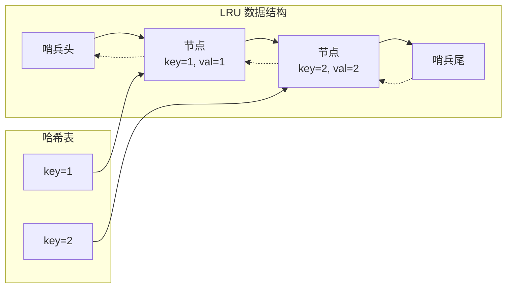

---

title: "LRU缓存"

difficulty: 中等

category: 设计题

tags:

  - leetcode

  - 设计题

  - 哈希表

  - 双向链表

created: "2026-07-21"

---

# 146. LRU 缓存（LRU Cache）

> 难度：中等 | 主题：设计、哈希表、双向链表

## 题目

设计一个满足 LRU（最近最少使用）缓存约束的数据结构。

实现 `LRUCache` 类：

- `LRUCache(int capacity)` —— 以正整数容量初始化

- `int get(int key)` —— 存在返回 value，否则 -1

- `void put(int key, int value)` —— 存在则更新，不存在则插入；超容量则**淘汰最久未使用**

要求：`get` 和 `put` 均为 **O(1)**。

**示例**

```text

["LRUCache","put","put","get","put","get"] [[2],[1,1],[2,2],[1],[3,3],[2]]

输出：[null,null,null,1,null,-1]

```

---

## 思路
### 先讲个故事：办公桌的咖啡杯

想象你的办公桌只能放 3 个咖啡杯。你每次用过一个杯子就把它拿到桌子最左边。当你想放一个新杯子时，如果桌上已经满了，就把最右边的（最久没用过的）拿走。

这就是 LRU——**最近用过的放最前面，满了就淘汰最后面的。**

### 引导式推导：为什么是 双向链表 + 哈希表？

**需求**：

1. O(1) 查找：需要哈希表 `key → node`

2. O(1) 删除和插入：需要链表（且要 O(1) 删任意节点）

3. 知道前驱才能 O(1) 删除 → **双向链表**

**为什么不是单向链表？** 删除节点时需要知道前驱。单向链表找前驱要遍历（O(n)），双向链表有 `prev` 指针直接拿到前驱（O(1)）。

**为什么用哨兵节点？** 避免 `head` 和 `tail` 为 None 的特殊判断。没有哨兵时，删除唯一节点、在空链表插入等场景都需要额外判断。



### 核心操作

**get(key)**：

1. 查哈希表：不存在 → 返回 -1

2. 存在 → 把节点**移到链表头部**（标记为最近使用）

**put(key, value)**：

1. key 已存在 → 更新 value，移到头部

2. key 不存在 → 创建新节点加到头部；如果容量满，删除尾部节点

```text

put(1,1): cache={}, 容量=2

  → 创建节点1, 加到头部。链表: head↔1↔tail

put(2,2):

  → 创建节点2, 加到头部。链表: head↔2↔1↔tail

get(1): 存在

  → 节点1移到头部。链表: head↔1↔2↔tail

put(3,3): 容量满

  → 淘汰尾部节点2（最久未使用）

  → 创建节点3, 加到头部。链表: head↔3↔1↔tail

  → get(2) = -1 ✓

```

---

## 代码

```python

class ListNode:

    def __init__(self, key=0, val=0):

        self.key = key

        self.val = val

        self.prev = None

        self.next = None

class LRUCache:

    def __init__(self, capacity: int):

        self.capacity = capacity

        self.cache = {}

        self.head = ListNode()

        self.tail = ListNode()

        self.head.next = self.tail

        self.tail.prev = self.head

    def _remove(self, node):

        node.prev.next = node.next

        node.next.prev = node.prev

    def _add_to_head(self, node):

        node.next = self.head.next

        node.prev = self.head

        self.head.next.prev = node

        self.head.next = node

    def get(self, key: int) -> int:

        if key not in self.cache:

            return -1

        node = self.cache[key]

        self._remove(node)

        self._add_to_head(node)

        return node.val

    def put(self, key: int, value: int) -> None:

        if key in self.cache:

            node = self.cache[key]

            node.val = value

            self._remove(node)

            self._add_to_head(node)

        else:

            if len(self.cache) >= self.capacity:

                last = self.tail.prev

                self._remove(last)

                del self.cache[last.key]

            node = ListNode(key, value)

            self.cache[key] = node

            self._add_to_head(node)

```

## 复杂度

| 操作 | 时间 | 空间 |

|------|------|------|

| get | O(1) | O(capacity) |

| put | O(1) | O(capacity) |

---

## 实战考量
### 频率分析

> **出现在**：设计题之王，第 85 次高频。字节/阿里/美团等几乎必考。约 60% 的中高级常会出这道题。更值得掌握的是——**能不能从"O(1) 查找 + O(1) 插入删除"倒推出哈希表 + 双向链表**。

### 延伸思考

**Q：为什么用双向链表不是单向？**

A：删除节点需要前驱。单向链表找前驱要遍历 O(n)，双向链表 O(1)。

**Q：为什么用哨兵节点？**

A：避免 head 和 tail 为 None 的特殊判断，四步指针操作统一。

**Q：为什么节点要存 key？**

A：淘汰尾部节点时，需要通过 `last.key` 从哈希表中删除。如果只存 value，无法反查 key。

**Q：Python 的 `OrderedDict` 一行搞定？**

A：是的，`OrderedDict` 底层也是双向链表 + 哈希表。先手动实现展示底层理解，再提 OrderedDict 保底。

**Q：如果要求线程安全？**

A：加 `threading.RLock` 包裹 get 和 put。

**Q：LFU（最不经常使用）怎么实现？**

A：每个频率对应一个双向链表，外加 `min_freq` 变量追踪当前最小频率。比 LRU 复杂一个量级。

### 易错点

- `_remove` 和 `_add_to_head` 的指针操作顺序——一步都不能错

- 删除尾部节点后**必须同时从哈希表中删除**

- `get` 不只是读取——它改变了访问顺序，必须移到头部

- `put` 更新已有 key 时也要移动节点

- 哨兵节点初始化：`head.next = tail` 和 `tail.prev = head` 不能漏

---

## 生活类比

> **LRU → 办公桌上的咖啡杯**

>

> 桌子只能放 capacity 个杯子。每次用一个杯子就拿到桌子最左边。新杯子来了，如果桌子满了——最右边那个（最久没用的）扔掉。

>

> 用两个词概括：**最近使用的放前面，满了淘汰最后面。**

---

## 相关题目

| 题目 | 关系 |

|------|------|

| 208实现Trie前缀树 | 设计题同族 |

| [[380O(1)时间插入删除和获取随机元素]] | O(1) 数据结构同族 |

---

→ 返回题单：[[LeetCode学习路线图#十五、设计题]]

## 速记卡（面试闪卡）

**Q1：一句话讲清「146. LRU 缓存（LRU Cache）」到底是什么？**

A：设计满足 LRU（Least Recently Used，最近最少使用）约束的缓存，get 和 put 都要 O(1)，超容量时淘汰最久未使用的。设计题之王。

**Q2：题目与咖啡杯 —— 怎么理解？**

A：像办公桌只放 capacity 个咖啡杯，每次用过的拿到最左边，桌上满了就把最右边（最久没用）的扔掉。一句话：最近使用的放前面，满了淘汰最后面。

**Q3：结构与选型 —— 怎么理解？**

A：要 O(1) 查找必须哈希表（key → 节点），要 O(1) 删除任意节点必须双向链表（单向链表找前驱要 O(n)）。再加哨兵头尾节点，免去 head/tail 为 None 的特殊判断——这四步指针操作才统一。

**Q4：操作与易错 —— 怎么理解？**

A：get 命中要移到头部（它会改变访问顺序！）；put 存在则更新并移头，不存在则加头，容量满时删尾部并「同步从哈希表删除」（节点要存 key 才能反查）。哨兵初始化 `head.next=tail`、`tail.prev=head` 不能漏。

**Q5：复杂度与延伸 —— 怎么理解？**

A：get/put 都是 O(1)、空间 O(capacity)。Python 的 OrderedDict 底层就是这个；进阶 LFU（最不经常使用）要维护每频率一个链表 + min_freq，复杂一个量级。

**Q6：核心速记主线有哪些？**

A：题目、哈希 + 双链表、哨兵节点、移到头部、淘汰删哈希、LFU 延伸。

**口诀**

A：LRU 缓存双链表，哈希定位 O(1；

最近用者挪到头，满时尾删哈希清。

## 相关链接

- [[笔记/Leetcode笔记/15_设计题/208实现Trie前缀树|实现Trie前缀树]]

- [[笔记/Leetcode笔记/15_设计题/00-解题模板|设计题 解题模板]]

- [[笔记/Leetcode笔记/14_数学与位运算/231-2的幂|2的幂]]

- [[笔记/Leetcode笔记/13_动态规划/63不同路径II|不同路径II]]

- [[笔记/Leetcode笔记/04_链表/143重排链表|重排链表]]

