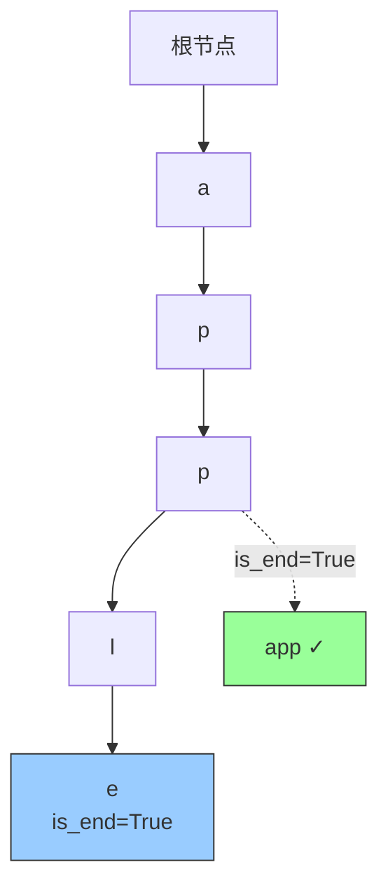
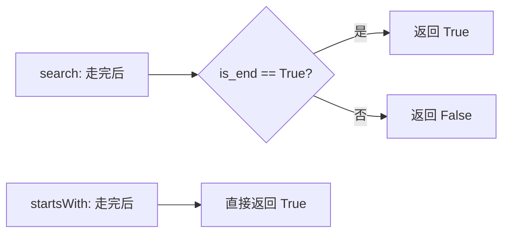

---

title: "实现Trie前缀树"

difficulty: 中等

category: 设计题

tags:

  - leetcode

  - 设计题

created: "2026-07-21"

---

# 208. 实现 Trie (前缀树)

> 难度：中等 | 主题：设计、树、字符串

## 题目

实现 Trie（前缀树）类，支持 `insert`（插入单词）、`search`（搜索单词）、`startsWith`（搜索前缀）。

**示例**

```text

输入：["Trie","insert","search","search","startsWith","insert","search"]

     [[],["apple"],["apple"],["app"],["app"],["app"],["app"]]

输出：[null,null,true,false,true,null,true]

```

---

## 思路
### 先讲个故事：字典里的书签

你翻过纸质字典吗？找单词时你不会从第一页翻到最后一页——你先翻到 "a" 开头的区域，再缩小到 "ap"，再缩小到 "app"，最后找到 "apple"。

Trie 树就是这个思路的数字化：**每个节点代表一个字符，从根到叶的路径就是整个单词。** 查前缀就像在字典里快速翻页，查单词还要确认"翻到这里就结束了"。

### 引导式推导：从字典到树结构

**核心设计**：每个 TrieNode 有两个属性：

- `children`：字典/数组，映射字符 → 子节点

- `is_end`：标记这个节点是否是一个完整单词的结尾

**为什么需要 `is_end`？** 因为插入 "apple" 后搜索 "app" 应该返回 False——"app" 只是前缀，不是完整单词。



**三个操作的本质**：

| 操作 | 做什么 |
|------|--------|
| `insert` | 沿路径走，没有的节点就创建，最后标记 `is_end=True` |
| `search` | 沿路径走，每步检查子节点存在，最后检查 `is_end` |
| `startsWith` | 沿路径走，每步检查子节点存在，走完就返回 True |

### search vs startsWith 的唯一区别



### 为什么用字典而不是数组？

| | 字典 | 数组（长度 26） |
|---|---|---|
| 灵活性 | 支持任意字符集（Unicode） | 只支持 26 个字母 |
| 空间 | 只存实际用到的字符 | 固定 26 个槽位 |
| 查找 | O(1) 哈希 | O(1) 索引 |
| 推荐 | 更稳妥 | 更快但浪费 |

---

## 代码

```python

class TrieNode:

    def __init__(self):

        self.children = {}

        self.is_end = False

class Trie:

    def __init__(self):

        self.root = TrieNode()

    def insert(self, word):

        node = self.root

        for ch in word:

            if ch not in node.children:

                node.children[ch] = TrieNode()

            node = node.children[ch]

        node.is_end = True

    def search(self, word):

        node = self.root

        for ch in word:

            if ch not in node.children:

                return False

            node = node.children[ch]

        return node.is_end

    def startsWith(self, prefix):

        node = self.root

        for ch in prefix:

            if ch not in node.children:

                return False

            node = node.children[ch]

        return True

```

## 复杂度

| 指标 | 值 | 解释 |
|------|----|------|
| insert | O(L) | L 为单词长度 |
| search | O(L) | L 为单词长度 |
| startsWith | O(L) | L 为前缀长度 |
| 空间 | O(总字符数) | 每个字符对应一个 TrieNode |

---

## 实战考量
### 频率分析

> **出现在**：设计题常考，常见。约 40% 常会从 Trie 延伸讨论"自动补全"或"敏感词过滤"。更值得掌握的是——**理解 Trie 的树形结构，以及 search 和 startsWith 的区别**。

### 延伸思考

**Q：Trie 的典型应用场景？**

A：自动补全（搜索框提示）、拼写检查、IP 路由的最长前缀匹配、敏感词过滤（AC 自动机）、基因组序列匹配。

**Q：search 和 startsWith 的区别？**

A：search 要求最后节点 `is_end = True`（必须是完整单词）；startsWith 只要走完路径即可。插入 "apple" 后，search("app") 返回 False，startsWith("app") 返回 True。

**Q：如何实现删除操作？**

A：递归删除：从叶子节点向上，如果节点无子节点且不是单词结尾，删除该节点。需要后序遍历，时间复杂度 O(L)。

**Q：Trie 和哈希表有什么区别？**

A：哈希表只能精确匹配，Trie 支持前缀匹配和按字典序遍历。Trie 可以高效查找所有以某个前缀开头的单词；哈希表查找 O(1) 但无法做前缀查询。

**Q：如何优化 Trie 的空间？**

A：使用压缩 Trie（Radix Tree / Patricia Trie），合并只有一个子节点的路径。

### 易错点

- `insert` 最后要设置 `node.is_end = True`

- `search` 要判断 `is_end` 而不是直接返回 True

- `startsWith` 不需要判断 `is_end`

- 如果忘记设置 `is_end`，search 将永远返回 False

---

## 生活类比

> **Trie → 字典里的快速翻页**

>

> 想象你在查字典，不需要从头翻到尾——先定位到 "a" 区域，再缩小到 "ap"，再缩小到 "app"，最后确认 "apple" 是一个完整词条。

>

> 一句话总结：**每个节点代表一个字符，从根到叶就是整个单词。查前缀就是快速翻页，查单词还要确认"翻到这里结束了"。**

---

## 相关题目

| 题目 | 关系 |
|------|------|
| 79单词搜索 | Trie 优化（单词搜索 II 中用于剪枝） |
| 146LRU缓存 | 设计题同族 |

---

→ 返回题单：[[LeetCode学习路线图#十五、设计题]]

## 速记卡（面试闪卡）

**Q1：一句话讲清「208. 实现 Trie (前缀树)」到底是什么？**

A：208 题要实现支持插入、查找单词与前缀的 Trie 前缀树，每个节点存子节点和结尾标记。

**Q2：题目 —— 怎么理解？**

A：实现 Trie 类，支持 insert（插单词）、search（查单词）、startsWith（查前缀）。像翻字典：先定位 ‘a’ 区，再缩到 ‘ap’‘app’，最后确认 ‘apple’ 是完整词条。Trie（前缀树）每个节点代表一个字符，根到叶就是整个单词。

**Q3：思路 —— 怎么理解？**

A：TrieNode 两个属性：children（字符→子节点映射）和 is_end（是否单词结尾）。insert 沿路径建节点、末尾标 is_end；search 走完还要验 is_end；startsWith 走完即返回。用字典而非定长数组，支持任意字符集。

**Q4：代码 —— 怎么理解？**

A：insert：逐字符建/走节点，末位 is_end=True。search：逐字符走，末位返回 node.is_end。startsWith：逐字符走，走完即 True。每个操作 O(L)，L 为单词长度。

**Q5：复杂度 —— 怎么理解？**

A：insert/search/startsWith 均 O(L)，空间 O(总字符数)（每字符一个节点）。易错：忘设 is_end 导致 search 永远 False；startsWith 不判 is_end。删除需后序遍历，优化可用压缩 Trie（Radix Tree）。

**Q6：核心速记主线有哪些？**

- 节点存 children 字典 + is_end 结尾标记

- insert 末尾标 is_end，search 要验 is_end

- startsWith 走完即返回，不验结尾

- 操作 O(L)，空间 O(总字符数)

**口诀**

A：Trie 像本字典翻，

逐字深入节点连；

插完标记 is_end，

查词验尾前缀宽。

## 相关链接

- [[笔记/Leetcode笔记/15_设计题/146LRU缓存|LRU缓存]]

- [[笔记/Leetcode笔记/15_设计题/00-解题模板|设计题 解题模板]]

- [[笔记/Leetcode笔记/14_数学与位运算/470用Rand7实现Rand10|用Rand7实现Rand10]]

- [[笔记/Leetcode笔记/02_字符串/14最长公共前缀|最长公共前缀]]

- [[笔记/Leetcode笔记/03_栈与队列/232用栈实现队列|用栈实现队列]]

