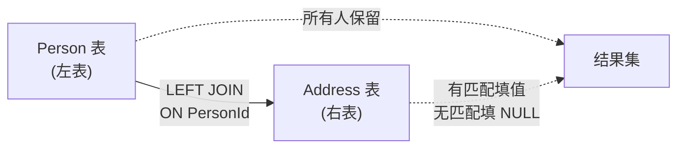

---

title: "组合两个表"

tags:

  - leetcode

  - sql

  - 简单

  - left_join

  - 多表查询

difficulty: 简单

created: "2026-07-21"

---

# 175. 组合两个表（Combine Two Tables）

> 难度：简单 | 考点：LEFT JOIN

## 题目

表 `Person`（PersonId, FirstName, LastName）和表 `Address`（AddressId, PersonId, City, State）。查询每个人的姓名和地址，即使地址不存在也显示 NULL。

**示例**

```text

Person 表：

| personId | lastName | firstName |

| 1        | Wang     | Allen     |

| 2        | Alice    | Bob       |

Address 表：

| addressId | personId | city | state |

| 1         | 2        | NYC  | NY    |

输出：

| firstName | lastName | city  | state |

| Allen     | Wang     | null  | null  |

| Bob       | Alice    | NYC   | NY    |

```

---

## 思路
### 先讲个故事：全员地址清单

把两张表想象成"人员名册"和"通讯录"：名册上每个人都有编号（PersonId），通讯录里记录了部分人的地址。老板让你生成一份"全员地址清单"，没有留地址的人也要列出来，地址栏写"无"。

这就是 LEFT JOIN 的典型场景——**以左表（Person）为主，右表（Address）有就填，没有就留空（NULL）**。

### 引导式推导：SQL 执行逻辑

**第 1 步：从 Person 表读取所有行（主表）**

```text

Person: [Allen Wang], [Bob Alice]

```

**第 2 步：对每一行，在 Address 表中按 PersonId 匹配**

```text

PersonId=1 → Address 中没有 → City=NULL, State=NULL

PersonId=2 → Address 中有 → City=NYC, State=NY

```

**第 3 步：返回结果**



### LEFT JOIN vs INNER JOIN

| | LEFT JOIN | INNER JOIN |
|---|---|---|
| 左表 | 全部保留 | 只保留匹配的 |
| 右表 | 有匹配填值，无匹配填 NULL | 只保留匹配的 |
| 本题用 | ✓ | ✗（会丢掉没有地址的人） |

---

## SQL 代码

```sql

SELECT

    p.FirstName,

    p.LastName,

    a.City,

    a.State

FROM Person p

LEFT JOIN Address a

    ON p.PersonId = a.PersonId;

```

## 复杂度

| 指标 | 分析 |
|------|------|
| 时间 | O(m + n) — m 为 Person 行数，n 为 Address 行数。LEFT JOIN 时数据库会对右表做哈希匹配或索引查找 |
| 空间 | O(m + n) — 结果集最多包含 Person 的所有行，加上连接过程中的临时数据结构 |

---

## 实战考量
### 频率分析

> **出现在**：SQL 入门必考，约 50% 的 SQL 常会从 LEFT JOIN 开始。关键在于**能不能区分 LEFT JOIN 和 INNER JOIN**，以及 ON 和 WHERE 在 LEFT JOIN 中的区别。

### 延伸思考

**Q：LEFT JOIN 和 INNER JOIN 的区别？**

A：LEFT JOIN 保留左表所有行，右表无匹配填 NULL；INNER JOIN 只保留两表都匹配的行。如果本题用 INNER JOIN，没有地址的人就不会出现在结果中。

**Q：如果反过来，显示所有地址（即使没有对应的人）？**

A：用 RIGHT JOIN，或者把 Address 放左边用 LEFT JOIN（推荐）。一般习惯用 LEFT JOIN 把主表放左边，可读性更好。

**Q：ON 和 WHERE 在 LEFT JOIN 中的区别？**

A：ON 是连接条件，决定"如何匹配"；WHERE 是过滤条件，在连接完成后过滤。如果把 `p.PersonId = a.PersonId` 写到 WHERE 里，LEFT JOIN 会退化为 INNER JOIN——因为 WHERE 会过滤掉 NULL 行。

**Q：如果 Person 表和 Address 表都有百万行，怎么优化？**

A：在 `Address.PersonId` 上建索引，因为 LEFT JOIN 需要对 Address 表做查找。

### 易错点

- LEFT JOIN 写成 INNER JOIN（丢掉了没有地址的人）

- 连接条件写进 WHERE 子句（LEFT JOIN 退化为 INNER JOIN）

- 忘记给表起别名，导致列名歧义

---

## 生活类比

> **LEFT JOIN → 全员地址清单**

>

> 名册上每个人都要列出来，通讯录里有地址就填上，没有就写"无"。以名册为主，通讯录为辅。

>

> 一句话总结：**左表全保留，右表有就填，没有就 NULL。**

---

## 相关题目

| 题目 | 关系 |
|------|------|
| 176第二高的薪水 | SQL 基础，子查询入门 |
| 184部门工资最高的员工 | JOIN + 窗口函数 |

---

→ 返回题单：[[LeetCode学习路线图#十六、SQL 高频]]

## 速记卡（面试闪卡）

**Q1：一句话讲清「175. 组合两个表（Combine Two Tables）」到底是什么？**

A：这是一道 SQL 入门题：用 LEFT JOIN 查出每个人的姓名和地址，无地址的人也保留、地址列填 NULL。

**Q2：题目 —— 怎么理解？**

A：Person 表是人员名册，Address 是通讯录；老板要"全员地址清单"，没留地址的人也要列出、地址写"无"。以左表 Person 为主（LEFT JOIN），右表有就填、无就 NULL。

**Q3：思路 —— 怎么理解？**

A：想象发名册：先读 Person 全部行（主表），再按 PersonId 去 Address 匹配；对不上的行地址留空。核心就一句——左表全保留，右表有就填，没有就 NULL（LEFT JOIN，左外连接）。

**Q4：SQL 代码 —— 怎么理解？**

A：SELECT p.FirstName, p.LastName, a.City, a.State FROM Person p LEFT JOIN Address a ON p.PersonId = a.PersonId; 把 Address 放右边 LEFT JOIN，ON 用主键关联，主表永远是左边的 Person。

**Q5：复杂度 —— 怎么理解？**

A：时间 O(m+n)——Person m 行、Address n 行，数据库对右表做哈希/索引匹配；空间 O(m+n)——结果集最多装下 Person 所有行加连接临时结构。LEFT JOIN 代价随两表行数线性增长。

**Q6：核心速记主线有哪些？**

- LEFT JOIN 以左表为主，右表无匹配填 NULL

- ON 是连接条件、WHERE 是连接后过滤，别写反

- 想显所有地址用 RIGHT JOIN 或调换主表

- Address.PersonId 建索引可加速百万级查询

**口诀**

A：组两表用 LEFT JOIN，

左全留右空来填；

ON 管连接 WHERE 筛，

写错退化内接连。

## 相关链接

- [[笔记/Leetcode笔记/16_SQL高频/176第二高的薪水|第二高的薪水]]

- [[笔记/Leetcode笔记/16_SQL高频/180连续出现的数字|连续出现的数字]]

- [[笔记/Leetcode笔记/16_SQL高频/177第N高的薪水|第N高的薪水]]

- [[笔记/Leetcode笔记/16_SQL高频/178分数排名|分数排名]]

- [[笔记/Leetcode笔记/16_SQL高频/184部门工资最高的员工|部门工资最高的员工]]

