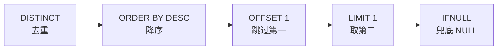

---

title: "第二高的薪水"

tags:

  - leetcode

  - sql

  - 中等

  - 子查询

  - limit

  - offset

  - ifnull

difficulty: 中等

created: "2026-07-21"

---

# 176. 第二高的薪水（Second Highest Salary）

> 难度：中等 | 考点：子查询、LIMIT、OFFSET、IFNULL、窗口函数

## 题目

`Employee` 表（Id, Salary），查询第二高的薪水。如果不存在第二高，返回 NULL。

**示例**

```text

Employee 表：

| id | salary |

| 1  | 100    |

| 2  | 200    |

| 3  | 300    |

输出：

| SecondHighestSalary |

| 200                 |

```

---

## 思路
### 先讲个故事：颁奖典礼的第二名

学校颁奖典礼，要请第二名上台。主持人做了四件事：

1. **去重**（DISTINCT）——如果两个人并列第一，第二名应该是下一个不同的分数

2. **排序**（ORDER BY DESC）——从高到低站好队

3. **跳过第一个**（OFFSET 1）——第一名跳过

4. **请第二名上台**（LIMIT 1）——只请一个人

但万一只有一个人参赛呢？主持人提前准备了**兜底方案**（IFNULL）——如果找不到第二名，就说"今天没有第二名"（返回 NULL）。

### 引导式推导：四步走

**第 1 步：DISTINCT 去重**

```text

薪水: [100, 200, 300, 200] → 去重后: [100, 200, 300]

```

**第 2 步：ORDER BY DESC 降序**

```text

[300, 200, 100]

```

**第 3 步：LIMIT 1 OFFSET 1 跳过第一个取第二个**

```text

OFFSET 1 跳过 300 → LIMIT 1 取 200 ✓

```

**第 4 步：IFNULL 兜底**

```text

如果去重后只有一个值 → 子查询返回空 → IFNULL 转为 NULL

```



---

## SQL 代码

```sql

SELECT

    IFNULL(

        (SELECT DISTINCT Salary

         FROM Employee

         ORDER BY Salary DESC

         LIMIT 1 OFFSET 1),

        NULL

    ) AS SecondHighestSalary;

```

## 复杂度

| 指标 | 分析 |
|------|------|
| 时间 | O(n log n) — DISTINCT 去重 + ORDER BY 排序主导 |
| 空间 | O(n) — DISTINCT 需要去重后的中间结果集 |

> 如果 Salary 列上有索引，`ORDER BY Salary DESC` 可以直接利用索引的有序性，时间降到 O(n)。

---

## 实战考量
### 频率分析

> **出现在**：SQL 中等题高频，约 40% 的同类题会考。重点在于**边界情况处理**——不存在第二高时要返回 NULL 而不是空结果集。

### 延伸思考

**Q：OFFSET 和 LIMIT 的区别？**

A：LIMIT 限制返回的行数，OFFSET 跳过前 N 行。`LIMIT 1 OFFSET 1` = 跳过 1 行取 1 行。OFFSET 从 0 开始计数。

**Q：为什么用 DISTINCT？**

A：可能有多个员工薪水相同（比如两个人都拿 100 万），第二高应该是去重后的第二个不同值。

**Q：为什么用 IFNULL？**

A：子查询结果为空时不会返回 NULL，而是返回空结果集（0 行）。IFNULL 确保返回一个 NULL 值，满足题目要求。

**Q：窗口函数 DENSE_RANK 怎么做？**

```sql

SELECT DISTINCT Salary AS SecondHighestSalary

FROM (

    SELECT Salary, DENSE_RANK() OVER (ORDER BY Salary DESC) AS rnk

    FROM Employee

) t

WHERE rnk = 2;

```

如果没有第二高，这个查询返回空结果集，而不是 NULL。需要额外处理。

**Q：如果不存在第二高，子查询返回什么？**

A：返回空结果集（0 行），IFNULL 将其转为 NULL。

### 易错点

- 忘记 DISTINCT，相同薪水被当成不同排名

- 把 OFFSET 和 LIMIT 顺序搞反

- 不用 IFNULL，空结果集不等于 NULL

---

## 生活类比

> **第二高的薪水 → 颁奖典礼的第二名**

>

> 主持人做了四件事：去重、排队、跳过第一名、请第二名上台。万一只有一个人参赛，就说"今天没有第二名"。

>

> 一句话总结：**去重、降序、跳过第一个、取第一个，再用 IFNULL 兜底。**

---

## 相关题目

| 题目 | 关系 |
|------|------|
| 177第N高的薪水 | 通用版：第 N 高的薪水 |
| 178分数排名 | 窗口函数排名（DENSE_RANK） |

---

→ 返回题单：[[LeetCode学习路线图#十六、SQL 高频]]

## 速记卡（面试闪卡）

**Q1：一句话讲清「176. 第二高的薪水（Second Highest Salary）」到底是什么？**

A：查薪水中排第二大的不同值，若不存在则返回 NULL。

**Q2：题目核心 —— 怎么理解？**

A：像颁奖请第二名上台：先去重、再降序排队、跳过第一、请第二；英文 Second Highest Salary，边界是可能根本没有第二高。

**Q3：思路拆解 —— 怎么理解？**

A：如同主持人四步走：DISTINCT 去重、ORDER BY DESC 降序、OFFSET 1 跳过第一、LIMIT 1 取第二；英文 LIMIT/OFFSET 控制行与偏移。

**Q4：代码骨架 —— 怎么理解？**

A：好比兜底：子查询查不到会返回空结果集而非 NULL，套一层 IFNULL 把空转成 NULL；英文 IFNULL 空值处理函数。

**Q5：复杂度与实战 —— 怎么理解？**

A：如同先排队再挑人，时间 O(n log n)、空间 O(n)；SQL 高频中等题，约四成会考"不存在要返回 NULL"的边界。

**Q6：核心速记主线有哪些？**

- 去重：DISTINCT 让并列第一不占第二

- 降序：ORDER BY Salary DESC 从高到低

- 跳过：OFFSET 1 跳过第一，LIMIT 1 取第二

- 兜底：IFNULL 把空结果集换成 NULL

**口诀**

A：第二高薪怎么查

去重降序跳第一

LIMIT取一OFFSET跳

IFNULL兜底返回空

## 相关链接

- [[笔记/Leetcode笔记/16_SQL高频/177第N高的薪水|第N高的薪水]]

- [[笔记/Leetcode笔记/16_SQL高频/184部门工资最高的员工|部门工资最高的员工]]

- [[笔记/Leetcode笔记/16_SQL高频/180连续出现的数字|连续出现的数字]]

- [[笔记/Leetcode笔记/16_SQL高频/178分数排名|分数排名]]

- [[笔记/Leetcode笔记/16_SQL高频/175组合两个表|组合两个表]]

