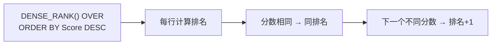

---

title: "分数排名"

tags:

  - leetcode

  - sql

  - 中等

  - 窗口函数

  - dense_rank

  - 排名

difficulty: 中等

created: "2026-07-21"

---

# 178. 分数排名（Rank Scores）

> 难度：中等 | 考点：窗口函数、DENSE_RANK、自连接

## 题目

`Scores` 表（Id, Score），按分数降序排名。排名规则：分数相同排名相同，排名连续（即 DENSE_RANK 语义）。

**示例**

```text

Scores 表：

| id | score |

| 1  | 3.50  |

| 2  | 3.65  |

| 3  | 4.00  |

| 4  | 3.85  |

| 5  | 4.00  |

| 6  | 3.65  |

输出：

| score | rank |

| 4.00  | 1    |

| 4.00  | 1    |

| 3.85  | 2    |

| 3.65  | 3    |

| 3.65  | 3    |

| 3.50  | 4    |

```

---

## 思路
### 先讲个故事：运动会的成绩单

学校运动会，老师要给每个选手排名。规则是：

- 分数最高的排第 1

- 分数相同的并列排名（两个人都是 4.00 分，都排第 1）

- 排名连续不跳号（第 1 名之后是第 2 名，不是第 3 名）

这就是 DENSE_RANK 的定义——**密集排名，并列同名，连续不跳号。**

### 引导式推导：两种解法

**解法一：窗口函数 DENSE_RANK（推荐）**



**解法二：自连接（不用窗口函数）**

对每个分数，数一数有多少个不同的分数 >= 它：

```text

分数 4.00 → 有多少个不同的分数 >= 4.00? → 1 个（4.00本身）→ 排名 1

分数 3.85 → 有多少个不同的分数 >= 3.85? → 2 个（4.00, 3.85）→ 排名 2

分数 3.65 → 有多少个不同的分数 >= 3.65? → 3 个（4.00, 3.85, 3.65）→ 排名 3

```

### 窗口函数 vs 自连接

| | 窗口函数 | 自连接 |

|---|---|---|

| 时间 | O(n log n) | O(n²) |

| 代码 | 简洁 | 复杂 |

| 推荐 | ✓ | 兜底方案 |

---

## SQL 代码
### 方法一：窗口函数 DENSE_RANK（推荐）

```sql

SELECT

    Score,

    DENSE_RANK() OVER (ORDER BY Score DESC) AS `Rank`

FROM Scores

ORDER BY Score DESC;

```

### 方法二：自连接（不用窗口函数）

```sql

SELECT

    s1.Score,

    COUNT(DISTINCT s2.Score) AS `Rank`

FROM Scores s1

JOIN Scores s2

    ON s1.Score <= s2.Score

GROUP BY s1.Id, s1.Score

ORDER BY s1.Score DESC;

```

## 复杂度

| 方法 | 时间复杂度 | 空间复杂度 |

|------|-----------|-----------|

| DENSE_RANK 窗口函数 | O(n log n) — 窗口函数内部排序 | O(n) — 临时存储排名结果 |

| 自连接 | O(n²) — 笛卡尔积遍历 | O(n) — GROUP BY 中间结果 |

---

## 实战考量
### 频率分析

> **出现在**：窗口函数经典应用，约 35% 的同类题会考。关键在于你**DENSE_RANK 的理解**，以及不用窗口函数的兜底方案。

### 延伸思考

**Q：DENSE_RANK vs RANK 的区别？**

| 分数 | DENSE_RANK | RANK | ROW_NUMBER |

|------|-----------|------|------------|

| 100  | 1         | 1    | 1          |

| 100  | 1         | 1    | 2          |

| 90   | 2         | 3    | 3          |

| 80   | 3         | 4    | 4          |

**Q：如果不用窗口函数怎么做？**

A：用自连接。核心思路：对于每个分数，统计有多少个不同的分数 >= 它。

**Q：PARTITION BY 怎么用？**

A：`DENSE_RANK() OVER (PARTITION BY department ORDER BY Score DESC)` 表示按部门分组，每个部门内部独立排名。见 184部门工资最高的员工。

**Q：窗口函数有哪些常见类型？**

A：`ROW_NUMBER()`（唯一编号）、`RANK()`（跳号排名）、`DENSE_RANK()`（密集排名）、`NTILE(n)`（分桶）。

**Q：`ORDER BY Score DESC` 写在 OVER 里和外层有什么区别？**

A：OVER 里的 ORDER BY 决定窗口内的排序（即排名的依据），外层 ORDER BY 决定最终结果的展示顺序。两者通常一致，但语义不同。

### 易错点

- 用 RANK 而不是 DENSE_RANK（排名会跳号）

- 忘记用反引号包裹 Rank 保留字

- 自连接版本忘记 DISTINCT（相同分数会重复计数）

---

## 生活类比

> **分数排名 → 运动会成绩单**

>

> 分数最高的排第 1，分数相同的并列排名，排名连续不跳号。这就是 DENSE_RANK——密集排名，并列同名，连续不跳号。

>

> 一句话总结：**DENSE_RANK = 并列同名 + 连续不跳号。**

---

## 相关题目

| 题目 | 关系 |

|------|------|

| 184部门工资最高的员工 | PARTITION BY 分组排名 |

| 177第N高的薪水 | DENSE_RANK 找第 N 名 |

| 180连续出现的数字 | 窗口函数 LEAD/LAG |

---

→ 返回题单：[[LeetCode学习路线图#十六、SQL 高频]]

## 速记卡（面试闪卡）

**Q1：一句话讲清「178. 分数排名（Rank Scores）」到底是什么？**

A：按分数降序给成绩排名，同分并列、名次连续不跳号（即 DENSE_RANK）。

**Q2：题目怎么理解？ —— 怎么理解？**

A：运动会发奖：同分并列（两人都4.00都第1），下一名紧接排第2不跳号。这就是密集排名（DENSE_RANK，并列同名、连续不跳号）。

**Q3：窗口函数怎么写？ —— 怎么理解？**

A：DENSE_RANK() OVER (ORDER BY Score DESC) 像给每人发一张名次贴纸，一行一个自动算好。这是窗口函数（window function，对每行在其"窗口"内计算排名）。

**Q4：不用窗口怎么写？ —— 怎么理解？**

A：自连接：对每个分数，数"有多少个不同分数 ≥ 它"就是它的名次，像自己跟自己比高低。这是自连接兜底（self-join fallback）。

**Q5：复杂度和实战怎么理解？ —— 怎么理解？**

A：窗口函数 O(n log n) 胜过自连接 O(n²)，约35%同类题会考，别误用会跳号的 RANK。核心就在 DENSE_RANK 的理解与兜底写法。

**Q6：核心速记主线有哪些？**

- 题目：分数降序排名，同分并列、连续不跳

- 核心：DENSE_RANK 窗口函数一行搞定

- 兜底：自连接数"≥我的不同分数"个数

- 实战：窗口函数经典，约35%会考，别误用 RANK

**口诀**

A：分数排名用密排，

同分并列不跳号；

窗口函数一行写，

自连兜底也可靠。

## 相关链接

- [[笔记/Leetcode笔记/16_SQL高频/184部门工资最高的员工|部门工资最高的员工]]

- [[笔记/Leetcode笔记/16_SQL高频/177第N高的薪水|第N高的薪水]]

- [[笔记/Leetcode笔记/16_SQL高频/180连续出现的数字|连续出现的数字]]

- [[笔记/Leetcode笔记/16_SQL高频/176第二高的薪水|第二高的薪水]]

- [[笔记/Leetcode笔记/16_SQL高频/175组合两个表|组合两个表]]

